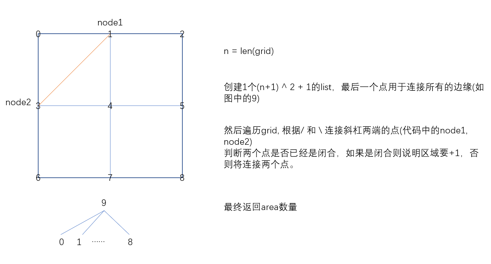
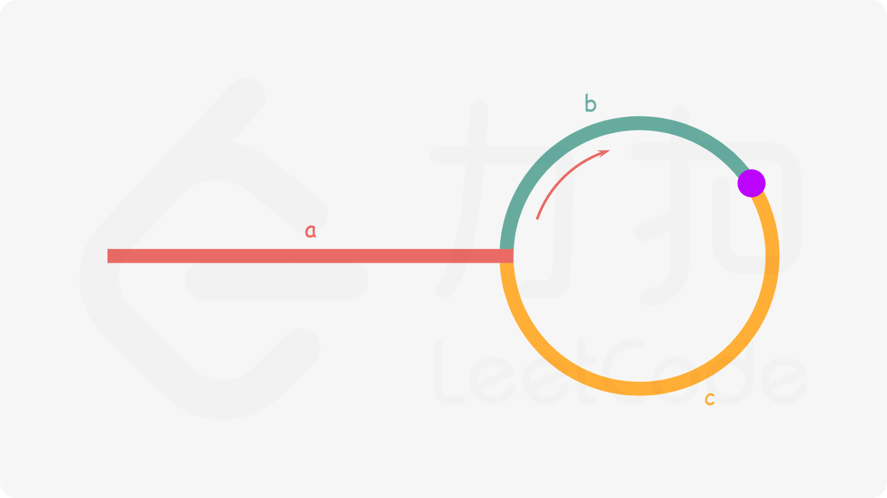
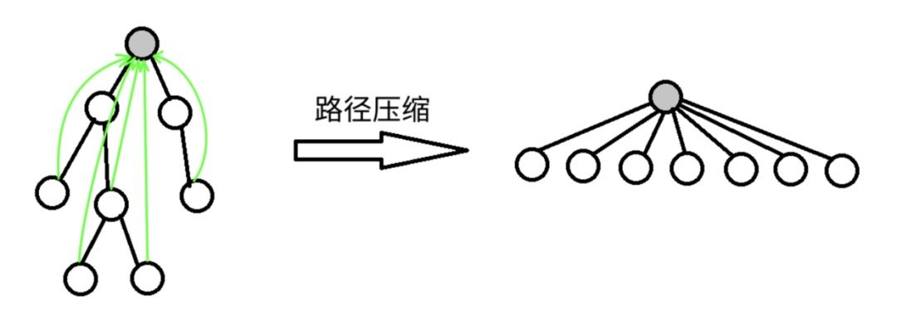

# Leetcode每日一题

题目来源：[力扣(Leetcode)官网](https://leetcode-cn.com/)

`代码链接在题目描述后，也可以通过题号来寻找`

编译都是用的`python3或python`

本地编译python3时，需要如下操作

```python
from typing import List

class Solution:
	def searchRange(self, nums: List[int], target: int) -> List[int]:
```

## [959 由斜杠划分区域](https://leetcode-cn.com/problems/regions-cut-by-slashes/)

在由 1 x 1 方格组成的 N x N 网格 grid 中，每个 1 x 1 方块由 /、\ 或空格构成。这些字符会将方块划分为一些共边的区域。（请注意，反斜杠字符是转义的，因此 \ 用 "\\" 表示）。返回区域的数目。

**提示：**

1. `1 <= grid.length == grid[0].length <= 30`
2. `grid[i][j]` 是 `'/'`、`'\'`、或 `' '`。

[959代码](959.py)

[官方视频题解](https://leetcode-cn.com/problems/regions-cut-by-slashes/solution/you-xie-gang-hua-fen-qu-yu-by-leetcode-67xb/)

考察知识点：[并查集](#并查集DisjointSets)

「斜杠」、「反斜杠」把单元格拆分成的 2 个三角形的形态，在做合并的时候需要分类讨论。根据「斜杠」、「反斜杠」分割的特点，我们把一个单元格分割成逻辑上的 4 个部分。


我们须要遍历一次输入的二维网格 grid，在`单元格内`和`单元格间`进行合并。

* 单元格内：

如果是空格：合并 0、1、2、3；
如果是斜杠：合并 0、3，合并 1、2；
如果是反斜杠：合并 0、1，合并 2、3。

* 单元格间：

把每一个单元格拆分成 4 个小三角形以后，相邻的单元格须要合并，无须分类讨论。我们选择在遍历 grid 的每一个单元格的时候，分别`向右、向下`尝试合并。


`复杂度分析`

时间复杂度：$O(N^2logN)$。

空间复杂度：$O(N^2)$。


另一种解法



思路是如果斜杠的两个节点都在边缘这个集合里，那么它就闭合了，将空间一分为二。

## [1579. 保证图可完全遍历](https://leetcode-cn.com/problems/remove-max-number-of-edges-to-keep-graph-fully-traversable/)

Alice 和 Bob 共有一个无向图，其中包含 n 个节点和 3  种类型的边：

* 类型 1：只能由 Alice 遍历。

* 类型 2：只能由 Bob 遍历。

* 类型 3：Alice 和 Bob 都可以遍历。


给你一个数组 edges ，其中 edges[i] = [typei, ui, vi] 表示节点 ui 和 vi 之间存在类型为 typei 的双向边。请你在保证图仍能够被 Alice和 Bob 完全遍历的前提下，找出可以删除的最大边数。如果从任何节点开始，Alice 和 Bob 都可以到达所有其他节点，则认为图是可以完全遍历的。

返回可以删除的最大边数，如果 Alice 和 Bob 无法完全遍历图，则返回 -1 。


示例1：


> 输入：n = 4, edges = [[3,1,2],[3,2,3],[1,1,3],[1,2,4],[1,1,2],[2,3,4]]
> 输出：2
> 解释：如果删除 [1,1,2] 和 [1,1,3] 这两条边，Alice 和 Bob 仍然可以完全遍历这个图。再删除任何其他的边都无法保证图可以完全遍历。所以可以删除的最大边数是 2 。

示例2：


> 输入：n = 4, edges = [[3,1,2],[3,2,3],[1,1,4],[2,1,4]]
> 输出：0
> 解释：注意，删除任何一条边都会使 Alice 和 Bob 无法完全遍历这个图。

示例3：


> 输入：n = 4, edges = [[3,2,3],[1,1,2],[2,3,4]]
> 输出：-1
> 解释：在当前图中，Alice 无法从其他节点到达节点 4 。类似地，Bob 也不能达到节点 1 。因此，图无法完全遍历。

提示：

* 1 <= n <= 10^5
* 1 <= edges.length <= min(10^5, 3 * n * (n-1) / 2)
* edges[i].length == 3
* 1 <= edges\[i\]\[0\] <= 3
* 1 <= edges\[i\]\[1\] < edges\[i\]\[2\] <= n
* 所有元组 (typei, ui, vi) 互不相同

[1579代码](1579.py)


考察知识点：[并查集](#并查集DisjointSets)

[官方解题思路](https://leetcode-cn.com/problems/remove-max-number-of-edges-to-keep-graph-fully-traversable/solution/bao-zheng-tu-ke-wan-quan-bian-li-by-leet-mtrw/)

`思路与算法`

我们称类型 1, 2, 31,2,3 的边分别为「Alice 独占边」「Bob 独占边」以及「公共边」。

首先我们需要思考什么样的图是可以被 Alice 和 Bob 完全遍历的。对于 Alice 而言，她可以经过的边是「Alice 独占边」以及「公共边」，由于她需要能够从任意节点到达任意节点，那么就说明：

当图中仅有「Alice 独占边」以及「公共边」时，整个图是连通的，即整个图只包含一个连通分量。

同理，对于 Bob 而言，当图中仅有「Bob 独占边」以及「公共边」时，整个图也要是连通的。


由于题目描述中希望我们`删除最多数目的边`，这`等价于保留最少数目的边`。换句话说，我们可以从一个仅包含n个节点（而没有边）的无向图开始，逐步添加边，使得满足上述的要求。

那么我们应该按照什么策略来添加边呢？直觉告诉我们，「公共边」的重要性大于「Alice 独占边」以及「Bob 独占边」，因为「公共边」是 Alice 和 Bob 都可以使用的，而他们各自的独占边却不能给对方使用。

「公共边」的重要性也是可以证明的：

> 对于一条连接了两个不同的连通分量的「公共边」而言，如果我们不保留这条公共边，那么 Alice 和 Bob 就无法往返这两个连通分量，即他们分别需要使用各自的独占边。因此，Alice 需要一条连接这两个连通分量的独占边，Bob 同样也需要一条连接这两个连通分量的独占边，那么一共需要两条边，这就严格不优于直接使用一条连接这两个连通分量的「公共边」了。

因此，我们可以遵从优先添加「公共边」的策略。

具体地，我们遍历每一条「公共边」，对于其连接的的两个节点：

* 如果这两个节点在同一个连通分量中，那么添加这条「公共边」是无意义的；

* 如果这两个节点不在同一个连通分量中，我们就可以（并且一定）添加这条「公共边」，然后合并这两个节点所在的连通分量。

这就提示了我们使用并查集来维护整个图的连通性，上述的策略只需要用到并查集的「查询」和「合并」这两个最基础的操作。

在处理完了所有的「公共边」之后，我们需要处理他们`各自的独占边`，而方法也与添加「公共边」类似。我们将当前的并查集复制一份，一份交给 Alice，一份交给 Bob。随后 Alice 不断地向并查集中添加「Alice 独占边」，Bob 不断地向并查集中添加「Bob 独占边」。在处理完了所有的独占边之后，如果这两个并查集都只包含一个连通分量，那么就说明 Alice 和 Bob 都可以遍历整个无向图。

`细节`

在使用并查集进行合并的过程中，我们每遇到一次失败的合并操作（即需要合并的两个点属于同一个连通分量），那么就说明当前这条边可以被删除，将答案增加 1。

## [1128. 等价多米诺骨牌对的数量](https://leetcode-cn.com/problems/number-of-equivalent-domino-pairs/)

给你一个由一些多米诺骨牌组成的列表 dominoes。

如果其中某一张多米诺骨牌可以通过旋转 0 度或 180 度得到另一张多米诺骨牌，我们就认为这两张牌是等价的。形式上，`dominoes[i] = [a, b]`和`dominoes[j] = [c, d]`等价的前提是 a=c 且 b=d，或是 a=d 且 b=c。在` 0 <= i < j < dominoes.length` 的前提下，找出满足`dominoes[i]`和`dominoes[j]`等价的骨牌对`(i, j)`的数量。

> 示例：
> 输入：dominoes = [[1,2],[2,1],[3,4],[5,6]]
> 输出：1

**提示：**

- `1 <= dominoes.length <= 40000`
- `1 <= dominoes[i][j] <= 9`

[1128代码](1128.py)


`解析`：

注意到每张牌都是二元组(x,y)，那么用10x+y就可以唯一确定，如果规定让小的为x，那么可以同时确定等价的多米诺骨牌。

接下来问题就是如何储存数量信息，可以使用`字典`，key为10x+y，value为个数。那么，我们最后的结果是要将大于1的value，进行$C_{value}^2$，然后相加。也可以使用`数组`

可以将value设为二元数组[i,j]，初次添加为[1,0]，然后每次更新都变为[i+1,i+j]，i是等价骨牌的数量，j是通过类似循环来计算$C_{value}^2$。也可以通过其他方式来计算。

`复杂度分析`

时间复杂度：$O(N)$。

空间复杂度：$O(1)$。因为实际上字典大小不会超过100。

## [724. 寻找数组的中心索引](https://leetcode-cn.com/problems/find-pivot-index/)

给定一个整数类型的数组 nums，请编写一个能够返回数组 “中心索引” 的方法。

我们是这样定义数组 中心索引 的：数组中心索引的左侧所有元素相加的和等于右侧所有元素相加的和。

如果数组不存在中心索引，那么我们应该返回 -1。如果数组有多个中心索引，那么我们应该返回最靠近左边的那一个。

> 示例1:
>
> 输入：
> nums = [1, 7, 3, 6, 5, 6]
> 输出：3
> 解释：
> 索引 3 (nums[3] = 6) 的左侧数之和 (1 + 7 + 3 = 11)，与右侧数之和 (5 + 6 = 11) 相等。
> 同时, 3 也是第一个符合要求的中心索引。
>
> 
>
> 示例2：
>
> 输入：
> nums = [1, 2, 3]
> 输出：-1
> 解释：
> 数组中不存在满足此条件的中心索引。

**提示**：

- `nums` 的长度范围为 `[0, 10000]`。
- 任何一个 `nums[i]` 将会是一个范围在 `[-1000, 1000]`的整数。

[724代码](724.py)


考察知识点：[前缀和](#前缀和)

`思路`

记数组的全部元素之和为total，当遍历到第 i 个元素时，设其左侧元素之和为sum，则其右侧元素之和为total-nums\[i\]-sum。左右元素相等即为2*sum+nums[i]=total。

当中心索引左侧或右侧没有元素时，即为零个项相加，这在数学上称作「空和」。在程序设计中我们约定「空和是零」。

`复杂度`:

- 时间复杂度：O(n)，其中 n为数组的长度。
- 空间复杂度：O(1)。


## [1631. 最小体力消耗路径](https://leetcode-cn.com/problems/path-with-minimum-effort/)

你准备参加一场远足活动。给你一个二维`rows x columns`的地图`heights`，其中`heights[row][col]` 表示格子 `(row, col)`的高度。一开始你在最左上角的格子`(0, 0)`，且你希望去最右下角的格子`(rows-1, columns-1)`（注意下标从 0 开始编号）。你每次可以往**上，下，左，右**四个方向之一移动，你想要找到耗费**体力**最小的一条路径。

一条路径耗费的**体力值**是路径上相邻格子之间**高度差绝对值**的**最大值**决定的。

请你返回从左上角走到右下角的最小**体力消耗值**。


示例1：


> 输入：heights = [[1,2,2],[3,8,2],[5,3,5]]
> 输出：2
> 解释：路径 [1,3,5,3,5] 连续格子的差值绝对值最大为 2 。
> 这条路径比路径 [1,2,2,2,5] 更优，因为另一条路径差值最大值为 3 。

示例2：


> 输入：heights = [[1,2,3],[3,8,4],[5,3,5]]
> 输出：1
> 解释：路径 [1,2,3,4,5] 的相邻格子差值绝对值最大为 1 ，比路径 [1,3,5,3,5] 更优。

示例3：


> 输入：heights = [[1,2,1,1,1],[1,2,1,2,1],[1,2,1,2,1],[1,2,1,2,1],[1,1,1,2,1]]
> 输出：0
> 解释：上图所示路径不需要消耗任何体力。

**提示**：

* rows == heights.length
* columns == heights[i].length
* 1 <= rows, columns <= 100
* 1 <= heights\[i\]\[j\] <= 10^6

[1631代码](1631.py)


`思路`：

我们可以将本题抽象成如下的一个图论模型：

* 我们将地图中的每一个格子看成图中的一个节点；
* 我么将两个相邻（左右相邻或者上下相邻）的两个格子对应的节点之间连接一条无向边，边的权值为这两个格子的高度差的绝对值；
* 我们需要找到一条从左上角到右下角的最短路径，其中一条路径的长度定义为其经过的所有边权的最大值。

由于地图是二维的，我们需要给每个格子对应的节点赋予一个唯一的节点编号。如果地图的行数为 m，列数为 n，那么位置为(i, j)的格子对应的编号为 i*n+j，这样 ,mn个格子的编号一一对应着[0, mn)范围内的所有整数。当然，如果读者使用的语言支持对二元组进行哈希计算、作为下标访问等，则不需要这一步操作。


`方法一：二分查找`

我们可以将这个问题转化成一个「判定性」问题，即：

> 是否存在一条从左上角到右下角的路径，其经过的所有边权的最大值不超过 xx？

这个判定性问题解决起来并不复杂，我们只要从左上角开始进行`深度优先搜索`或者`广度优先搜索`，在搜索的过程中只允许经过边权不超过 x 的边，搜索结束后判断是否能到达右下角即可。

随着 x 的增大，原先可以经过的边仍然会被保留，因此如果当 x=x0时，我们可以从左上角到达右下角，那么当 x > x0时同样也可以可行的。因此我们可以使用二分查找的方法，找出满足要求的最小的那个 x 值，记为 x_ans，那么：

* 当 x < x_ans,我们无法从左上角到达右下角；

* 当 x >=x_ans,我们可以从左上角到达右下角。

由于格子的高度范围为 \[1, 10^6\]，因此我们可以 [0, 10^6-1] 的范围内对 x 进行二分查找。在每一步查找的过程中，我们使用进行深度优先搜索或者广度优先搜索判断是否可以从左上角到达右下角，并根据判定结果更新二分查找的左边界或右边界即可。

`复杂度分析`

* 时间复杂度：$O(mn \log C)$，其中m和n分别是地图的行数和列数，C是格子的最大高度，在本题中C不超过 10^6。我们需要进行$O(\log C)$次二分查找，每一步查找的过程中需要使用广度优先搜索，在O(mn)的时间判断是否可以从左上角到达右下角，因此总时间复杂度为$O(mn \log C)$。

* 空间复杂度：O(mn)，即为广度优先搜索中使用的队列需要的空间。


Python代码

>  定义一个set，放入符合条件的tuple(i,j)，如果(m-1,n-1)最后在set中，则x_ans小于mid。
>
> 使用q=collections.deque([0,0])，q.popleft()，set.add()


`方法二：并查集`

我们将这mn个节点放入并查集中，实时维护它们的连通性。

由于我们需要找到从左上角到右下角的最短路径，因此我们可以将图中的`所有边按照权值从小到大进行排序，并依次加入并查集中`。当我们加入一条权值为x的边之后，如果左上角和右下角从非连通状态变为连通状态，那么x即为答案。

所有边利用三元组来存储：`(node1,node2,h(node1,node2))`

```python
edges = []
for i in range(m):
    for j in range(n):
        here = i*n + j
        if i > 0:
            edges.append((here - n,here,abs(heights[i-1][j]-heights[i][j])))
        if j > 0:
            edges.append((here - 1,here,abs(heights[i][j-1]-heights[i][j])))
edges.sort(key = lambda e:e[2])
```


`复杂度分析`

* 时间复杂度$O(mn \log(mn))$，其中m和n分别是地图的行数和列数。图中的边数为O(mn)，因此排序的时间复杂度为$O(mn \log (mn))$并查集的时间复杂度为$O(mn \cdot \alpha(mn))$，其中$\alpha$为阿克曼函数的反函数。由于后者在渐进意义下小于前者，因此总时间复杂度为$O(mn \log(mn))$。
* 空间复杂度：O(mn)O(mn)，即为存储所有边以及并查集需要的空间。


## [778. 水位上升的泳池中游泳](https://leetcode-cn.com/problems/swim-in-rising-water/)

在一个 N x N 的坐标方格 grid 中，每一个方格的值 grid[i][j] 表示在位置 (i,j) 的平台高度。

现在开始下雨了。当时间为 t 时，此时雨水导致水池中任意位置的水位为 t 。你可以从一个平台游向四周相邻的任意一个平台，但是前提是此时水位必须同时淹没这两个平台。假定你可以瞬间移动无限距离，也就是默认在方格内部游动是不耗时的。当然，在你游泳的时候你必须待在坐标方格里面。

你从坐标方格的左上平台 (0，0) 出发。最少耗时多久你才能到达坐标方格的右下平台 (N-1, N-1)？

> 示例 1:
>
> 输入: [[0,2],[1,3]]
> 输出: 3
> 解释:
> 时间为0时，你位于坐标方格的位置为 (0, 0)。
> 此时你不能游向任意方向，因为四个相邻方向平台的高度都大于当前时间为 0 时的水位。
>
> 等时间到达 3 时，你才可以游向平台 (1, 1). 因为此时的水位是 3，坐标方格中的平台没有比水位 3 更高的，所以你可以游向坐标方格中的任意位置
>
> 
>
>
> 示例2:
>
> 输入: [[0,1,2,3,4],[24,23,22,21,5],[12,13,14,15,16],[11,17,18,19,20],[10,9,8,7,6]]
> 输出: 16
> 解释:
>  0  1  2  3  4
> 24 23 22 21  5
> 12 13 14 15 16
> 11 17 18 19 20
> 10  9  8  7  6
> 我们必须等到时间为 16，此时才能保证平台 (0, 0) 和 (4, 4) 是连通的

**提示**:

* 2 <= N <= 50.
* grid\[i\]\[j\] 是 [0, ..., N*N - 1] 的排列。

[839代码](839.py)


`思路`

注意题目中的重要信息：假定你可以 瞬间移动 无限距离，游动不耗时。当前这个问题就转换成为：找一个时刻 t，使得这个二维网格上数值 小于等于 t 的部分，存在一条从左上角到右下角的路径。即：经过了时间 t 以后，可以瞬间从左上角（坐标 [0, 0]）游到右下角（坐标 [N - 1, N - 1]）


关于连通性的问题，如果只问结果，不问具体怎么连起来的，还可以考虑使用[并查集](#并查集DisjointSets)

可以模拟下雨的过程，把网格抽象成一个`无权图`，每经过一个时刻，就`考虑此时和雨水高度相等的单元格`，考虑这个单元格的`上、下、左、右、四个方向`，并且`高度更低`的单元格，把它们在并查集中进行`合并`。在判断左上和右下是否连通。


`复杂度分析`：

* 时间复杂度：$O(N^2 \log N)$，其中N是方格的边长，计数排序$O(N^2)$，合并四周、检查起点和终点是否同属于一个连通分量$O(\log N^2)$，总的时间复杂度为$O(N^2 + N^2\log N^2) = O(N^2 + 2N^2\log N) = O(N^2 \log N)$
* 空间复杂度：$O(N^2)$，数组 index 的长度，并查集底层的长度均为$N^2$。


## [839. 相似字符串组](https://leetcode-cn.com/problems/similar-string-groups/)

如果交换字符串 X 中的两个不同位置的字母，使得它和字符串 Y 相等，那么称 X 和 Y 两个`字符串相似`。如果这两个字符串本身是相等的，那它们也是相似的。

例如，"tars" 和 "rats" 是相似的 (交换 0 与 2 的位置)； "rats" 和 "arts" 也是相似的，但是 "star" 不与 "tars"，"rats"，或 "arts" 相似。

总之，它们通过相似性形成了两个关联组：{"tars", "rats", "arts"} 和 {"star"}。注意，"tars" 和 "arts" 是在同一组中，即使它们并不相似。形式上，对每个组而言，要确定一个单词在组中，只需要这个词和该组中至少一个单词相似。

给你一个字符串列表 strs。列表中的每个字符串都是 strs 中其它所有字符串的一个字母异位词。请问 strs 中有多少个`相似字符串组`？

> 示例 1：
>
> 输入：strs = ["tars","rats","arts","star"]
> 输出：2
>
> 
>
>
> 示例 2：
>
> 输入：strs = ["omv","ovm"]
> 输出：1

**提示**：

* 1 <= strs.length <= 100
* 1 <= strs[i].length <= 1000
* sum(strs[i].length) <= 2 * 104
* strs[i] 只包含小写字母。
* strs 中的所有单词都具有相同的长度，且是彼此的字母异位词。

**备注**：

>   字母异位词（anagram），一种把某个字符串的字母的位置（顺序）加以改换所形成的新词。


`思路`：[并查集](#并查集DisjointSets)

我们把每一个字符串看作点，字符串之间是否相似看作边，那么可以发现本题询问的是给定的图中`有多少连通分量`。于是可以想到使用**并查集**维护节点间的连通性。

我们枚举给定序列中的任意一对字符串，检查其`是否具有相似性`，如果相似，那么我们就`将这对字符串相连`。

在实际代码中，我们可以首先判断当前这对字符串是否已经连通，如果没有连通，我们再检查它们是否具有相似性，可以优化一定的时间复杂度的常数。


**字符串相似函数**

```python
def isSimilar(self,x,y):
    num = 0
    for a,b in zip(x,y):
        if a != b:
            num += 1
        if num > 2:
            return False
    return True
```


**复杂度分析**：

* 时间复杂度：$O(n^2m + n \log n))$，其中 nn 是字符串的数量。我们需要$O(n^2)$地枚举任意一对字符串之间的关系，对于任意一对字符串，我们需要 O(m)的时间检查字符串是否相同。在最坏情况下我们需要对并查集执行O(n)次合并，合并的均摊时间复杂度$O(\log n)$。综上，总的时间复杂度为$O(n^2m + n \log n))$。
* 空间复杂度：O(n)，其中n是字符串的数量。并查集需要O(n)的空间。

## [888. 公平的糖果棒交换](https://leetcode-cn.com/problems/fair-candy-swap/)

爱丽丝和鲍勃有不同大小的糖果棒：A[i] 是爱丽丝拥有的第 i 根糖果棒的大小，B[j] 是鲍勃拥有的第 j 根糖果棒的大小。

因为他们是朋友，所以他们想交换一根糖果棒，这样交换后，他们都有相同的糖果总量。（一个人拥有的糖果总量是他们拥有的糖果棒大小的总和。）

返回一个整数数组 ans，其中 ans[0] 是爱丽丝必须交换的糖果棒的大小，ans[1] 是 Bob 必须交换的糖果棒的大小。如果有多个答案，你可以返回其中任何一个。保证答案存在。

> 示例 1：
>
> 输入：A = [1,1], B = [2,2]
> 输出：[1,2]
>
> 
>
> 示例 2：
>
> 输入：A = [1,2], B = [2,3]
> 输出：[1,2]
>
> 
>
> 示例 3：
>
> 输入：A = [2], B = [1,3]
> 输出：[2,3]
>
> 
>
> 示例 4：
>
> 输入：A = [1,2,5], B = [2,4]
> 输出：[5,4]

**提示**：

* 1 <= A.length <= 10000
* 1 <= B.length <= 10000
* 1 <= A[i] <= 100000
* 1 <= B[i] <= 100000
* 保证爱丽丝与鲍勃的糖果总量不同。
* 答案肯定存在。

[888代码](888.py)


记爱丽丝的糖果棒的总大小为$\textit{sumA}$，鲍勃的糖果棒的总大小为$\textit{sumB}$。设答案为{x,y}，即爱丽丝的大小为x的糖果棒与鲍勃的大小为y的糖果棒交换，则有如下等式：
$$
sumA - x + y = sumB -y + x \\
x = y + \frac{{sumA - sumB}}{2}
$$
对于B中任意一个数，只要A中对应公式存在相应的数，那么就找到了一组可行解。

为了快速查询 A*A* 中是否存在某个数，我们可以先将 A*A* 中的数字存入哈希表中。

```python
a = set(A)
if x in a:
    reutrn [x,y]
```

## [424. 替换后的最长重复字符](https://leetcode-cn.com/problems/longest-repeating-character-replacement/)

给你一个仅由大写英文字母组成的字符串，你可以将任意位置上的字符替换成另外的字符，总共可最多替换 k 次。在执行上述操作后，找到`包含重复字母的最长子串的长度`。

注意：字符串长度 和 k 不会超过 104。   

> 示例 1：
>
>  输入：s = "ABAB", k = 2 输出：4 
>
> 解释：用两个'A'替换为两个'B',反之亦然。
>
> 
>
> 示例 2： 输入：s = "AABABBA", k = 1 输出：4 
>
> 解释： 将中间的一个'A'替换为'B',字符串变为 "AABBBBA"。 子串 "BBBB" 有最长重复字母, 答案为 4。

[424代码](424.py)


`思路`：[双指针](#双指针)

我们可以枚举字符串中的`每一个位置作为右端点`，然后`找到其最远的左端点的位置`，满足该区间内除了出现次数最多的那一类字符之外，剩余的字符（即非最长重复字符）数量不超过k个。

这样我们可以想到使用`双指针`维护这些区间，每次右指针右移，如果区间仍然满足条件，那么左指针不移动，否则左指针至多右移一格，保证区间长度不减小。

当我们右指针移动到尽头，左右指针对应的区间的长度必然对应一个长度最大的符合条件的区间。


实际代码中，由于字符串中仅包含大写字母，我们可以使用一个`长度为26的数组`维护每一个字符的出现次数。每次区间右移，我们更新右移位置的字符出现的次数，然后尝试用它更新重复字符出现次数的历史最大值，最后我们使用该最大值计算出区间内非最长重复字符的数量，以此判断左指针是否需要右移即可。

也可以使用sum(arr)函数，但速度会比每次循环更新最大值要慢。

```python
class Solution(object):
    def characterReplacement(self, s, k):
        """
        :type s: str
        :type k: int
        :rtype: int
        """
        num = [0] * 26
        n = len(s)
        left = right = maxn = 0
        while right < n:
            num[ord(s[right]) - ord("A")] += 1
            #每次迭代只有上面的情况加一，所以最大只要比较历史最大和新加一的那个字母数字
            maxn = max(maxn,num[ord(s[right]) - ord("A")])
            if (right - left + 1) - maxn > k:
                num[ord(s[left]) - ord("A")] -= 1
                left += 1
            #确保区间长度不会减小，但right会一直向右移动
            right += 1
        return right - left
```

## [643. 子数组最大平均数 I](https://leetcode-cn.com/problems/maximum-average-subarray-i/)

给定 n 个整数，找出平均数最大且长度为 k 的连续子数组，并输出该最大平均数。

> 示例：
>
> 输入：[1,12,-5,-6,50,3], k = 4
> 输出：12.75
> 解释：最大平均数 (12-5-6+50)/4 = 51/4 = 12.75

**提示**：

* 1 <= k <= n <= 30,000。
* 所给数据范围 [-10,000，10,000]。


[643代码](643.py)


`思路`：[滑动窗口](#滑动窗口)

规定了子数组的长度，所以可以通过`寻找子数组的最大元素和`的方式寻找子数组的最大平均数。元素和最大的子数组对应的平均数也是最大的。将计算nums[0--k-1]作为初始值，每次向右移动，减去nums[i-1]，加上nums[i+k-1]，将该值和历史最大值进行比较，更新最大值。


**复杂度分析**：

- 时间复杂度：O(n)，其中n是数组nums的长度。遍历数组一次。
- 空间复杂度：O(1)。

## [1208. 尽可能使字符串相等](https://leetcode-cn.com/problems/get-equal-substrings-within-budget/)

给你两个长度相同的字符串，s 和 t。

将 s 中的第 i 个字符变到 t 中的第 i 个字符需要 |s[i] - t[i]| 的开销（开销可能为 0），也就是两个字符的 ASCII 码值的差的绝对值。

用于变更字符串的最大预算是 maxCost。在转化字符串时，总开销应当小于等于该预算，这也意味着字符串的转化可能是不完全的。

如果你可以将 s 的子字符串转化为它在 t 中对应的子字符串，则返回可以转化的最大长度。

如果 s 中没有子字符串可以转化成 t 中对应的子字符串，则返回 0。

> 示例 1：
>
> 输入：s = "abcd", t = "bcdf", cost = 3
> 输出：3
> 解释：s 中的 "abc" 可以变为 "bcd"。开销为 3，所以最大长度为 3。
>
> 
>
> 示例 2：
>
> 输入：s = "abcd", t = "cdef", cost = 3
> 输出：1
> 解释：s 中的任一字符要想变成 t 中对应的字符，其开销都是 2。因此，最大长度为 1。
>
> 
>
> 示例 3：
>
> 输入：s = "abcd", t = "acde", cost = 0
> 输出：1
> 解释：你无法作出任何改动，所以最大长度为 1。

**提示**：

* 1 <= s.length, t.length <= 10^5
* 0 <= maxCost <= 10^6
* s 和 t 都只含小写英文字母。

[1208代码](1208.py)


`思路`：[滑动窗口](#滑动窗口)

 

**复杂度分析**：

- 时间复杂度：O(n)。
- 空间复杂度：O(n)。

## [1423. 可获得的最大点数](https://leetcode-cn.com/problems/maximum-points-you-can-obtain-from-cards/)

几张卡牌排成一行，每张卡牌都有一个对应的点数。点数由整数数组 cardPoints 给出。

`每次行动，你可以从行的开头或者末尾拿一张卡牌，最终你必须正好拿 k 张卡牌`。

你的点数就是你拿到手中的所有卡牌的点数之和。

给你一个整数数组 cardPoints 和整数 k，请你返回`可以获得的最大点数`。

> 示例 1：
>
> 输入：cardPoints = [1,2,3,4,5,6,1], k = 3
> 输出：12
> 解释：第一次行动，不管拿哪张牌，你的点数总是 1 。但是，先拿最右边的卡牌将会最大化你的可获得点数。最优策略是拿右边的三张牌，最终点数为 1 + 6 + 5 = 12 。
>
> 
>
> 示例 2：
>
> 输入：cardPoints = [2,2,2], k = 2
> 输出：4
> 解释：无论你拿起哪两张卡牌，可获得的点数总是 4 。
>
> 
>
> 示例 3：
>
> 输入：cardPoints = [9,7,7,9,7,7,9], k = 7
> 输出：55
> 解释：你必须拿起所有卡牌，可以获得的点数为所有卡牌的点数之和。
>
> 
>
> 示例 4：
>
> 输入：cardPoints = [1,1000,1], k = 1
> 输出：1
> 解释：你无法拿到中间那张卡牌，所以可以获得的最大点数为 1 。 
>
> 
>
> 示例 5：
>
> 输入：cardPoints = [1,79,80,1,1,1,200,1], k = 3
> 输出：202

**提示**：

* 1 <= cardPoints.length <= 10^5
* 1 <= cardPoints[i] <= 10^4
* 1 <= k <= cardPoints.length

[1423代码](1423.py)


`思路`：

题目可以转化为n-k的`固定窗口`大小，找到`窗口内之和最小`。那么，用[固定窗口](#固定窗口)模板就可以很快做出来了。


**复杂度分析**

* 时间复杂度：O(n)，其中 nn 是数组 cardPoints 的长度。
* 空间复杂度：O(1)。

## [978. 最长湍流子数组](https://leetcode-cn.com/problems/longest-turbulent-subarray/)

当A的子数组`A[i], A[i+1], ..., A[j]`满足下列条件时，我们称其为湍流子数组：

* 若`i <= k < j`，当 k 为奇数时，`A[k] >A[k+1]`，且当 k 为偶数时，`A[k] < A[k+1]`；
* 或 若`i <= k < j`，当 k 为偶数时，`A[k] > A[k+1]`，且当 k 为奇数时，`A[k] < A[k+1]`。

也就是说，如果**比较符号在子数组中的每个相邻元素对之间翻转**，则该子数组是湍流子数组。

返回 A 的最大湍流子数组的长度。

 

> 示例 1：
>
> 输入：[9,4,2,10,7,8,8,1,9]
> 输出：5
> 解释：(A[1] > A[2] < A[3] > A[4] < A[5])
>
> 
>
> 示例 2：
>
> 输入：[4,8,12,16]
> 输出：2
>
> 
>
> 示例 3：
>
> 输入：[100]
> 输出：1

**提示**：

* 1 <= A.length <= 40000
* 0 <= A[i] <= 10^9

[978代码](978.py)


`思路`：

可以想到符号变化，就是(arr[i]-[arri-1])(arr[i-1]-arr[i-2])<0。

特别要注意的是相减为0的情况。

## [119. 杨辉三角 II](https://leetcode-cn.com/problems/pascals-triangle-ii/)

给定一个非负索引 *k*，其中 *k* ≤ 33，返回杨辉三角的第 *k* 行。

>  示例:
>
> 输入: 3
> 输出: [1,3,3,1]

**进阶：**

你可以优化你的算法到 *O*(*k*) 空间复杂度吗？


[119代码](119.py)

`思路`：


杨辉三角具有以下性质：

1. 每行数字左右对称，由1开始逐渐变大再变小，并最终回到1。
2. 第n行（从0开始编号）的数字有n+1项，前n行共有$\frac{n(n+1)}{2}$个数。

3. 第n行的第m个数（从0开始编号）可表示为可以被表示为组合数$\mathcal{C}(n,m)$，记作$\mathcal{C}_n^m$
     或$C\binom{n}{m}$，即为从n个不同元素中取m个元素的组合数。我们可以用公式来表示它：$\mathcal{C}_n^m=\dfrac{n!}{m!(n-m)!}$	。
4. 每个数字等于上一行的左右两个数字之和，可用此性质写出整个杨辉三角。即第n行的第i个数等于第n-1行的第i-1个数和第i个数之和。这也是组合数的性质之一，即$\mathcal{C}_n^i=\mathcal{C}_{n-1}^i+\mathcal{C}_{n-1}^{i-1}$
5. $(a+b)^n$的展开式（二项式展开）中的各项系数依次对应杨辉三角的第n行中的每一项。


使用性质四来计算，方法为了优化空间使用`滚动数组`

```python
class Solution:
    def getRow(self, rowIndex: int) -> List[int]:
        ans = [1]
        for length in range(1, rowIndex+1):
            tmp = [1]
            for i in range(1, length):
                tmp.append(ans[i] + ans[i-1])
            tmp.append(1)
            ans = tmp
        return ans
```


或者使用递推公式
$$
C_n^m = \frac{{n!}}{{m!(n - m)!}} = C_n^{m - 1} \times \frac{{n - m + 1}}{m}
$$

## [448. 找到所有数组中消失的数字](https://leetcode-cn.com/problems/find-all-numbers-disappeared-in-an-array/)

给定一个范围在  1 ≤ a[i] ≤ n ( n = 数组大小 ) 的 整型数组，数组中的元素一些出现了两次，另一些只出现一次。找到所有在 [1, n] 范围之间没有出现在数组中的数字。

您能在不使用额外空间且时间复杂度为O(n)的情况下完成这个任务吗? 你可以假定返回的数组不算在额外空间内。

> 示例:
>
> 
>
> 输入:
> [4,3,2,7,8,2,3,1]
>
> 输出:
> [5,6]


[448.py](448.py)

`思路`:

方法一：使用python的集合类型

```python
arr = set(nums)
arr2 = set([i for i in range(1,len(nums) + 1)])
ans = list(arr2 - arr)
```


方法二：因为元素大小有限，可以考虑用哈希表或者固定长度的数组来存储出现的元素

而我们想要优化空间复杂度的话，就需要尝试考虑`将原数组nums作为存储数组`。

由于nums的数字范围均在[1,n]中，我们可以利用这一范围之外的数字，来表达「是否存在」的含义。

具体来说，遍历num，`每遇到一个数x,就让nums[x−1] 增加n`。由于nums 中所有数均在[1,n] 中，增加以后，这些数必然大于n。最后我们遍历nums，若nums[i] 未大于n，就说明没有遇到过数i+1。这样我们就找到了缺失的数字。

注意，当我们遍历到某个位置时，其中的数可能已经被增加过，因此需要对n取模来还原出它本来的值。

## [765. 情侣牵手](https://leetcode-cn.com/problems/couples-holding-hands/)

N 对情侣坐在连续排列的 2N 个座位上，想要牵到对方的手。 计算最少交换座位的次数，以便每对情侣可以并肩坐在一起。 一次交换可选择任意两人，让他们站起来交换座位。

人和座位用 0 到 2N-1 的整数表示，情侣们按顺序编号，第一对是 (0, 1)，第二对是 (2, 3)，以此类推，最后一对是 (2N-2, 2N-1)。

这些情侣的初始座位  row[i] 是由最初始坐在第 i 个座位上的人决定的。

> 示例 1:
>
> 输入: row = [0, 2, 1, 3]
> 输出: 1
> 解释: 我们只需要交换row[1]和row[2]的位置即可。
>
> 
>
> 示例 2:
>
> 输入: row = [3, 2, 0, 1]
> 输出: 0
> 解释: 无需交换座位，所有的情侣都已经可以手牵手了。

**说明**:

* len(row) 是偶数且数值在 [4, 60]范围内。
* 可以保证row 是序列 0...len(row)-1 的一个全排列。

[765.py](765.py)


`思路`:

方法一：并查集

使用并查集，节点为n，如果节点a指向节点b，代表需要进行一次交换，遍历数组，每次取两个数进行合并，最后遍历parent数组，如果parent[i]=i，表示无需换位置，而不相等的表示需要交换。


方法二：暴力破解

`情侣之间，一方与1进行异或，可以得到另一方`:a^1 = b	b^1 = a


## [485. 最大连续1的个数](https://leetcode-cn.com/problems/max-consecutive-ones/)

给定一个二进制数组， 计算其中最大连续1的个数。

>  示例 1:
>
> 输入: [1,1,0,1,1,1]
> 输出: 3
> 解释: 开头的两位和最后的三位都是连续1，所以最大连续1的个数是 3.

**说明**:

* 输入的数组只包含 0 和1。
* 输入数组的长度是正整数，且不超过 10,000。

[495.py](485.py)

`思路`：

遍历一次，如果为1则长度加1，如果为0则清0。

要注意的是，只有遇到0才会记录长度，所以可以在遍历后加一个max，也可以给数组最后添加一个不为1的数。

```python
class Solution:
    def findMaxConsecutiveOnes(self, nums: List[int]) -> int:
        maxl,l = 0,0
        for num in nums:
            if num == 1:
                l += 1
            else:
                maxl = max(l,maxl)
                l = 0
        maxl = max(l,maxl)
        return maxl
```

如果是字符串，则可以在for循环中添加，参考[5677. 统计同构子字符串的数目](#5677. 统计同构子字符串的数目)

这题目的集合是26个小写字母

```python
class Solution:
    def countHomogenous(self, s: str) -> int:
        x = '$'
        cnt = 0
        ans = 0
        for c in s + '#':
            if c == x:
                cnt += 1
            else:
                ans += cnt * (cnt + 1) // 2
                x = c
                cnt = 1
        return ans % 1000000007
```

## [561. 数组拆分 I](https://leetcode-cn.com/problems/array-partition-i/)

给定长度为 2n 的整数数组 nums ，你的任务是将这些数分成 n 对, 例如 (a1, b1), (a2, b2), ..., (an, bn) ，使得从 1 到 n 的 min(ai, bi) 总和最大。

返回该 最大总和 。

>  示例 1：
>
> 输入：nums = [1,4,3,2]
> 输出：4
> 解释：所有可能的分法（忽略元素顺序）为：
>
> (1, 4), (2, 3) -> min(1, 4) + min(2, 3) = 1 + 2 = 3
>
> (1, 3), (2, 4) -> min(1, 3) + min(2, 4) = 1 + 2 = 3
>
> (1, 2), (3, 4) -> min(1, 2) + min(3, 4) = 1 + 3 = 4
>
> 所以最大总和为 4
>
> 
>
> 示例 2：
>
> 输入：nums = [6,2,6,5,1,2]
> 输出：9
> 解释：最优的分法为 (2, 1), (2, 5), (6, 6). min(2, 1) + min(2, 5) + min(6, 6) = 1 + 2 + 6 = 9

**提示**：

* 1 <= n <= 104
* nums.length == 2 * n
* -104 <= nums[i] <= 104


[561.py](561.py)

`排序`:

要总数最大，那么一组数里面的差距要很小，所以，可以证明排序完的数组的总和最大。

````python
nums.sort()
return sum(nums[::2])
````

## [566. 重塑矩阵](https://leetcode-cn.com/problems/reshape-the-matrix/)

在MATLAB中，有一个非常有用的函数 reshape，它可以将一个矩阵重塑为另一个大小不同的新矩阵，但保留其原始数据。

给出一个由二维数组表示的矩阵，以及两个正整数r和c，分别表示想要的重构的矩阵的行数和列数。

重构后的矩阵需要将原始矩阵的所有元素以相同的行遍历顺序填充。

如果具有给定参数的reshape操作是可行且合理的，则输出新的重塑矩阵；否则，输出原始矩阵。

> 示例 1:
>
> 输入: 
> nums = [[1,2], [3,4]]，r = 1, c = 4
> 输出: 
> [[1,2,3,4]]
> 解释:
> 行遍历nums的结果是 [1,2,3,4]。新的矩阵是 1 * 4 矩阵, 用之前的元素值一行一行填充新矩阵。
>
> 
>
> 示例 2:
>
> 输入: 
> nums = [[1,2],[3,4]]，r = 2, c = 4
> 输出: 
> [[1,2], [3,4]]
> 解释:
> 没有办法将 2 * 2 矩阵转化为 2 * 4 矩阵。 所以输出原矩阵。

**注意**：

* 给定矩阵的宽和高范围在 [1, 100]。
* 给定的 r 和 c 都是正数。

[566.py](566.py)


`思路`:

方法一：直接遍历nums数组，用tmp数组来存储一行的数据，长度为c时添加给ans。


方法二：映射

直接从二维数组nums得到r行c列的重塑矩阵：

* 设nums本身为m行n列，如果m\*n!=r\*c，那么二者包含的元素个数不相同，因此无法进行重塑；

* 否则，对于x∈[0,mn)，第x 个元素在nums 中对应的下标为 (x / n,x % n)，而在新的重塑矩阵中对应的下标为(x / c,x % c)。我们直接进行赋值即可。


## [1004. 最大连续1的个数 III](https://leetcode-cn.com/problems/max-consecutive-ones-iii/)

给定一个由若干 0 和 1 组成的数组 A，我们最多可以将 K 个值从 0 变成 1 。

返回仅包含 1 的最长（连续）子数组的长度。

> 示例 1：
>
> 输入：A = [1,1,1,0,0,0,1,1,1,1,0], K = 2
> 输出：6
> 解释： 
> [1,1,1,0,0,1,1,1,1,1,1]
> 粗体数字从 0 翻转到 1，最长的子数组长度为 6。
>
> 
>
> 示例 2：
>
> 输入：A = [0,0,1,1,0,0,1,1,1,0,1,1,0,0,0,1,1,1,1], K = 3
> 输出：10
> 解释：
> [0,0,1,1,1,1,1,1,1,1,1,1,0,0,0,1,1,1,1]
> 粗体数字从 0 翻转到 1，最长的子数组长度为 10。

**提示**：

* 1 <= A.length <= 20000
* 0 <= K <= A.length
* A[i] 为 0 或 1 

[1004.py](1004.py)


`滑动窗口`

窗口内，0的个数大于K时，左端点向右。


**复杂度分析**：

* 时间复杂度：O(n)，其中 nn 是数组A的长度。我们至多只需要遍历该数组两次（左右指针各一次）。
* 空间复杂度：O(1)，我们只需要常数的空间保存若干变量。


# Leetcode热题Hot100

这里`不抄题目`，只`分析想法和代码`

## [1. 两数之和](https://leetcode-cn.com/problems/two-sum/)

双重遍历，第二个从i+1开始遍历。

```python
class Solution(object):
    def twoSum(self, nums, target):
        """
        :type nums: List[int]
        :type target: int
        :rtype: List[int]
        """
        for i in range(len(nums)-1):
            for j in range(i+1,len(nums)):
                if nums[i]+nums[j]==target:
                    return [i,j]
```

## [2. 两数相加](https://leetcode-cn.com/problems/add-two-numbers/)

考察利用链表来实现加法。

关键在于如何处理`两个链表长度不相等时`以及`进位加一`。

利用l.val if l else 0，可以将链表长度补为相等，因为空的地方都为0。

利用一个变量flag来记录是否需要进位加一。

建立相同的结点l和tmp，tmp用来形成链表，而l是带头结点的链表的头结点。

```python
# Definition for singly-linked list.
# class ListNode(object):
#     def __init__(self, val=0, next=None):
#         self.val = val
#         self.next = next
class Solution(object):
    def addTwoNumbers(self, l1, l2):
        """
        :type l1: ListNode
        :type l2: ListNode
        :rtype: ListNode
        """
        l = tmp = ListNode()
        flag = 0
        while l1 or l2 or flag:
            val = (l1.val if l1 else 0) + (l2.val if l2 else 0) + flag
            tmp.next = ListNode(val%10)
            tmp = tmp.next
            flag = val//10
            l1 = l1.next if l1 else 0
            l2 = l2.next if l2 else 0
        return l.next
```

## [3. 无重复字符的最长子串](https://leetcode-cn.com/problems/longest-substring-without-repeating-characters/)

动态规划问题，f(i)与f(i-1)的关系，如果s[i]不重复那么，就是简单加一，如果重复，需要计算重复数字之间的距离。

我在这里处理的时候，最后结果是cur的最大值，cur的意义是无重复字符的子串长度

```python
class Solution(object):
    def lengthOfLongestSubstring(self, s):
        """
        :type s: str
        :rtype: int
        """
        tmp = ''
        ans,cur = 0,0
        for i in range(len(s)):
            if s[i] not in tmp:
                cur += 1
                tmp += s[i]
            else:
                index = tmp.find(s[i])
                cur -= index
                tmp = tmp[index+1:] + s[i]
            if cur > ans:
                ans = cur
        return ans
```

## [4. 寻找两个正序数组的中位数](https://leetcode-cn.com/problems/median-of-two-sorted-arrays/)

[官方解题思路](https://leetcode-cn.com/problems/median-of-two-sorted-arrays/solution/xun-zhao-liang-ge-you-xu-shu-zu-de-zhong-wei-s-114/)

主要思想为`二分法`

转化成**寻找两个有序数组中的第k小的数**

```python
class Solution(object):
    def findMedianSortedArrays(self, nums1, nums2):
        """
        :type nums1: List[int]
        :type nums2: List[int]
        :rtype: float
        """
        m,n = len(nums1),len(nums2)
        if (m + n) & 1 != 0:
            return self.getkthEle((m + n)//2 + 1,nums1,nums2)
        else:
            return (self.getkthEle((m + n)//2,nums1,nums2) + \
            self.getkthEle((m + n)//2 + 1,nums1,nums2))/2

    def getkthEle(self,k,nums1,nums2):
        index1,index2 = 0,0
        m,n = len(nums1),len(nums2)
        while True:
            #特殊情况
            if index1 == m:
                return nums2[index2 + k - 1]
            if index2 == n:
                return nums1[index1 + k - 1]
            if k == 1:
                return min(nums1[index1],nums2[index2])
            #一般情况
            newindex1 = min(index1 + k//2 - 1,m - 1)
            newindex2 = min(index2 + k//2 - 1,n - 1)
            if nums1[newindex1] <= nums2[newindex2]:
                k -= newindex1 - index1 + 1
                index1 = newindex1 + 1 
            else:
                k -= newindex2 - index2 + 1
                index2 = newindex2 + 1
```

## [5. 最长回文子串](https://leetcode-cn.com/problems/longest-palindromic-substring/)

我自己的思路是，最长字串的左端left一定在0-len(s)中，然后利用滑窗k来遍历数组，更新k的情况有加一、加二两种情况。但这种最后思考最终未实现，因为注意点很多，需要考虑扩张问题，而且加一加二两种情况也会互相冲突。所以，思路一定要抓住主要的，有一些想法有道理但实现成本高，情况复杂。


这题最重要的是`回文中心`的概念，a可以作为中心，aa也可以作为中心，然后向两边扩张，然后遍历就可以了。

* 时间复杂度：O(n^2)，其中 nn 是字符串的长度。长度为1和2的回文中心分别有n和 n-1个，每个回文中心最多会向外扩展 O(n)次。
* 空间复杂度：O(1)。

```python
class Solution(object):
    def longestPalindrome(self, s):
        """
        :type s: str
        :rtype: str
        """
        k = 0
        for i in range(len(s)):
            left,right = self.expand(s,i,i)
            if right - left + 1 > k:
                k = right - left + 1
                ans = s[left:right + 1]
            left,right = self.expand(s,i,i + 1)
            if right - left + 1 > k:
                k = right - left + 1
                ans = s[left:right + 1]           
        return ans 

    def expand(self,s,left,right):
        while left >= 0 and right < len(s) \
        and s[left] == s[right]:
            left -= 1
            right += 1
        return left + 1,right - 1
```

## [6. Z 字形变换](https://leetcode-cn.com/problems/zigzag-conversion/)

最上和最下行只要对2n-2求余排列就行，中间的有两类数，相加为2n-2。

```python
class Solution(object):
    def convert(self, s, numRows):
        """
        :type s: str
        :type numRows: int
        :rtype: str
        """
        ans = ''
        if numRows == 1:
            return s
        if numRows == 2:
            for i in range(0,len(s),2):
            	ans += s[i]
            for i in range(1,len(s),2):
            	ans += s[i]
            return ans
        for i in range(0,len(s),2*numRows - 2):
            ans += s[i]
        for i in range(1,numRows - 1):
            j = 2*numRows - 2 - i
            while i < len(s) or j < len(s):
                if i < len(s):
                    ans += s[i]
                    i += 2*numRows - 2
                if  j < len(s):
                    ans += s[j]
                    j += 2*numRows - 2
        for i in range(numRows-1,len(s),2*numRows-2):
            ans += s[i]
        return ans
```

## [7. 整数反转](https://leetcode-cn.com/problems/reverse-integer/)

判断是否溢出可以用位移运算符

```python
class Solution:
    def reverse(self, x: int) -> int:
        nums = []
        if x < 0:
            flag = 1
            x = -x
        else:
            flag = 0
        while x > 9:
            nums.append(x % 10)
            x = int(x / 10)
        nums.append(x)
        ans = 0
        for i in range(len(nums)):
            ans += nums[i]*(10**(len(nums)-1-i))
        if flag == 1:
            ans = -ans
        if not -1 <= (ans>>31) <= 0:
            return 0
        return ans
```

清晰一点的解法

```python
class Solution:
    def reverse(self, x: int) -> int:
        y, res = abs(x), 0
        # 则其数值范围为 [−2^31,  2^31 − 1]
        boundry = (1<<31) -1 if x>0 else 1<<31
        while y != 0:
            res = res*10 +y%10
            if res > boundry :
                return 0
            y //=10
        return res if x >0 else -res
```

## [8. 字符串转换整数 (atoi)](https://leetcode-cn.com/problems/string-to-integer-atoi/)

这里有多种方法，下面代码使用的是直接遍历。

但这题涉及到各种边界问题，避免代码臃肿，可以使用`有限状态机`，当满足条件时在各种不同状态下进行处理。

```python
class Solution:
    def myAtoi(self, str: str) -> int:
        i = 0
        n = len(str)
        while i < n and str[i]==' ':
            i = i + 1
        if n == 0 or i == n:
            return 0
        flag = 1
        if str[i] == '-':
            flag = -1
        if str[i] == '+' or str[i] == '-':
            i = i + 1
        INT_MAX=2**31-1
        INT_MIN=-2**31
        ans = 0
        while i < n and '0'<=str[i]<='9':
            ans = ans*10 + int(str[i])
            i += 1
            if(ans-1>INT_MAX):
                break
        ans = ans*flag
        if ans > INT_MAX:
            return INT_MAX
        return INT_MIN if ans<INT_MIN else ans
```

## [9. 回文数](https://leetcode-cn.com/problems/palindrome-number/)

将int转换为字符串就非常简单了。

```python
class Solution:
    def isPalindrome(self, x: int) -> bool:
        s = str(x)
        for i in range(len(s)//2):
            if s[i] != s[-i-1]:
                return False
        return True
```

## [11. 盛最多水的容器](https://leetcode-cn.com/problems/container-with-most-water/)

双指针

分别处于头尾向中间前进

可以证明移动数值小的那个指针，可以保持最大值。

```python
class Solution:
    def maxArea(self, height: List[int]) -> int:
        left,right = 0,len(height) - 1
        ans = 0
        while left < right:
            if min(height[left],height[right])*(right - left) > ans:
                ans = min(height[left],height[right])*(right - left)
            if height[left] <= height[right]:
                left += 1
            else:
                right -= 1
        return ans
```

## [12. 整数转罗马数字](https://leetcode-cn.com/problems/integer-to-roman/)

将给定的整数转换为罗马数字需要找到上述 13 个符号的序列，这些符号的对应值加起来就是整数。

为了表示一个给定的整数，我们寻找适合它的最大符号。我们减去它，然后寻找适合余数的最大符号，依此类推，直到余数为0。我们取出的每个符号都附加到输出的罗马数字字符串上。

```python
class Solution:
    def intToRoman(self, num: int) -> str:
        digits = [(1000, "M"), (900, "CM"), (500, "D"), (400, "CD"), (100, "C"), (90, "XC"), (50, "L"), (40, "XL"), (10, "X"), (9, "IX"), (5, "V"), (4, "IV"), (1, "I")]
        roman_digits = []
        for value, symbol in digits:
            if num == 0: 
                break
            count, num = divmod(num, value)
            roman_digits.append(symbol * count)
        return "".join(roman_digits)
```

## [13. 罗马数字转整数](https://leetcode-cn.com/problems/roman-to-integer/)

如果出现当前位比前一位要小，那么就减去两倍前一位的数。

```python
class Solution:
    def romanToInt(self, s: str) -> int:
        dic = {'I':1,'V':5,'X':10,'L':50,'C':100,'D':500,'M':1000}
        ans = 0
        for i in range(len(s)):
            ans += dic[s[i]]
            if i > 0 and dic[s[i - 1]] < dic[s[i]]:
                ans -= 2*dic[s[i - 1]]
        return ans 
```

## [14. 最长公共前缀](https://leetcode-cn.com/problems/longest-common-prefix/)

纵向比较

```python
class Solution:
    def longestCommonPrefix(self, strs: List[str]) -> str:
        ans = ''
        if strs == []:
            return ans
        for i in range(len(strs[0])):
            flag = 1
            for j in range(len(strs)):
                if i == len(strs[j]) or strs[0][i] != strs[j][i]:
                    flag = 0
                    break
            if flag == 1:
                ans += strs[0][i]
            else:
                break
        return ans
```

zip *方法

```python
class Solution:
    def longestCommonPrefix(self, strs: List[str]) -> str:
        str = ''
        for i in zip(*strs):
            if len(set(i)) == 1:
                str += i[0]
            else:
                break
        return str

```

## [15. 三数之和](https://leetcode-cn.com/problems/3sum/)

优化三重遍历

```python
class Solution:
    def threeSum(self, nums: List[int]) -> List[List[int]]:
        n = len(nums)
        nums.sort()
        ans = []
        for i in range(n):
            if i > 0 and nums[i] == nums[i - 1]:
                continue
            k = n - 1
            for j in range(i + 1,n):
                if j > i + 1 and nums[j] == nums[j - 1]:
                    continue
                while j < k and nums[j] + nums[k] + nums[i] > 0:
                    k -= 1
                if j == k:
                    break
                if nums[j] + nums[k] + nums[i] == 0:
                    ans.append([nums[i],nums[j],nums[k]])
        return ans 
```

## [17. 电话号码的字母组合](https://leetcode-cn.com/problems/letter-combinations-of-a-phone-number/)

涉及到所有组合，可以考虑用[回溯法](#回溯法)。

```python
class Solution:
    def letterCombinations(self, digits: str) -> List[str]:
        if not digits:
            return list()
        phoneMap = {"2": "abc","3": "def","4": "ghi","5": "jkl",\
        "6": "mno","7": "pqrs","8": "tuv","9": "wxyz"}
        def backtrack(index):
            if index == len(digits):
                combinations.append("".join(combination))
            else:
                digit = digits[index]
                for letter in phoneMap[digit]:
                    combination.append(letter)
                    backtrack(index + 1)
                    combination.pop()

        combination = list()
        combinations = list()
        backtrack(0)
        return combinations
```

## [18. 四数之和](https://leetcode-cn.com/problems/4sum/)

和三数之和一样

```python
class Solution:
    def fourSum(self, nums: List[int], target: int) -> List[List[int]]:
        quadruplets = list()
        if not nums or len(nums) < 4:
            return quadruplets
        
        nums.sort()
        length = len(nums)
        for i in range(length - 3):
            if i > 0 and nums[i] == nums[i - 1]:
                continue
            if nums[i] + nums[i + 1] + nums[i + 2] + nums[i + 3] > target:
                break
            if nums[i] + nums[length - 3] + nums[length - 2] + nums[length - 1] < target:
                continue
            for j in range(i + 1, length - 2):
                if j > i + 1 and nums[j] == nums[j - 1]:
                    continue
                if nums[i] + nums[j] + nums[j + 1] + nums[j + 2] > target:
                    break
                if nums[i] + nums[j] + nums[length - 2] + nums[length - 1] < target:
                    continue
                left, right = j + 1, length - 1
                while left < right:
                    total = nums[i] + nums[j] + nums[left] + nums[right]
                    if total == target:
                        quadruplets.append([nums[i], nums[j], nums[left], nums[right]])
                        while left < right and nums[left] == nums[left + 1]:
                            left += 1
                        left += 1
                        while left < right and nums[right] == nums[right - 1]:
                            right -= 1
                        right -= 1
                    elif total < target:
                        left += 1
                    else:
                        right -= 1
        
        return quadruplets
```

## [19. 删除链表的倒数第 N 个结点](https://leetcode-cn.com/problems/remove-nth-node-from-end-of-list/)

方法一：先求出链表长度，在删除倒数第N个结点

```python
# Definition for singly-linked list.
# class ListNode:
#     def __init__(self, val=0, next=None):
#         self.val = val
#         self.next = next
class Solution:
    def removeNthFromEnd(self, head: ListNode, n: int) -> ListNode:
        first = ListNode(0,head)
        tmp = first
        length = 0
        while tmp.next:
            tmp = tmp.next
            length += 1
        tmp = first
        for _ in range(length - n):
            tmp = tmp.next
        tmp.next = tmp.next.next
        return first.next
```

方法二：双指针，慢指针在快指针运动n时开始移动

```python
class Solution:
    def removeNthFromEnd(self, head: ListNode, n: int) -> ListNode:
        first = ListNode(0,head)
        fast,slow = first,first
        for _ in range(n + 1):
            fast = fast.next
        while fast:
            fast = fast.next
            slow = slow.next
        slow.next = slow.next.next
        return first.next
```

方法三：栈

## [20. 有效的括号](https://leetcode-cn.com/problems/valid-parentheses/)

用数组来模拟`栈`

```python
class Solution:
    def isValid(self, s: str) -> bool:
        arrs = []
        left = ['(','[','{']
        right = [')',']','}']
        for i in range(len(s)):
            if len(arrs) > 0 and s[i] in right and arrs[-1] in left \
            and left.index(arrs[-1]) == right.index(s[i]):
                arrs.pop()
            else:
                arrs.append(s[i])
        return len(arrs) == 0

    
class Solution:
    def isValid(self, s: str) -> bool:
        arrs = []
        pairs = {')':'(',']':'[','}':'{'}
        for i in range(len(s)):
            if len(arrs) > 0 and s[i] in pairs and pairs[s[i]] == arrs[-1]:
                arrs.pop()
            else:
                arrs.append(s[i])
        return len(arrs) == 0
```

## [21. 合并两个有序链表](https://leetcode-cn.com/problems/merge-two-sorted-lists/)

```python
# Definition for singly-linked list.
# class ListNode:
#     def __init__(self, val=0, next=None):
#         self.val = val
#         self.next = next
class Solution:
    def mergeTwoLists(self, l1: ListNode, l2: ListNode) -> ListNode:
        first = ListNode()
        tmp = first
        while l1 and l2:
            if l1.val <= l2.val:
                tmp.next = l1
                tmp = tmp.next
                l1 = l1.next
            else:
                tmp.next = l2
                tmp = tmp.next
                l2 = l2.next
        if l1:
            tmp.next = l1
        elif l2:
            tmp.next = l2
        return first.next
```

## [22. 括号生成](https://leetcode-cn.com/problems/generate-parentheses/)

回溯法，这里是[回溯法-有条件限制的所有组合](#有条件限制的所有组合)

```python
class Solution:
    def generateParenthesis(self, n: int) -> List[str]:
        ans = []
        def backtrack(S, left, right):
            if len(S) == 2 * n:
                ans.append(''.join(S))
                return
            if left < n:
                S.append('(')
                backtrack(S, left+1, right)
                S.pop()
            if right < left:
                S.append(')')
                backtrack(S, left, right+1)
                S.pop()

        backtrack([], 0, 0)
        return ans
```

## [23. 合并K个升序链表](https://leetcode-cn.com/problems/merge-k-sorted-lists/)

先完成合并2个升序链表，然后`顺序合并`，直到合为一个。

```python
# Definition for singly-linked list.
# class ListNode:
#     def __init__(self, val=0, next=None):
#         self.val = val
#         self.next = next
class Solution:
    def mergeKLists(self, lists: List[ListNode]) -> ListNode:
        def merge2Lists(l1,l2):
            first = ListNode()
            tmp = first
            while l1 and l2:
                if l1.val <= l2.val:
                    tmp.next = l1
                    tmp = tmp.next
                    l1 = l1.next
                else:
                    tmp.next = l2
                    tmp = tmp.next
                    l2 = l2.next
            if l1:
                tmp.next = l1
            elif l2:
                tmp.next = l2
            return first.next

        if lists == [] or lists == [[]]:
            return None
        ans = lists[0]
        for i in range(1,len(lists)):
            ans = merge2Lists(ans,lists[i])
        return ans
```

## [31. 下一个排列](https://leetcode-cn.com/problems/next-permutation/)

注意到下一个排列总是比当前排列要大，除非该排列已经是最大的排列。我们希望找到一种方法，能够找到一个大于当前序列的新序列，且变大的幅度尽可能小。具体地：

* 我们需要将一个左边的「较小数」与一个右边的「较大数」交换，以能够让当前排列变大，从而得到下一个排列。
* 同时我们要让这个「较小数」尽量靠右，而「较大数」尽可能小。当交换完成后，「较大数」右边的数需要按照升序重新排列。这样可以在保证新排列大于原来排列的情况下，使变大的幅度尽可能小。

具体算法：

* 首先从后向前查找第一个顺序对 (i,i+1)，满足 a[i] < a[i+1]。这样「较小数」即为 a[i]。此时 [i+1,n)必然是下降序列。
* 如果找到了顺序对，那么在区间 [i+1,n)中从后向前查找第一个元素 jj 满足 a[i] < a[j]。这样「较大数」即为 a[j]。
* 交换 a[i]与 a[j]，此时可以证明区间 [i+1,n) 必为降序。我们可以直接使用双指针反转区间 [i+1,n)使其变为升序，而无需对该区间进行排序。

```python
class Solution:
    def nextPermutation(self, nums: List[int]) -> None:
        i = len(nums) - 2
        while i >= 0 and nums[i] >= nums[i + 1]:
            i -= 1
        if i >= 0:
            j = len(nums) - 1
            while j >= 0 and nums[i] >= nums[j]:
                j -= 1
            nums[i], nums[j] = nums[j], nums[i]
        
        left, right = i + 1, len(nums) - 1
        while left < right:
            nums[left], nums[right] = nums[right], nums[left]
            left += 1
            right -= 1
```

## [32. 最长有效括号](https://leetcode-cn.com/problems/longest-valid-parentheses/)

[解法解析](https://leetcode-cn.com/problems/longest-valid-parentheses/solution/zui-chang-you-xiao-gua-hao-by-leetcode-solution/)

`动态规划`

```python
class Solution:
    def longestValidParentheses(self, s: str) -> int:
        n = len(s)
        if n==0:return 0
        dp = [0]*n
        for i in range(len(s)):
            # i-dp[i-1]-1是与当前)对称的位置
            if s[i]==')' and i-dp[i-1]-1>=0 and s[i-dp[i-1]-1]=='(':
               dp[i]=dp[i-1]+dp[i-dp[i-1]-2]+2
        return max(dp)  
```

`栈`

```python
class Solution:
    def longestValidParentheses(self, s: str) -> int:
        stack = [-1]
        length = 0
        max_length = 0
        for i in range(len(s)):
            if s[i] == '(':
                stack.append(i)
            else:
                stack.pop()
                if stack == []:
                    stack.append(i)
                else:
                    length = i-stack[-1]
                    max_length = max(max_length,length)
        return max_length
```

`正向逆向结合`

计算左右括号的数量，如果右括号数量多，就都清0；

但出现)()这种情况，就没法处理，处理办法是从右边向左做相似遍历。

```python
class Solution:
    def longestValidParentheses(self, s: str) -> int:
        n,left,right,maxlen = len(s),0,0,0
        for i in range(n):
            if s[i] == '(':
                left += 1
            else:
                right += 1
            if left == right:
                maxlen = max(maxlen,2*right)
            if left < right:
                left = right = 0
        left = right = 0
        for i in range(n-1,-1,-1):
            if s[i] == ')':
                right += 1
            else:
                left += 1
            if left == right:
                maxlen = max(maxlen,2*left)
            if left > right:
                left = right = 0
        return maxlen
```

## [33. 搜索旋转排序数组](https://leetcode-cn.com/problems/search-in-rotated-sorted-array/)

二分法

```python
class Solution:
    def search(self, nums: List[int], target: int) -> int:
        if not nums:
            return -1
        l, r = 0, len(nums) - 1
        while l <= r:
            mid = (l + r) // 2
            if nums[mid] == target:
                return mid
            if nums[0] <= nums[mid]:
                if nums[0] <= target < nums[mid]:
                    r = mid - 1
                else:
                    l = mid + 1
            else:
                if nums[mid] < target <= nums[len(nums) - 1]:
                    l = mid + 1
                else:
                    r = mid - 1
        return -1
```

## [34. 在排序数组中查找元素的第一个和最后一个位置](https://leetcode-cn.com/problems/find-first-and-last-position-of-element-in-sorted-array/)

二分法中查找排序数组的第一个和最后一个位置

```python
class Solution:
	def searchRange(self, nums: List[int], target: int) -> List[int]:
		if len(nums) == 0:
			return [-1, -1]
		first_position = self.find_first_position(nums, target)
		if first_position == -1:
			return [-1, -1]
		last_position = self.find_last_position(nums, target)
		return [first_position, last_position]

	def find_first_position(self, nums, target):
		l,r = 0,len(nums)-1
		while l < r:
			mid = (l + r) // 2
			if nums[mid] < target:
				l = mid + 1
			elif nums[mid] > target:
				r = mid -1
			else:
				r = mid
		if nums[l] == target:
			return l
		else:
			return -1

	def find_last_position(self, nums, target):
		l,r = 0,len(nums)-1
		while l < r:
			mid = (l + r + 1) // 2
			if nums[mid] > target:
				r = mid - 1
			elif nums[mid] < target:
				l = mid + 1
			else:
				l = mid
		if nums[r] == target:
			return r
		else:
			return -1
```

## [39. 组合总和](https://leetcode-cn.com/problems/combination-sum/)

方法一：

搜索回溯，但这里没有进行剪枝。

罗列所有可能，在加和超过target或者取数超过数组时终止。

这里如果ans.append(tmp[:])，不使用tmp[:]，而使用tmp，会得到[]。

```python
class Solution:
    def combinationSum(self, candidates: List[int], target: int) -> List[List[int]]:
        ans = []
        tmp = []
        def backtrack(i, add):
            if i >= len(candidates) or add >= target:
                if add == target:
                    ans.append(tmp[:])
                return
            tmp.append(candidates[i])
            backtrack(i, add + candidates[i]) 
            tmp.pop()
            backtrack(i + 1, add)
        backtrack(0, 0)
        return ans 
```

方法二：

还是搜索回溯，但做的是减法

```python
class Solution:
    def combinationSum(self, candidates: List[int], target: int) -> List[List[int]]:

        def dfs(candidates, begin, size, path, res, target):
            if target == 0:
                res.append(path)
                return

            for index in range(begin, size):
                residue = target - candidates[index]
                if residue < 0:
                    break
                dfs(candidates, index, size, path + [candidates[index]], res, residue)

        size = len(candidates)
        if size == 0:
            return []
        candidates.sort()
        path = []
        res = []
        dfs(candidates, 0, size, path, res, target)
        return res
```

## [46. 全排列](https://leetcode-cn.com/problems/permutations/)

可以用标记数组来控制数字不被重复取，但这里使用的是动态维护数组，将已经取过的数和未取得数字交换。

```python
class Solution:
    def permute(self, nums: List[int]) -> List[List[int]]:
        def backtrack(first = 0):
            # 所有数都填完了
            if first == n:  
                res.append(nums[:])
            for i in range(first, n):
                # 动态维护数组
                nums[first], nums[i] = nums[i], nums[first]
                # 继续递归填下一个数
                backtrack(first + 1)
                # 撤销操作
                nums[first], nums[i] = nums[i], nums[first]
        
        n = len(nums)
        res = []
        backtrack()
        return res
```

## [42. 接雨水](https://leetcode-cn.com/problems/trapping-rain-water/)

方法一：

用数组去存储当前位置左边最高值和右边最高值，最后进行计算。

```python
class Solution:
    def trap(self, height: List[int]) -> int:
        n = len(height)
        if n == 0 or n == 1:
            return 0
        maxleft = [0]*n
        maxleft[0] = height[0]
        for i in range(1,n):
            maxleft[i] = max(height[i],maxleft[i - 1])
        maxright = [0]*n
        maxright[n - 1] = height[n - 1]
        for i in range(n - 2,-1,-1):
            maxright[i] = max(height[i],maxright[i + 1])
        ans = 0
        for i in range(1,len(height) - 1):
            ans += (min(maxleft[i],maxright[i]) - height[i])
        return ans
```

方法二：

双指针，分别从最左端和最右端出发，较小的向中间移动，并且需要存储两边遍历时的高度值。

## [48. 旋转图像](https://leetcode-cn.com/problems/rotate-image/)

[官方题解](https://leetcode-cn.com/problems/rotate-image/solution/xuan-zhuan-tu-xiang-by-leetcode-solution-vu3m/)

方法一：

翻转代替旋转

```python
class Solution:
    def rotate(self, matrix: List[List[int]]) -> None:
        n = len(matrix)
        # 水平翻转
        for i in range(n // 2):
            for j in range(n):
                matrix[i][j], matrix[n - i - 1][j] = matrix[n - i - 1][j], matrix[i][j]
        # 主对角线翻转
        for i in range(n):
            for j in range(i):
                matrix[i][j], matrix[j][i] = matrix[j][i], matrix[i][j]
```

方法二：

找规律，用tmp来存储变量

```python
class Solution:
    def rotate(self, matrix: List[List[int]]) -> None:
        n = len(matrix)
        for i in range(n // 2):
            for j in range((n + 1) // 2):
                matrix[i][j], matrix[n - j - 1][i], matrix[n - i - 1][n - j - 1], matrix[j][n - i - 1] \
                    = matrix[n - j - 1][i], matrix[n - i - 1][n - j - 1], matrix[j][n - i - 1], matrix[i][j]

```

## [49. 字母异位词分组](https://leetcode-cn.com/problems/group-anagrams/)

```python
class Solution:
    def groupAnagrams(self, strs: List[str]) -> List[List[str]]:
        mp = collections.defaultdict(list)

        for st in strs:
            key = "".join(sorted(st))
            mp[key].append(st)
        
        return list(mp.values())
```


```python
class Solution:
    def groupAnagrams(self, strs: List[str]) -> List[List[str]]:
        mp = collections.defaultdict(list)

        for st in strs:
            counts = [0] * 26
            for ch in st:
                counts[ord(ch) - ord("a")] += 1
            # 需要将 list 转换成 tuple 才能进行哈希
            mp[tuple(counts)].append(st)
        
        return list(mp.values())
```

`defaultdict`：用法

```python
from collections import defaultdict

dict1 = defaultdict(int)
dict2 = defaultdict(set)
dict3 = defaultdict(str)
dict4 = defaultdict(list)
dict1[2] ='two'

print(dict1[1])
print(dict2[1])
print(dict3[1])
print(dict4[1])

0
set()

[]
```


## [53. 最大子序和](https://leetcode-cn.com/problems/maximum-subarray/)

动态规划

```python
class Solution:
    def maxSubArray(self, nums: List[int]) -> int:
        n = len(nums)
        for i in range(1,n):
            if nums[i - 1] > 0:
                nums[i] += nums[i -1]
        return max(nums)

class Solution:
    def maxSubArray(self, nums: List[int]) -> int:
        n = len(nums)
        ans = tmp = nums[0]
        for i in range(1,n):
            if tmp > 0:
                tmp += nums[i]
            else:
                tmp = nums[i]
            if tmp > ans:
                ans = tmp
        return ans
```

## [55. 跳跃游戏](https://leetcode-cn.com/problems/jump-game/)

```python
class Solution:
    def canJump(self, nums: List[int]) -> bool:
        n = len(nums)
        l,r = 0,nums[0]
        while r < n-1 :
            tmp = r
            for i in range(l,r + 1):
                r = max(r,i + nums[i])
            l = tmp
            if tmp == r:
                return False
        return True
```


## [56. 合并区间](https://leetcode-cn.com/problems/merge-intervals/)

每次更新区间[l,r]，将符合条件的拿出，重新更新。

```python
class Solution:
    def merge(self, intervals: List[List[int]]) -> List[List[int]]:
        ans = []
        intervals.sort(key = lambda x:x[0])
        l,r = intervals[0][0],intervals[0][1]
        for i in range(1,len(intervals)):
            if intervals[i][0] <= r:
                r = max(intervals[i][1],r)
            else:
                ans.append([l,r])
                l,r = intervals[i][0],intervals[i][1]
        ans.append([l,r])
        return ans
```

## [62. 不同路径](https://leetcode-cn.com/problems/unique-paths/)

排列组合：答案为$C_{m+n-2}^{m-1}$。

```python
class Solution:
    def uniquePaths(self, m: int, n: int) -> int:
        a,b = 1,1
        for i in range(m - 1):
            a *= m + n - 2 - i
            b *= i + 1
        return int(a/b)
```

## [64. 最小路径和](https://leetcode-cn.com/problems/minimum-path-sum/)

```python
class Solution:
    def minPathSum(self, grid: List[List[int]]) -> int:
        m,n = len(grid),len(grid[0])
        dp = [[0]*n for _ in range(m)]
        dp[0][0] = grid[0][0]
        for i in range(1,m):
            dp[i][0] = dp[i - 1][0] + grid[i][0]
        for i in range(1,n):
            dp[0][i] = dp[0][i - 1] + grid[0][i]
        for i in range(1,m):
            for j in range(1,n):
                dp[i][j] = min(dp[i - 1][j],dp[i][j - 1]) + grid[i][j]
        return dp[-1][-1]
```

## [70. 爬楼梯](https://leetcode-cn.com/problems/climbing-stairs/)

循环写斐波那契数列。

```python
class Solution:
    def climbStairs(self, n: int) -> int:
        if n == 1:
            return 1
        if n == 2:
            return 2
        a,b = 1,2
        for _ in range(n - 2):
            a,b = b,a + b
        return b
```

## [72. 编辑距离](https://leetcode-cn.com/problems/edit-distance/)

hard，直接看[题解](https://leetcode-cn.com/problems/edit-distance/solution/bian-ji-ju-chi-by-leetcode-solution/)吧


```python
class Solution:
    def minDistance(self, word1: str, word2: str) -> int:
        m=len(word1)
        n=len(word2)
        dp=list(range(n+1))
        for i in range(m):
            lu=dp[0]
            dp[0]=i+1
            for j in range(n):
                dp[j+1],lu=min(dp[j]+1,dp[j+1]+1,lu+int(word1[i]!=word2[j])),dp[j+1]
        return dp[-1]
```

## [75. 颜色分类](https://leetcode-cn.com/problems/sort-colors/)

系统排序函数

```python
class Solution:
    def sortColors(self, nums: List[int]) -> None:
        """
        Do not return anything, modify nums in-place instead.
        """
        nums.sort()
```

自己写快速排序

```python
class Solution:
    def sortColors(self, nums: List[int]) -> None:
        """
        Do not return anything, modify nums in-place instead.
        """
        def quicksort(arr,start,end):
            if start > end:
                return
            k = arr[end]
            l,r = start,end
            while l < r:
                while arr[l] <= k and l < r:
                    l += 1
                arr[l],arr[r] = arr[r],arr[l]
                while arr[r] > k and l < r:
                    r -= 1
                arr[l],arr[r] = arr[r],arr[l]
            quicksort(arr,start,l - 1)
            quicksort(arr,l + 1,end)
        quicksort(nums,0,len(nums) - 1)    
```

单指针，第一次将0放在1的前面，第二次将2放在1的后面。

```python
class Solution:
    def sortColors(self, nums: List[int]) -> None:
        """
        Do not return anything, modify nums in-place instead.
        """
class Solution:
    def sortColors(self, nums: List[int]) -> None:
        n = len(nums)
        ptr = 0
        for i in range(n):
            if nums[i] == 0:
                nums[i], nums[ptr] = nums[ptr], nums[i]
                ptr += 1
        for i in range(ptr, n):
            if nums[i] == 1:
                nums[i], nums[ptr] = nums[ptr], nums[i]
                ptr += 1
```

双指针，对上面进行优化，因为也就三个数。

```python
class Solution:
    def sortColors(self, nums: List[int]) -> None:
        n = len(nums)
        p0 = p1 = 0
        for i in range(n):
            if nums[i] == 1:
                nums[i], nums[p1] = nums[p1], nums[i]
                p1 += 1
            elif nums[i] == 0:
                nums[i], nums[p0] = nums[p0], nums[i]
                if p0 < p1:
                    nums[i], nums[p1] = nums[p1], nums[i]
                p0 += 1
                p1 += 1
```

## [78. 子集](https://leetcode-cn.com/problems/subsets/)

迭代

```python
class Solution:
    def subsets(self, nums: List[int]) -> List[List[int]]:
        res = [[]]
        for i in nums:
            res = res + [[i] + num for num in res]
        return res
```

回溯

```python
class Solution:
    def subsets(self, nums: List[int]) -> List[List[int]]:
        ans = []
        n = len(nums)
        
        def backtrack(i, tmp):
            ans.append(tmp)
            for j in range(i, n):
                backtrack(j + 1,tmp + [nums[j]] )
        backtrack(0, [])
        return ans
```

## [79. 单词搜索](https://leetcode-cn.com/problems/word-search/)

本题可以使用DFS(深度优先遍历)、回溯法


设函数check(i,j,k) 判断以网格的(i,j) 位置出发，能否搜索到单词word[k..]，其中word[k..] 表示字符串 word 从第k个字符开始的后缀子串。如果能搜索到，则返回true，反之返回false。

```python
class Solution:
    def exist(self, board: List[List[str]], word: str) -> bool:
        directions = [(0, 1), (0, -1), (1, 0), (-1, 0)]

        def check(i: int, j: int, k: int) -> bool:
            if board[i][j] != word[k]:
                return False
            if k == len(word) - 1:
                return True
            
            visited.add((i, j))
            result = False
            for di, dj in directions:
                newi, newj = i + di, j + dj
                if 0 <= newi < len(board) and 0 <= newj < len(board[0]):
                    if (newi, newj) not in visited:
                        if check(newi, newj, k + 1):
                            result = True
                            break            
            visited.remove((i, j))
            return result

        h, w = len(board), len(board[0])
        visited = set()
        for i in range(h):
            for j in range(w):
                if check(i, j, 0):
                    return True
        return False
```

这里回溯用到了标记，因为#是不会在集合里的，所以可以用作`边界条件`和`已经访问过`，就可以节省空间。


几个细节：

is_exist为什么要用self：

`函数定义中声明的变量，他们与在函数外使用的其它同名变量没有任何关系，即变量名称对函数来说是局部的。`

为什么要还原：

因为如果有路径没能走到底，那么它就不能影响其他路径的尝试。

```python
class Solution:
    def exist(self, board, word: str) -> bool:
        def helper(row, col, idx):
            if idx == len(word):
                self.is_exist = True
                return
            for i, j in [(row, col - 1), (row, col + 1), (row - 1, col), (row + 1, col)]:
                if self.is_exist:   # 截断跳出
                    return
                if board[i][j] == '#':
                    continue
                if board[i][j] == word[idx]:
                    board[i][j] = '#'
                    helper(i, j, idx + 1)
                    board[i][j] = word[idx]     # 注意还原！！！

        n, m = len(board), len(board[0])
        board = [['#'] + row + ['#'] for row in board]
        board.insert(0, ['#' for _ in range(m + 2)])
        board.append(['#' for _ in range(m + 2)])

        self.is_exist = False
        for i in range(1, n + 1):   # 注意遍历的范围，避免越界！！！
            for j in range(1, m + 1):
                if board[i][j] == word[0]:
                    board[i][j] = '#'
                    helper(i, j, 1)
                    board[i][j] = word[0]   # 注意还原！！！
                if self.is_exist:
                    return True
        return False
```


## [94. 二叉树的中序遍历](https://leetcode-cn.com/problems/binary-tree-inorder-traversal/)

递归

```python
# Definition for a binary tree node.
# class TreeNode:
#     def __init__(self, val=0, left=None, right=None):
#         self.val = val
#         self.left = left
#         self.right = right
class Solution:
    def inorderTraversal(self, root: TreeNode) -> List[int]:
        def inorder(root):
            if root == None:
                return
            inorder(root.left)
            ans.append(root.val)
            inorder(root.right)
        ans = []
        inorder(root)
        return ans
```

递归函数我们也可以用迭代的方式实现，两种方式是等价的，区别在于递归的时候隐式地维护了一个栈，而我们在迭代的时候需要显式地将这个栈模拟出来，其他都相同。


## [96. 不同的二叉搜索树](https://leetcode-cn.com/problems/unique-binary-search-trees/)

[题解](https://leetcode-cn.com/problems/unique-binary-search-trees/solution/bu-tong-de-er-cha-sou-suo-shu-by-leetcode-solution/)

推导G函数

```python
class Solution:
    def numTrees(self, n):
        """
        :type n: int
        :rtype: int
        """
        G = [0]*(n+1)
        G[0], G[1] = 1, 1

        for i in range(2, n+1):
            for j in range(1, i+1):
                G[i] += G[j-1] * G[i-j]

        return G[n]
```

数学方法推导G函数

```python
class Solution(object):
    def numTrees(self, n):
        """
        :type n: int
        :rtype: int
        """
        C = 1
        for i in range(0, n):
            C = C * 2*(2*i+1)/(i+2)
        return int(C)
```

## [98. 验证二叉搜索树](https://leetcode-cn.com/problems/validate-binary-search-tree/)

主要思路是递归和中序排序

自己的入门写法

```python
# Definition for a binary tree node.
# class TreeNode:
#     def __init__(self, val=0, left=None, right=None):
#         self.val = val
#         self.left = left
#         self.right = right
class Solution:
    def isValidBST(self, root: TreeNode) -> bool:
        def inorder(root):
            if not root:
                return
            inorder(root.left)
            tmp.append(root.val)
            inorder(root.right)
        tmp = []
        inorder(root)
        for i in range(len(tmp) - 1):
            if tmp[i] >= tmp[i + 1]:
                return False
        return True
```

递归写法，加入参数上下界

```python
class Solution:
    def isValidBST(self, root: TreeNode) -> bool:
        def helper(node, lower = float('-inf'), upper = float('inf')) -> bool:
            if not node:
                return True
            
            val = node.val
            if val <= lower or val >= upper:
                return False

            if not helper(node.right, val, upper):
                return False
            if not helper(node.left, lower, val):
                return False
            return True

        return helper(root)
```

中序遍历，调用栈

```python
class Solution:
    def isValidBST(self, root: TreeNode) -> bool:
        stack, inorder = [], float('-inf')
        
        while stack or root:
            while root:
                stack.append(root)
                root = root.left
            root = stack.pop()
            # 如果中序遍历得到的节点的值小于等于前一个 inorder，说明不是二叉搜索树
            if root.val <= inorder:
                return False
            inorder = root.val
            root = root.right
        return True
```

## [101. 对称二叉树](https://leetcode-cn.com/problems/symmetric-tree/)

递归法

```python
class Solution(object):
	def isSymmetric(self, root):
		"""
		:type root: TreeNode
		:rtype: bool
		"""
		if not root:
			return True
		def dfs(left,right):
			# 递归的终止条件是两个节点都为空
			# 或者两个节点中有一个为空
			# 或者两个节点的值不相等
			if not (left or right):
				return True
			if not (left and right):
				return False
			if left.val!=right.val:
				return False
			return dfs(left.left,right.right) and dfs(left.right,right.left)
		# 用递归函数，比较左节点，右节点
		return dfs(root.left,root.right)
```

迭代法

```python
class Solution(object):
	def isSymmetric(self, root):
		"""
		:type root: TreeNode
		:rtype: bool
		"""
		if not root or not (root.left or root.right):
			return True
		# 用队列保存节点	
		queue = [root.left,root.right]
		while queue:
			# 从队列中取出两个节点，再比较这两个节点
			left = queue.pop(0)
			right = queue.pop(0)
			# 如果两个节点都为空就继续循环，两者有一个为空就返回false
			if not (left or right):
				continue
			if not (left and right):
				return False
			if left.val!=right.val:
				return False
			# 将左节点的左孩子， 右节点的右孩子放入队列
			queue.append(left.left)
			queue.append(right.right)
			# 将左节点的右孩子，右节点的左孩子放入队列
			queue.append(left.right)
			queue.append(right.left)
		return True
```

## [102. 二叉树的层序遍历](https://leetcode-cn.com/problems/binary-tree-level-order-traversal/)

DFS广度优先遍历，queue存储的是每次一层上的节点，遍历时，将一层的节点依次弹出，记录数值、存储下一层的节点。

```python
# Definition for a binary tree node.
# class TreeNode:
#     def __init__(self, x):
#         self.val = x
#         self.left = None
#         self.right = None

class Solution:
    def levelOrder(self, root: TreeNode) -> List[List[int]]:
        if not root:
            return []
        queue = [root]
        ans = []
        while queue:
            tmp = []
            n = len(queue)
            for _ in range(n):
                r = queue.pop(0)
                tmp.append(r.val)
                if r.left:
                    queue.append(r.left)
                if r.right:
                    queue.append(r.right)
            ans.append(tmp)
        return ans
```

## [104. 二叉树的最大深度](https://leetcode-cn.com/problems/maximum-depth-of-binary-tree/)

和上一层一样的思路，层序遍历，都是BFS的产物。

使用collections.deque([root])更快，弹出使用popleft()，因为使用list.pop(0)复杂度为O(N)。

```python
# Definition for a binary tree node.
# class TreeNode:
#     def __init__(self, val=0, left=None, right=None):
#         self.val = val
#         self.left = left
#         self.right = right
class Solution:
    def maxDepth(self, root: TreeNode) -> int:
        if not root:
            return 0
        deque = [root]
        ans = 0
        while deque:
            for _ in range(len(deque)):
                r = deque.pop(0)
                if r.left:
                    deque.append(r.left)
                if r.right:
                    deque.append(r.right)
            ans += 1
        return  ans
```

## [105. 从前序与中序遍历序列构造二叉树](https://leetcode-cn.com/problems/construct-binary-tree-from-preorder-and-inorder-traversal/)

方法一：递归

细节

在中序遍历中对根节点进行定位时，一种简单的方法是直接扫描整个中序遍历的结果并找出根节点，但这样做的时间复杂度较高。我们可以考虑使用哈希表来帮助我们快速地定位根节点。对于哈希映射中的每个键值对，键表示一个元素（节点的值），值表示其在中序遍历中的出现位置。在构造二叉树的过程之前，我们可以对中序遍历的列表进行一遍扫描，就可以构造出这个哈希映射。在此后构造二叉树的过程中，我们就只需要 O(1)O(1) 的时间对根节点进行定位了。

```python
# Definition for a binary tree node.
# class TreeNode:
#     def __init__(self, val=0, left=None, right=None):
#         self.val = val
#         self.left = left
#         self.right = right
class Solution:
    def buildTree(self, preorder: List[int], inorder: List[int]) -> TreeNode:
        def myBuildTree(preorder_left: int, preorder_right: int, inorder_left: int, inorder_right: int):
            if preorder_left > preorder_right:
                return None            
            preorder_root = preorder_left
            inorder_root = index[preorder[preorder_root]]        
            root = TreeNode(preorder[preorder_root])
            # 得到左子树中的节点数目
            size_left_subtree = inorder_root - inorder_left
            root.left = myBuildTree(preorder_left + 1, preorder_left + size_left_subtree, inorder_left, inorder_root - 1)
            root.right = myBuildTree(preorder_left + size_left_subtree + 1, preorder_right, inorder_root + 1, inorder_right)
            return root
        
        n = len(preorder)
        # 构造哈希映射，帮助我们快速定位根节点
        index = {element: i for i, element in enumerate(inorder)}
        return myBuildTree(0, n - 1, 0, n - 1)
```

方法二：迭代
思路

迭代法是一种非常巧妙的实现方法。

对于前序遍历中的任意两个连续节点 uu 和 vv，根据前序遍历的流程，我们可以知道 uu 和 vv 只有两种可能的关系：

* v是u的左儿子。这是因为在遍历到u之后，下一个遍历的节点就是u的左儿子，即v；

* u没有左儿子，并且v是u的某个祖先节点（或者u本身）的右儿子。如果u没有左儿子，那么下一个遍历的节点就是u的右儿子。如果u没有右儿子，我们就会向上回溯，直到遇到第一个有右儿子（且u不在它的右儿子的子树中）的节点$u_a$ ，那么v就是$u_a$的右儿子。

## [114. 二叉树展开为链表](https://leetcode-cn.com/problems/flatten-binary-tree-to-linked-list/)

递归

```python
# Definition for a binary tree node.
# class TreeNode:
#     def __init__(self, x):
#         self.val = x
#         self.left = None
#         self.right = None

class Solution:
    def flatten(self, root: TreeNode) -> None:
        """
        Do not return anything, modify root in-place instead.
        """
        def flatten(self, root: TreeNode):
                if root is None:
                    return
                self.flatten(root.left)
                self.flatten(root.right)
                if root.left:
                    pre = root.left
                    while pre.right:
                        pre = pre.right
                    pre.right = root.right
                    root.right = root.left
                    root.left = None
        flatten(self,root)
```

递推方法

```python
# Definition for a binary tree node.
# class TreeNode:
#     def __init__(self, x):
#         self.val = x
#         self.left = None
#         self.right = None

class Solution:
    def flatten(self, root: TreeNode) -> None:
        """
        Do not return anything, modify root in-place instead.
        """
        while (root != None):
            if root.left != None:
                most_right = root.left
                while most_right.right != None: most_right = most_right.right
                most_right.right = root.right
                root.right = root.left
                root.left = None
            root = root.right
        return
```

## [121. 买卖股票的最佳时机](https://leetcode-cn.com/problems/best-time-to-buy-and-sell-stock/)

存储一个历史最低价

```python
class Solution:
    def maxProfit(self, prices: List[int]) -> int:
        minprice = prices[0]
        ans = 0
        for i in range(1,len(prices)):
            tmp = prices[i] - minprice
            if tmp > ans:
                ans = tmp
            minprice = min(minprice,prices[i])
        return ans
```

## [136. 只出现一次的数字](https://leetcode-cn.com/problems/single-number/)

用异或

```python
class Solution:
    def singleNumber(self, nums: List[int]) -> int:
        return reduce(lambda x, y: x ^ y, nums)

class Solution:
    def singleNumber(self, nums: List[int]) -> int:
        ans = 0
        for num in nums:
            ans ^= num
        return ans
```

## [141. 环形链表](https://leetcode-cn.com/problems/linked-list-cycle/)

快慢指针法

```python
# Definition for singly-linked list.
# class ListNode:
#     def __init__(self, x):
#         self.val = x
#         self.next = None

class Solution:
    def hasCycle(self, head: ListNode) -> bool:
        if not head or not head.next:
            return False
        
        slow = head
        fast = head.next

        while slow != fast:
            if not fast or not fast.next:
                return False
            slow = slow.next
            fast = fast.next.next
        
        return True
```

## [142. 环形链表 II](https://leetcode-cn.com/problems/linked-list-cycle-ii/)

利用快慢指针计算出头节点到入环点的距离。

[快慢指针](https://leetcode-cn.com/problems/linked-list-cycle-ii/solution/huan-xing-lian-biao-ii-by-leetcode-solution/)



a=c+(n−1)(b+c) 

所以在相遇后，从head再出发一个pre指针，它与slow相遇点就是入环点。


解释一下为什么慢指针入环第一圈没走完的时候就会和快指针相遇

>  设 环的长度为A,慢指针在入环的时候快指针在环中的位置B(取值范围0到A-1),
> 当快慢指针相遇时 [慢指针在环中走了C] ,有
>     C % A = ( B + 2C) % A,等价于 
>     An + C = B + 2C,合并得
>     C = An - B
>     当 n=1 时 , 0 <= C < A
> 故 慢指针在第一圈必定能和快指针相遇

```python
# Definition for singly-linked list.
# class ListNode:
#     def __init__(self, x):
#         self.val = x
#         self.next = None

class Solution:
    def detectCycle(self, head: ListNode) -> ListNode:
        fast,slow = head,head
        while True:
            if fast == None or fast.next == None:
                return None
            fast,slow = fast.next.next,slow.next
            if fast == slow:
                break
        fast = head
        while fast != slow:
            fast,slow = fast.next,slow.next
        return fast 
```


## [146. LRU 缓存机制](https://leetcode-cn.com/problems/lru-cache/)

## [148. 排序链表](https://leetcode-cn.com/problems/sort-list/)


## [152. 乘积最大子数组](https://leetcode-cn.com/problems/maximum-product-subarray/)

## [155. 最小栈](https://leetcode-cn.com/problems/min-stack/)

常数时间内检索到最小元素的栈。所以用了一个辅助栈。

```python
class MinStack:
    def __init__(self):
        self.stack = []
        self.min_stack = [math.inf]

    def push(self, x: int) -> None:
        self.stack.append(x)
        self.min_stack.append(min(x, self.min_stack[-1]))

    def pop(self) -> None:
        self.stack.pop()
        self.min_stack.pop()

    def top(self) -> int:
        return self.stack[-1]

    def getMin(self) -> int:
        return self.min_stack[-1]
```

不用辅助空间

```python
class MinStack:
    def __init__(self):
        """
        initialize your data structure here.
        """
        self.stack = []
        self.min_value = -1

    def push(self, x: int) -> None:
        if not self.stack:
            self.stack.append(0)
            self.min_value = x
        else:
            diff = x-self.min_value
            self.stack.append(diff)
            self.min_value = self.min_value if diff > 0 else x

    def pop(self) -> None:
        if self.stack:
            diff = self.stack.pop()
            if diff < 0:
                top = self.min_value
                self.min_value = top - diff
            else:
                top = self.min_value + diff
            return top

    def top(self) -> int:
        return self.min_value if self.stack[-1] < 0 else self.stack[-1] + self.min_value

    def getMin(self) -> int:
        return self.min_value if self.stack else -1
```

## [160. 相交链表](https://leetcode-cn.com/problems/intersection-of-two-linked-lists/)

* 创建两个指针 pApA 和 pBpB，分别初始化为链表 A 和 B 的头结点。然后让它们向后逐结点遍历。
* 当pA到达链表的尾部时，将它重定位到链表B 的头结点 (你没看错，就是链表 B); 类似的，当pB到达链表的尾部时，将它重定位到链表A的头结点。
* 若在某一时刻pA和 pB相遇，则 pA/pB为相交结点。

```python
# Definition for singly-linked list.
# class ListNode:
#     def __init__(self, x):
#         self.val = x
#         self.next = None

class Solution:
    def getIntersectionNode(self, headA: ListNode, headB: ListNode) -> ListNode:
        curr1, curr2 = headA, headB
        while curr1 != curr2:
            curr1 = curr1.next if curr1 else headB
            curr2 = curr2.next if curr2 else headA
        return curr1
```

## [169. 多数元素](https://leetcode-cn.com/problems/majority-element/)

排序

```python
class Solution:
    def majorityElement(self, nums: List[int]) -> int:
        nums.sort()
        return nums[len(nums) // 2]
```

哈希表

```python
class Solution:
    def majorityElement(self, nums: List[int]) -> int:
        counts = collections.Counter(nums)
        return max(counts.keys(), key=counts.get)
```

## [198. 打家劫舍](https://leetcode-cn.com/problems/house-robber/)

## [200. 岛屿数量](https://leetcode-cn.com/problems/number-of-islands/)

## [206. 反转链表](https://leetcode-cn.com/problems/reverse-linked-list/)

栈

```python
# Definition for singly-linked list.
# class ListNode:
#     def __init__(self, val=0, next=None):
#         self.val = val
#         self.next = next
class Solution:
    def reverseList(self, head: ListNode) -> ListNode:
        stack = []
        while head:
            stack.append(head.val)
            head = head.next
        ans = ListNode()
        tmp = ans
        while stack:
            tmp.next = ListNode(stack[-1])
            stack.pop()
            tmp = tmp.next
        return ans.next
```

迭代

```python
# Definition for singly-linked list.
# class ListNode:
#     def __init__(self, val=0, next=None):
#         self.val = val
#         self.next = next
class Solution:
    def reverseList(self, head: ListNode) -> ListNode:
        pre = None
        cur = head
        while cur:
            tmp = cur.next
            cur.next = pre
            pre = cur
            cur = tmp
        return pre
```


## [207. 课程表](https://leetcode-cn.com/problems/course-schedule/)

## [208. 实现 Trie (前缀树)](https://leetcode-cn.com/problems/implement-trie-prefix-tree/)

## [215. 数组中的第K个最大元素](https://leetcode-cn.com/problems/kth-largest-element-in-an-array/)

## [221. 最大正方形](https://leetcode-cn.com/problems/maximal-square/)

## [226. 翻转二叉树](https://leetcode-cn.com/problems/invert-binary-tree/)

DFS

```python
# Definition for a binary tree node.
# class TreeNode:
#     def __init__(self, val=0, left=None, right=None):
#         self.val = val
#         self.left = left
#         self.right = right
class Solution:
    def invertTree(self, root: TreeNode) -> TreeNode:
        if not root:
            return root
        right = self.invertTree(root.left)
        left = self.invertTree(root.right)
        root.left,root.right = left,right
        return root
```


## [234. 回文链表](https://leetcode-cn.com/problems/palindrome-linked-list/)

用数组来存储，上面一种简洁，下面一种快一些。

```python
# Definition for singly-linked list.
# class ListNode:
#     def __init__(self, val=0, next=None):
#         self.val = val
#         self.next = next
class Solution:
    def isPalindrome(self, head: ListNode) -> bool:
        arr = []
        while head:
            arr.append(head.val)
            head = head.next
        return arr == arr[::-1]

class Solution:
    def isPalindrome(self, head: ListNode) -> bool:
        arr = []
        while head:
            arr.append(head.val)
            head = head.next
        i,j = 0,len(arr)-1
        while i < j:
            if arr[i] != arr[j]:
                return False
            i += 1
            j -= 1
        return True
```

## [236. 二叉树的最近公共祖先](https://leetcode-cn.com/problems/lowest-common-ancestor-of-a-binary-tree/)

## [238. 除自身以外数组的乘积](https://leetcode-cn.com/problems/product-of-array-except-self/)

## [239. 滑动窗口最大值](https://leetcode-cn.com/problems/sliding-window-maximum/)

## [240. 搜索二维矩阵 II](https://leetcode-cn.com/problems/search-a-2d-matrix-ii/)

## [279. 完全平方数](https://leetcode-cn.com/problems/perfect-squares/)

## [283. 移动零](https://leetcode-cn.com/problems/move-zeroes/)

使用双指针，左指针指向当前已经处理好的序列的尾部，右指针指向待处理序列的头部。

右指针不断向右移动，每次右指针指向非零数，则将左右指针对应的数交换，同时左指针右移。

注意到以下性质：

左指针左边均为非零数；

右指针左边直到左指针处均为零。

因此每次交换，都是将左指针的零与右指针的非零数交换，且非零数的相对顺序并未改变。

```python
class Solution:
    def moveZeroes(self, nums: List[int]) -> None:
        n = len(nums)
        left = right = 0
        while right < n:
            if nums[right] != 0:
                nums[left], nums[right] = nums[right], nums[left]
                left += 1
            right += 1
```


## [287. 寻找重复数](https://leetcode-cn.com/problems/find-the-duplicate-number/)

## [297. 二叉树的序列化与反序列化](https://leetcode-cn.com/problems/serialize-and-deserialize-binary-tree/)

## [300. 最长递增子序列](https://leetcode-cn.com/problems/longest-increasing-subsequence/)

## [301. 删除无效的括号](https://leetcode-cn.com/problems/remove-invalid-parentheses/)

## [309. 最佳买卖股票时机含冷冻期](https://leetcode-cn.com/problems/best-time-to-buy-and-sell-stock-with-cooldown/)

## [312. 戳气球](https://leetcode-cn.com/problems/burst-balloons/)

## [322. 零钱兑换](https://leetcode-cn.com/problems/coin-change/)

## [337. 打家劫舍 III](https://leetcode-cn.com/problems/house-robber-iii/)

## [338. 比特位计数](https://leetcode-cn.com/problems/counting-bits/)

## [347. 前 K 个高频元素](https://leetcode-cn.com/problems/top-k-frequent-elements/)

## [394. 字符串解码](https://leetcode-cn.com/problems/decode-string/)

## [399. 除法求值](https://leetcode-cn.com/problems/evaluate-division/)

## [406. 根据身高重建队列](https://leetcode-cn.com/problems/queue-reconstruction-by-height/)


## [416. 分割等和子集](https://leetcode-cn.com/problems/partition-equal-subset-sum/)

## [437. 路径总和 III](https://leetcode-cn.com/problems/path-sum-iii/)

## [438. 找到字符串中所有字母异位词](https://leetcode-cn.com/problems/find-all-anagrams-in-a-string/)

## [448.找到所有数组中消失的数字](# [448. 找到所有数组中消失的数字](https://leetcode-cn.com/problems/find-all-numbers-disappeared-in-an-array/))

点击跳转每日一题

## [461. 汉明距离](https://leetcode-cn.com/problems/hamming-distance/)

异或，然后数1。

```python
class Solution:
    def hammingDistance(self, x: int, y: int) -> int:
        return bin(x^y).count('1')
```

## [494. 目标和](https://leetcode-cn.com/problems/target-sum/)

## [538. 把二叉搜索树转换为累加树](https://leetcode-cn.com/problems/convert-bst-to-greater-tree/)


## [543. 二叉树的直径](https://leetcode-cn.com/problems/diameter-of-binary-tree/)

深度优先遍历

```python
# Definition for a binary tree node.
# class TreeNode:
#     def __init__(self, x):
#         self.val = x
#         self.left = None
#         self.right = None

class Solution:
    def diameterOfBinaryTree(self, root: TreeNode) -> int:
        if not root:
            return 0
        self.res=0 #存储最长直径
        def dfs(root:TreeNode):# 记录每一个子树的深度
            if not root:
                return 0
            l= dfs(root.left)
            r= dfs(root.right)
            self.res=max(self.res,l+r)#存储当前节点与之前遍历节点的最长路径
            return max(l,r)+1 #返回当前子树的最长深度
        dfs(root)
        return self.res
```


## [560. 和为K的子数组](https://leetcode-cn.com/problems/subarray-sum-equals-k/)


## [581. 最短无序连续子数组](https://leetcode-cn.com/problems/shortest-unsorted-continuous-subarray/)

## [617. 合并二叉树](https://leetcode-cn.com/problems/merge-two-binary-trees/)

深度优先遍历

```python
# Definition for a binary tree node.
# class TreeNode:
#     def __init__(self, val=0, left=None, right=None):
#         self.val = val
#         self.left = left
#         self.right = right
class Solution:
    def mergeTrees(self, root1: TreeNode, root2: TreeNode) -> TreeNode:
        if not root1:
            return root2
        if not root2:
            return root1
        merge = TreeNode(root1.val + root2.val)
        merge.left = self.mergeTrees(root1.left,root2.left)
        merge.right = self.mergeTrees(root1.right,root2.right)
        return merge
```


## [621. 任务调度器](https://leetcode-cn.com/problems/task-scheduler/)


## [647. 回文子串](https://leetcode-cn.com/problems/palindromic-substrings/)

中心拓展法

回文数的中心可能是一个数，也可能是两个相同的数，有中心后向两边拓展。

```python
class Solution:
    def countSubstrings(self, s: str) -> int:
        n = len(s)
        self.cnt = 0
        def addcnt(i,j):
            while i >= 0 and j <= n - 1 and s[i] == s[j]:
                self.cnt += 1
                i -= 1
                j += 1
        for i in range(n):
            addcnt(i,i)
            addcnt(i,i + 1)
        return self.cnt
```

## [739. 每日温度](https://leetcode-cn.com/problems/daily-temperatures/)

维护一个单调栈，如果栈为空，填入，如果栈不为空，比较栈顶和当前值大小，如果当前值大，那么栈顶所对应的位置就能用i-stak[-1]来更新，从上往下把小的值全部更新。

```python
class Solution:
    def dailyTemperatures(self, T: List[int]) -> List[int]:
        ans = [0]*len(T)
        tmp = []
        for i in range(len(T)):
            if len(tmp) == 0:
                tmp.append(i)
            else:
                while tmp and T[i] > T[tmp[-1]]:
                    ans[tmp[-1]] = i - tmp[-1]
                    tmp.pop()
                tmp.append(i)
        return ans 
```


# 知识点目录

## 算法

- 基础技巧：分治、二分、贪心
- 排序算法：快速排序、归并排序、计数排序
- 搜索算法：回溯、递归、深度优先遍历，广度优先遍历，二叉搜索树等
- 图论：最短路径、最小生成树
- 动态规划：背包问题、最长子序列

## 数据结构

- 数组与链表：单 / 双向链表
- 栈与队列
- 哈希表
- 堆：最大堆 ／ 最小堆
- 树与图：最近公共祖先、并查集
- 字符串：前缀树（字典树） ／ 后缀树

## python类型常用方法

### dict

`字典中值的最大值及其对应的键`

对应的键 max(b,key=b.get)

对应的值 b[max(b,key=b.get)]

## Collections

### Counter

class collections.Counter([iterable-or-mapping])

可以像下面例子一样来创建一个 `Counter`:

```python
>>> c = Counter()                           # 创建一个新的空counter
>>> c = Counter('abcasdf')                  # 一个迭代对象生成的counter
>>> c = Counter({'red': 4, 'yello': 2})      # 一个映射生成的counter
>>> c = Counter(cats=2, dogs=5)             # 关键字参数生成的counter

# counter 生成counter, 虽然这里并没有什么用
>>> from collections import Counter
>>> c = Counter('abcasd')
>>> c
Counter({'a': 2, 'c': 1, 'b': 1, 's': 1, 'd': 1})
>>> c2 = Counter(c)
>>> c2
Counter({'a': 2, 'c': 1, 'b': 1, 's': 1, 'd': 1})
```

因为 `Counter` 实现了字典的 `__missing__` 方法， 所以当访问不存在的key的时候，返回值为0:

```python
>>> c = Counter(['apple', 'pear'])
>>> c['orange']
0
```

`counter` 常用的方法：

```python
# elements() 按照counter的计数，重复返回元素
>>> c = Counter(a=4, b=2, c=0, d=-2)
>>> list(c.elements())
['a', 'a', 'a', 'a', 'b', 'b']

# most_common(n) 按照counter的计数，按照降序，返回前n项组成的list; n忽略时返回全部
>>> Counter('abracadabra').most_common(3)
[('a', 5), ('r', 2), ('b', 2)]

# subtract([iterable-or-mapping]) counter按照相应的元素，计数相减
>>> c = Counter(a=4, b=2, c=0, d=-2)
>>> d = Counter(a=1, b=2, c=3, d=4)
>>> c.subtract(d)
>>> c
Counter({'a': 3, 'b': 0, 'c': -3, 'd': -6})

# update([iterable-or-mapping]) 不同于字典的update方法，这里更新counter时，相同的key的value值相加而不是覆盖
# 实例化 Counter 时， 实际也是调用这个方法


# Counter 间的数学集合操作
>>> c = Counter(a=3, b=1, c=5)
>>> d = Counter(a=1, b=2, d=4)
>>> c + d                       # counter相加, 相同的key的value相加
Counter({'c': 5, 'a': 4, 'd': 4, 'b': 3})
>>> c - d                       # counter相减, 相同的key的value相减，只保留正值得value
Counter({'c': 5, 'a': 2})
>>> c & d                       # 交集:  取两者都有的key,value取小的那一个
Counter({'a': 1, 'b': 1})
>>> c | d                       # 并集:  汇聚所有的key, key相同的情况下，取大的value
Counter({'c': 5, 'd': 4, 'a': 3, 'b': 2})

常见做法:
sum(c.values())                 # 继承自字典的.values()方法返回values的列表，再求和
c.clear()                       # 继承自字典的.clear()方法，清空counter
list(c)                         # 返回key组成的list
set(c)                          # 返回key组成的set
dict(c)                         # 转化成字典
c.items()                       # 转化成(元素，计数值)组成的列表
Counter(dict(list_of_pairs))    # 从(元素，计数值)组成的列表转化成Counter
c.most_common()[:-n-1:-1]       # 最小n个计数的(元素，计数值)组成的列表
c += Counter()                  # 利用counter的相加来去除负值和0的值
```


# 相关知识点

## 前缀和

什么是`前缀和`？

前缀和是一个数组的某项下标之前(包括此项元素)的所有数组元素的和

|            |                     定义式                      |                      递推式                       |
| :--------: | :---------------------------------------------: | :-----------------------------------------------: |
| 一维前缀和 |           $b[i]=\sum_{j=0}^{i} a[j]$            |                $b[i]=b[i-1]+a[i]$                 |
| 二维前缀和 | $b[x][y]=\sum_{i=0}^{x} \sum_{j=0}^{y} a[i][j]$ | $b[x][y]=b[x-1][y]+b[x][y-1]-b[x-1][y-1]+a[x][y]$ |

### 一维前缀和

根据上述表达式我们可以以`O(1)`求出`区间[i,j]的区间和 `

```python
# 建立	pre[i]是i及之前nums之和
pre = [0]
for num in nums:
    pre.append(pre[-1] + num)
pre = pre[1:]
#  使用，等价于 nums[i] + nums[i + 1] + ... + nums[j]
pre[j] - pre[i-1] 
```

### 二维前缀和

```python
m,n = len(matrix), len(matrix[0])
# 建立
pre = [[0 for _ in range(n + 1)] for _ in range(m + 1)]

for i in range(1, m+1):
    for j in range(1, n+1):
        pre[i][j] = pre[i-1][j]+ pre[i][j-1] - pre[i-1][j-1] + matrix[i-1][j-1]
pre = pre[1:][1:]
# 使用，等价于以(x1,y1)为矩阵左上角以(x2,y2)为矩阵右下角的所有格子的和
# x,y从0起始
pre[x2][y2] + pre[x1-1][y1-1] - pre[x1-1][y2] - pre[x2][y2-1]
```

## 差分数组

**定义：**记录当前位置的数与上一位置的数的差值.

|  原数组  |  9   |  3   |  5   |  4   |  2   |
| :------: | :--: | :--: | :--: | :--: | :--: |
| 差分数组 |  9   |  -6  |  2   |  -1  |  -2  |

**前缀和的思想**是 根据元素与元素之间的并集关系(和的关系),**求出某些元素的和的值**.

而差分的思想与此不同.

**差分的思想**是 根据元素与元素之间的逻辑关系(大小关系),**求出某一位置元素的值**.


## 双指针

在链表中常常会用到：

```python
fast = root.next
slow = roow
while 条件:
    if 判断条件:
        结果
    fast = fast .next.next
    slow = slow.next
```

fast是从root.next开始还是root开始要自行选择


## 滑动窗口

### 可变窗口

```python
        start,end = 0,0
        ans = 0

        for end in 可迭代集合
            更新窗口内信息
            while 窗口内不符合题意
                扩展或者收缩窗口
                start += 1
            更新答案
        返回 ans
```


```python
"""给定待查串s和目标串t"""
need, window = {}, {}
for c in t:
    记录need     # 视具体问题而定
left, right = 0, 0
valid = 0
while right < len(s):        # 窗口右边界不断扩大，本质是搜索问题的可能解
    c = s[right]      # 即将加入到窗口中的字符
    right += 1
    更新窗口中的数据
    while 满足窗口收缩条件：  # 窗口的左边界收缩，本质是优化可行解
        记录或返回结果
        d = s[left]   # 即将从窗口中删除的字符
        left += 1
        更新窗口中的数据
return 结果
```

### 固定窗口

```python
        start,end = 0,0
        ans = 0

        for start in 可迭代集合
        	更新窗口内信息（前指针进窗口，后指针出窗口）
       		end += 1
        	更新答案
        返回 ans
```

**推荐**：i从winsize开始到n结束

```python
        n = len(arrs)
        # 滑动窗口大小为 k
        winsize = k
        # 选前 k 个作为初始值
        s = sum(arrs[:winsize])
        minSum = s
        for i in range(winsize, n):
            # 滑动窗口每向右移动一格，增加从右侧进入窗口的元素值，并减少从左侧离开窗口的元素值
            s += arrs[i] - arrs[i - winsize]
            minSum = min(minSum, s)
        return minSum
```

## 二分法

### 查找有序数组中的单一元素

```python
def binarySearch(nums, target):
    # 左右都闭合的区间 [l, r]
    l, r = 0, len(nums) - 1
    while l <= r:
        mid = (left + right) >> 1
        if nums[mid] == target:
            return mid
        # 搜索区间变为 [mid+1, right]
        if nums[mid] < target:
            l = mid + 1
        # 搜索区间变为 [left, mid - 1]
        if nums[mid] > target:
            r = mid - 1
    return -1
```

### 查找有序数组最左边的满足条件的值的索引

```python
def find_first_position(nums, target):
	l,r = 0,len(nums)-1
	while l < r:
		mid = (l + r) // 2
		if nums[mid] < target:
			l = mid + 1
		elif nums[mid] > target:
			r = mid -1
		else:
			r = mid
	if nums[l] == target:
		return l
	else:
		return -1
```

### 查找有序数组最右边的满足条件的值的索引

```python
def find_last_position(nums, target):
	l,r = 0,len(nums)-1
	while l < r:
		mid = (l + r + 1) // 2
		if nums[mid] > target:
			r = mid - 1
		elif nums[mid] < target:
			l = mid + 1
		else:
			l = mid
	if nums[r] == target:
		return r
	else:
		return -1
```


## 树相关

### 一个中心：树的遍历

一个中心指的是**树的遍历**。整个树的专题只有一个中心点，那就是树的遍历。

不管是什么题目，核心就是树的遍历，这是一切的基础，不会树的遍历后面讲的都是白搭。

其实树的遍历的本质就是去把树里边儿的每个元素都访问一遍。必须得从根节点开始访问，然后根据子节点指针访问子节点，但是子节点有多个（二叉树最多两个）方向，所以又有了先访问哪个的问题，这造成了不同的遍历方式。

> 左右子节点的访问顺序通常不重要，极个别情况下会有一些微妙区别。比如说我们想要访问一棵树的最左下角节点，那么顺序就会产生影响。

而遍历不是目的，遍历是为了更好地做处理，这里的处理包括搜索，修改树等。树虽然只能从根开始访问，但是我们可以**选择**在访问完毕回来的时候做处理，还是在访问回来之前做处理，这两种不同的方式就是**后序遍历**和**先序遍历**。

而树的遍历又可以分为两个基本类型，分别是`深度优先遍历`和`广度优先遍历`。这两种遍历方式并不是树特有的，但却伴随树的所有题目。值得注意的是，这两种遍历方式只是一种逻辑而已，因此理论可以应用于任何数据结构。

#### 树的遍历递归写法

```python
class BiTNode:
    def __init__(self,data= 0):
        self.data = data
        self.lchild = None
        self.rchild = None

#前序遍历打印二叉树的节点内容
def printTreePreOrder(root):
    if root ==  None:
        return None
    print(root.data,end = ' ')
    if root.lchild != None:
        printTreePreOrder(root.lchild)
    if root.rchild != None:
    	printTreePreOrder(root.rchild)

#中序遍历打印二叉树的节点内容
def printTreeMidOrder(root):
    if root ==  None:
        return None
    if root.lchild != None:
        printTreeMidOrder(root.lchild)
    print(root.data,end = ' ')
    if root.rchild != None:
    	printTreeMidOrder(root.rchild)

#后序遍历打印二叉树的节点内容
def printTreePostOrder(root):
    if root ==  None:
        return None
    if root.lchild != None:
        printTreePostOrder(root.lchild)
    if root.rchild != None:
    	printTreePostOrder(root.rchild)
    print(root.data,end = ' ')
```

#### 树的遍历迭代写法

统一三种树的遍历方式的方法叫做`双色标记法`。平时练习大可**只用递归**。然后面试的时候，真的要求用迭代或者是对性能有特别要求的那种题目，套用这种方法。

我们知道垃圾回收算法中，有一种算法叫三色标记法。 即：

- 用白色表示尚未访问
- 灰色表示尚未完全访问子节点
- 黑色表示子节点全部访问

那么我们可以模仿其思想，使用双色标记法来统一三种遍历。

其核心思想如下：

- 使用颜色标记节点的状态，新节点为白色，已访问的节点为灰色。
- 如果遇到的节点为白色，则将其标记为灰色，然后将其右子节点、自身、左子节点依次入栈。
- 如果遇到的节点为灰色，则将节点的值输出。

使用这种方法实现的中序遍历如下：

```python
class Solution:
    def inorderTraversal(self, root: TreeNode) -> List[int]:
        WHITE, GRAY = 0, 1
        res = []
        stack = [(WHITE, root)]
        while stack:
            color, node = stack.pop()
            if node is None: continue
            if color == WHITE:
                stack.append((WHITE, node.right))	#左
                stack.append((GRAY, node))			#根
                stack.append((WHITE, node.left))	#右
            else:
                res.append(node.val)
        return res
```

可以看出，实现上 WHITE 就表示的是递归中的第一次进入过程，Gray 则表示递归中的从叶子节点返回的过程。 因此这种迭代的写法更接近递归写法的本质。

如要**实现前序、后序遍历，也只需要调整左右子节点的入栈顺序即可，其他部分是无需做任何变化**。

### 两个基本点

上面提到了树的遍历有两种基本方式，分别是**深度优先遍历（以下简称 DFS）和广度优先遍历（以下简称 BFS），这就是两个基本点**。这两种遍历方式下面又会细分几种方式。比如 **DFS 细分为前中后序遍历， BFS 细分为带层的和不带层的**。

**DFS 适合做一些暴力枚举的题目，DFS 如果借助函数调用栈，则可以轻松地使用递归来实现。**

层次遍历和 BFS 是**完全不一样**的东西。

层次遍历就是一层层遍历树，按照树的层次顺序进行访问。

[102. 二叉树的层序遍历](#[102. 二叉树的层序遍历](https://leetcode-cn.com/problems/binary-tree-level-order-traversal/))

```python
class Solution:
    def levelOrder(self, root: TreeNode) -> List[List[int]]:
        if not root:
            return []
        queue = [root]
        ans = []
        while queue:
            tmp = []
            for _ in range(len(queue)):
                r = queue.pop(0)
                tmp.append(r.val)
                if r.left:
                    queue.append(r.left)
                if r.right:
                    queue.append(r.right)
            ans.append(tmp)
        return ans
```

**BFS 的核心在于求最短问题时候可以提前终止，这才是它的核心价值，层次遍历是一种不需要提前终止的 BFS 的副产物**。这个提前终止不同于 DFS 的剪枝的提前终止，而是找到最近目标的提前终止。比如我要找距离最近的目标节点，BFS 找到目标节点就可以直接返回。而 DFS 要穷举所有可能才能找到最近的，这才是 BFS 的核心价值。实际上，我们也可以使用 DFS 实现层次遍历的效果，借助于递归，代码甚至会更简单。

> 如果找到任意一个满足条件的节点就好了，不必最近的，那么 DFS 和 BFS 没有太大差别。同时为了书写简单，我通常会选择 DFS。

#### 深度优先遍历DFS

深度优先搜索算法（英语：Depth-First-Search，DFS）是一种用于遍历树或图的算法。沿着树的深度遍历树的节点，尽可能深的搜索树的分支。当节点 v 的所在边都己被探寻过，搜索将回溯到发现节点 v 的那条边的起始节点。这一过程一直进行到已发现从源节点可达的所有节点为止。如果还存在未被发现的节点，则选择其中一个作为源节点并重复以上过程，整个进程反复进行直到所有节点都被访问为止，属于**盲目搜索**。

深度优先搜索是图论中的经典算法，利用深度优先搜索算法可以产生目标图的相应拓扑排序表，利用拓扑排序表可以方便的解决很多相关的图论问题，如最大路径问题等等。因发明「深度优先搜索算法」，约翰 · 霍普克洛夫特与罗伯特 · 塔扬在 1986 年共同获得计算机领域的最高奖：图灵奖。


`算法流程`

1. 首先将根节点放入**stack**中。
2. 从*stack*中取出第一个节点，并检验它是否为目标。如果找到所有的节点，则结束搜寻并回传结果。否则将它某一个尚未检验过的直接子节点加入**stack**中。
3. 重复步骤 2。
4. 如果不存在未检测过的直接子节点。将上一级节点加入**stack**中。 重复步骤 2。
5. 重复步骤 4。
6. 若**stack**为空，表示整张图都检查过了——亦即图中没有欲搜寻的目标。结束搜寻并回传“找不到目标”。

**这里的 stack 可以理解为自己实现的栈，也可以理解为调用栈。如果是调用栈的时候就是递归，如果是自己实现的栈的话就是迭代。**

`算法模板`

二叉树模板

```
function dfs(root) {
	if (满足特定条件）{
		// 返回结果 or 退出搜索空间
	}
    dfs(root.left)
    dfs(root.right)
}
```

而我们不同的题目除了 if (满足特定条件部分不同之外)，还会写一些特有的逻辑，这些逻辑写的位置不同，效果也截然不同。那么位置不同会有什么影响，什么时候应该写哪里呢？接下来，我们就聊聊两种常见的 DFS 方式。

前序遍历和后序遍历是最常见的两种 DFS 方式。而另外一种遍历方式 （中序遍历）一般用于平衡二叉树，这个我们后面的**四个重要概念**部分再讲。

##### 前序遍历

如果你的代码大概是这么写的（注意主要逻辑的位置）：

```c++
function dfs(root) {
	if (满足特定条件）{
		// 返回结果 or 退出搜索空间
    }
    // 主要逻辑
    dfs(root.left)
    dfs(root.right)
}
```

那么此时我们称为前序遍历。

##### 后续遍历

而如果你的代码大概是这么写的（注意主要逻辑的位置）：

```c++
function dfs(root) {
	if (满足特定条件）{
		// 返回结果 or 退出搜索空间
    }
    dfs(root.left)
    dfs(root.right)
    // 主要逻辑
}
```

那么此时我们称为后序遍历。

值得注意的是， 我们有时也会会写出这样的代码：

```c++
function dfs(root) {
	if (满足特定条件）{
		// 返回结果 or 退出搜索空间
    }
    // 做一些事
    dfs(root.left)
    dfs(root.right)
    // 做另外的事
}
```

如上代码，我们在进入和退出左右子树的时候分别执行了一些代码。那么这个时候，是前序遍历还是后续遍历呢？实际上，这属于混合遍历了。不过我们这里只考虑**主逻辑**的位置，关键词是**主逻辑**。

#### 广度优先遍历BFS

BFS 也是图论中算法的一种，不同于 DFS， BFS 采用横向搜索的方式，在数据结构上通常采用队列结构。 注意，DFS 我们借助的是栈来完成，而这里借助的是队列。

BFS 比较适合找**最短距离/路径**和**某一个距离的目标**。比如`给定一个二叉树，在树的最后一行找到最左边的值。 `，此题是力扣 513 的原题。这不就是求距离根节点**最远距离**的目标么？ 一个 BFS 模板就解决了。


`算法流程`

1. 首先将根节点放入队列中。
2. 从队列中取出第一个节点，并检验它是否为目标。
   - 如果找到目标，则结束搜索并回传结果。
   - 否则将它所有尚未检验过的直接子节点加入队列中。
3. 若队列为空，表示整张图都检查过了——亦即图中没有欲搜索的目标。结束搜索并回传“找不到目标”。
4. 重复步骤 2。


“BFS 比较适合找**最短距离/路径**和**某一个距离的目标**”。 如果我需要求的是最短距离/路径，我是不关心我走到第几步的，这个时候可是用不标记层的目标。而如果我需要求距离某个节点距离等于 k 的所有节点，这个时候第几步这个信息就值得被记录了。

##### 标记层

一个常见的 BFS 模板，代入题目只需要根据题目微调即可。

```python
class Solution:
    def bfs(k):
        # 使用双端队列，而不是数组。因为数组从头部删除元素的时间复杂度为 N，双端队列的底层实现其实是链表。
        queue = collections.deque([root])
        # 记录层数
        steps = 0
        # 需要返回的节点
        ans = []
        # 队列不空，生命不止！
        while queue:
            size = len(queue)
            # 遍历当前层的所有节点
            for _ in range(size):
                node = queue.popleft()
                if (step == k) ans.append(node)
                if node.right:
                    queue.append(node.right)
                if node.left:
                    queue.append(node.left)
            # 遍历完当前层所有的节点后 steps + 1
            steps += 1
        return ans
```

##### 不标记层

不带层的模板更简单，因此大家其实只需要掌握带层信息的目标就够了。

一个常见的 BFS 模板，代入题目只需要根据题目微调即可。

```python
class Solution:
    def bfs(k):
        # 使用双端队列，而不是数组。因为数组从头部删除元素的时间复杂度为 N，双端队列的底层实现其实是链表。
        queue = collections.deque([root])
        # 队列不空，生命不止！
        while queue:
            node = queue.popleft()
            # 由于没有记录 steps，因此我们肯定是不需要根据层的信息去判断的。否则就用带层的模板了。
            if (node 是我们要找到的) return node
            if node.right:
                queue.append(node.right)
            if node.left:
                queue.append(node.left)
        return -1
```


## 回溯

>  回溯算法用于寻找`所有的可行解`，如果发现一个解不可行，则会舍弃不可行的解。

当题目中出现 `“所有组合” `等类似字眼时，我们第一感觉就要想到用回溯。

> 需要对`树的 DFS `熟悉，因为`回溯的问题`基本都可以抽象成`树形结构问题`

### 无条件限制的所有组合

下面的模板是，遍历digits里每个digit对应的字典里的所有letter

{'1':'abc,'2':'de'}，则遍历['ad','ae'','bd','de','cd','ce']

```python
    dic = {}
    def backtrack(index):
        if index == len(digits):
            combs.append("".join(comb))
        else:
            digit = digits[index]
            for letter in dic[digit]:
                comb.append(letter)
                backtrack(index + 1)
                comb.pop()
    comb = list()
    combs = list()
    backtrack(0)
```

### 有条件限制的所有组合

下面的模板是：给定n，n对括号()的有效组合

想象成树的有条件分支就比较好理解

```python
def generateParenthesis(self, n: int) -> List[str]:
    ans = []
    def backtrack(S, left, right):
        if len(S) == 2 * n:
            ans.append(''.join(S))
            return
        if left < n:
            S.append('(')
            backtrack(S, left+1, right)
            S.pop()
        if right < left:
            S.append(')')
            backtrack(S, left, right+1)
            S.pop()
    backtrack([], 0, 0)
    return ans
```

## 并查集DisjointSets

### 定义

并查集，在一些有N个元素的集合应用问题中，我们通常是在开始时让每个元素构成一个单元素的集合，然后按一定顺序将属于同一组的元素所在的集合合并，其间要反复查找一个元素在哪个集合中。这一类问题近几年来反复出现在信息学的国际国内赛题中。

### 特点

并查集被很多OIer认为是最简洁而优雅的数据结构之一，主要用于解决一些**元素分组**的问题。它管理一系列**不相交的集合**，并支持两种操作：

- **合并**（Union）：把两个不相交的集合合并为一个集合。
- **查询**（Find）：查询两个元素是否在同一个集合中。

初始化每一个点都是一个连通域，类似下图：


由于支持这两种操作，一个不相交集也常被称为联合-查找数据结构（Union-find Data Structure）或合并-查找集合（Merge-find Set）。为了更加精确的定义这些方法，需要定义如何表示集合。一种常用的策略是为每个集合选定一个固定的元素，称为代表，以表示整个集合。接着，Find(x) 返回 x 所属集合的代表，而 Union 使用两个集合的代表作为参数。

### 应用：

#### 亲戚问题

>**题目背景**
>若某个家族人员过于庞大，要判断两个是否是亲戚，确实还很不容易，现在给出某个亲戚关系图，求任意给出的两个人是否具有亲戚关系。
>**题目描述**
>规定：x和y是亲戚，y和z是亲戚，那么x和z也是亲戚。如果x,y是亲戚，那么x的亲戚都是y的亲戚，y的亲戚也都是x的亲戚。
>**输入格式**
>第一行：三个整数n,m,p，（n<=5000,m<=5000,p<=5000），分别表示有n个人，m个亲戚关系，询问p对亲戚关系。
>以下m行：每行两个数Mi，Mj，1<=Mi，Mj<=N，表示Mi和Mj具有亲戚关系。
>接下来p行：每行两个数Pi，Pj，询问Pi和Pj是否具有亲戚关系。
>**输出格式**
>P行，每行一个’Yes’或’No’。表示第i个询问的答案为“具有”或“不具有”亲戚关系。

建立模型，把所有人划分到若干个不相交的集合中，每个集合里的人彼此是亲戚。为了判断两个人是否为亲戚，只需看它们是否属于同一个集合即可。

#### 并查集的引入

并查集的重要思想在于，**用集合中的一个元素代表集合**。一个有趣的比喻，把集合比喻成**帮派**，而代表元素则是**帮主**。

这是一个**树**状的结构，要寻找集合的代表元素，只需要一层一层往上访问**父节点**（图中箭头所指的圆），直达树的**根节点**（图中橙色的圆）即可。根节点的父节点是它自己。

#### 并查集代码流程

* 初始化

假如有编号为1, 2, 3, ..., n的n个元素，我们用一个数组fa[]来存储每个元素的父节点（因为每个元素有且只有一个父节点，所以这是可行的）。一开始，我们先将它们的父节点设为自己。

* 查询find

我们用递归的写法实现对代表元素的查询：一层一层访问父节点，直至根节点（根节点的标志就是父节点是本身）。要判断两个元素是否属于同一个集合，只需要看它们的根节点是否相同即可。

* 合并union

合并操作也是很简单的，先找到两个集合的代表元素，然后将前者的父节点设为后者即可。

* 路径压缩

既然我们只关心一个元素对应的**根节点**，那我们希望每个元素到根节点的路径尽可能短，最好只需要一步。在查询的过程中，**把沿途的每个节点的父节点都设为根节点**即可。

### 核心API

#### find

```python
def find(self, x):
    while x != self.parent[x]:
        x = self.parent[x]
    return x
```

递归实现

```python
def find(self, x):
    if x != self.parent[x]:
        self.parent[x] = self.find(self.parent[x])
        return self.parent[x]
    return x
```

（这里进行了路径的压缩）



#### connected

直接利用上面实现好的 find 方法即可。如果两个节点的祖先相同，那么其就联通。

```python
def connected(self, p, q):
    return self.find(p) == self.find(q)
```

#### union

将其中一个节点挂到另外一个节点的祖先上，这样两者祖先就一样了。也就是说，两个节点联通了。

```python
def union(self, p, q):
    if self.connected(p, q): return
    self.parent[self.find(p)] = self.find(q)
```

### 不带权并查集

平时做题过程，遇到的更多的是不带权的并查集。相比于带权并查集， 其实现过程也更加简单。

#### 带路径压缩的代码模板

```python
class UnionFind:
    def __init__(self,n):
        self.parent = list(range(n))
        self.size = [1]*n
        self.cnt = n
    def find(self,x):
        if self.parent[x] != x:
            self.parent[x] = self.find(self.parent[x])
            return self.parent[x]
        return x

    def union(self,x,y):
        xroot = self.find(x)
        yroot = self.find(y)
        if xroot == yroot:
            return
        if self.size[xroot] < self.size[yroot]:
            xroot,yroot = yroot,xroot
        self.parent[yroot] = xroot
        self.size[xroot] += self.size[yroot]
        self.cnt -= 1
    def isConnected(self,x,y):
        return self.find(x) == self.find(y)
```

### 带权并查集

实际上并查集就是图结构，我们使用了哈希表来模拟这种图的关系。 而上面讲到的其实都是有向无权图，因此仅仅使用 parent 表示节点关系就可以了。而如果使用的是有向带权图呢？实际上除了维护 parent 这样的节点指向关系，我们还需要维护节点的权重，一个简单的想法是使用另外一个哈希表 weight 存储节点的权重关系。比如 `weight[a] = 1 表示 a 到其父节点的权重是 1`。

如果是带权的并查集，其查询过程的路径压缩以及合并过程会略有不同，因为我们不仅关心节点指向的变更，也关心权重如何更新。比如：

```
a    b
^    ^
|    |
|    |
x    y
```

如上表示的是 x 的父节点是 a，y 的父节点是 b，现在我需要将 x 和 y 进行合并。

```
a    b
^    ^
|    |
|    |
x -> y
```

假设 x 到 a 的权重是 w(xa)，y 到 b 的权重为 w(yb)，x 到 y 的权重是 w(xy)。合并之后会变成如图的样子：

```
a -> b
^    ^
|    |
|    |
x    y
```

那么 a 到 b 的权重应该被更新为什么呢？我们知道 w(xa) + w(ab) = w(xy) + w(yb)，也就是说 a 到 b 的权重 w(ab) = w(xy) + w(yb) - w(xa)。

当然上面关系式是加法，减法，取模还是乘法，除法等完全由题目决定，我这里只是举了一个例子。不管怎么样，这种运算一定需要满足**可传导性**。

#### 带路径压缩的代码模板

这里以加法型带权并查集为例，讲述一下代码应该如何书写。

```python
class UF:
    def __init__(self, M):
        # 初始化 parent，weight
        self.parent = {}
        self.weight = {}
        for i in range(M):
            self.parent[i] = i
            self.weight[i] = 0

   def find(self, x):
        if self.parent[x] != x:
            ancestor, w = self.find(self.parent[x])
            self.parent[x] = ancestor
            self.weight[x] += w
        return self.parent[x], self.weight[x]
    def union(self, p, q, dist):
        if self.connected(p, q): return
        leader_p, w_p = self.find(p)
        leader_q, w_q = self.find(q)
        self.parent[leader_p] = leader_q
        self.weight[leader_p] = dist + w_q - w_p
    def connected(self, p, q):
        return self.find(p)[0] == self.find(q)[0]
```

### 总结

如果题目有连通，等价的关系，那么你就可以考虑并查集，另外使用并查集的时候要注意路径压缩，否则随着树的高度增加复杂度会逐渐增大。

对于带权并查集实现起来比较复杂，主要是路径压缩和合并这块不一样，不过我们只要注意节点关系，画出如下的图：

```
a -> b
^    ^
|    |
|    |
x    y
```

就不难看出应该如何更新。

# 竞赛题

## 228场力扣周赛

[评论区](https://leetcode-cn.com/circle/discuss/l3HxwJ/)

### 5677. 统计同构子字符串的数目

给你一个字符串 `s` ，返回 `s` 中 **同构子字符串** 的数目。由于答案可能很大，只需返回对 `109 + 7` **取余** 后的结果。

**同构字符串** 的定义为：如果一个字符串中的所有字符都相同，那么该字符串就是同构字符串。

**子字符串** 是字符串中的一个连续字符序列。


**示例 1：**

```
输入：s = "abbcccaa"
输出：13
解释：同构子字符串如下所列：
"a"   出现 3 次。
"aa"  出现 1 次。
"b"   出现 2 次。
"bb"  出现 1 次。
"c"   出现 3 次。
"cc"  出现 2 次。
"ccc" 出现 1 次。
3 + 1 + 2 + 1 + 3 + 2 + 1 = 13
```

**示例 2：**

```
输入：s = "xy"
输出：2
解释：同构子字符串是 "x" 和 "y" 。
```

**示例 3：**

```
输入：s = "zzzzz"
输出：15
```

 

**提示：**

- `1 <= s.length <= 105`
- `s` 由小写字符串组成


中心拓展法，参考[647. 回文子串](https://leetcode-cn.com/problems/palindromic-substrings/)，但可惜超时了。

```python
class Solution:
    def countHomogenous(self, s: str) -> int:
        n = len(s)
        self.ans = 0
        def Isomorphism(i,k):
            while i < n and s[i] == k:
                i += 1            
                if self.ans == 10**9 +7:
                    self.ans = 0
                self.ans += 1
        for i in range(n):
            Isomorphism(i,s[i])
        return self.ans
```

每次找最长相同字串:大佬代码

```python
class Solution:
    def countHomogenous(self, s: str) -> int:
        x = '$'
        cnt = 0
        ans = 0
        for c in s + '#':
            if c == x:
                cnt += 1
            else:
                ans += cnt * (cnt + 1) // 2
                x = c
                cnt = 1
        return ans % 1000000007
```


