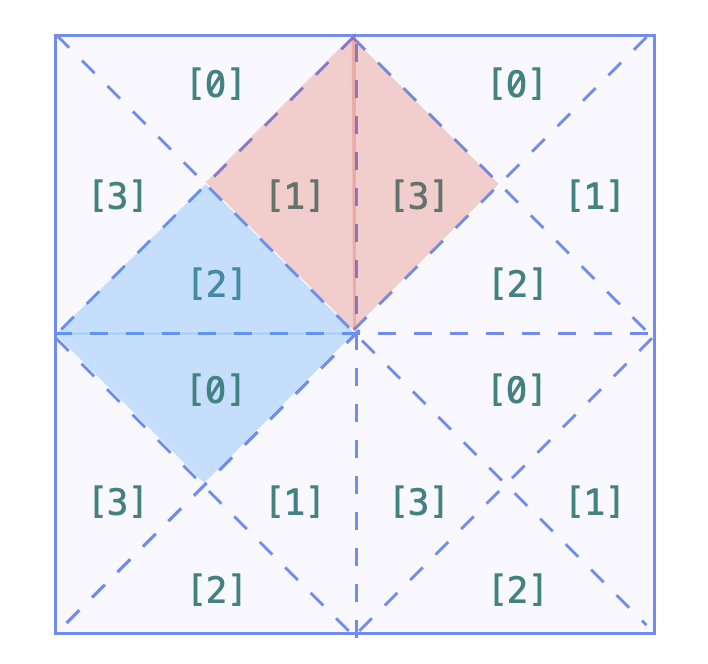

# Leetcode每日一题

题目来源：[力扣(Leetcode)官网](https://leetcode-cn.com/)

`代码链接在题目描述后，也可以通过题号来寻找`

## [959 由斜杠划分区域](https://leetcode-cn.com/problems/regions-cut-by-slashes/)

在由 1 x 1 方格组成的 N x N 网格 grid 中，每个 1 x 1 方块由 /、\ 或空格构成。这些字符会将方块划分为一些共边的区域。（请注意，反斜杠字符是转义的，因此 \ 用 "\\" 表示）。返回区域的数目。

**提示：**

1. `1 <= grid.length == grid[0].length <= 30`
2. `grid[i][j]` 是 `'/'`、`'\'`、或 `' '`。

[959代码](959.py)

[官方视频题解](https://leetcode-cn.com/problems/regions-cut-by-slashes/solution/you-xie-gang-hua-fen-qu-yu-by-leetcode-67xb/)

考察知识点：[并查集](#并查集DisjointSets)

「斜杠」、「反斜杠」把单元格拆分成的 2 个三角形的形态，在做合并的时候需要分类讨论。根据「斜杠」、「反斜杠」分割的特点，我们把一个单元格分割成逻辑上的 4 个部分。


我们须要遍历一次输入的二维网格 grid，在`单元格内`和`单元格间`进行合并。

* 单元格内：

如果是空格：合并 0、1、2、3；
如果是斜杠：合并 0、3，合并 1、2；
如果是反斜杠：合并 0、1，合并 2、3。

* 单元格间：

把每一个单元格拆分成 4 个小三角形以后，相邻的单元格须要合并，无须分类讨论。我们选择在遍历 grid 的每一个单元格的时候，分别`向右、向下`尝试合并。



`复杂度分析`

时间复杂度：$O(N^2logN)$。

空间复杂度：$O(N^2)$。


另一种解法


思路是如果斜杠的两个节点都在边缘这个集合里，那么它就闭合了，将空间一分为二。

## [1579. 保证图可完全遍历](https://leetcode-cn.com/problems/remove-max-number-of-edges-to-keep-graph-fully-traversable/)

Alice 和 Bob 共有一个无向图，其中包含 n 个节点和 3  种类型的边：

* 类型 1：只能由 Alice 遍历。

* 类型 2：只能由 Bob 遍历。

* 类型 3：Alice 和 Bob 都可以遍历。


给你一个数组 edges ，其中 edges[i] = [typei, ui, vi] 表示节点 ui 和 vi 之间存在类型为 typei 的双向边。请你在保证图仍能够被 Alice和 Bob 完全遍历的前提下，找出可以删除的最大边数。如果从任何节点开始，Alice 和 Bob 都可以到达所有其他节点，则认为图是可以完全遍历的。

返回可以删除的最大边数，如果 Alice 和 Bob 无法完全遍历图，则返回 -1 。


示例1：


> 输入：n = 4, edges = [[3,1,2],[3,2,3],[1,1,3],[1,2,4],[1,1,2],[2,3,4]]
> 输出：2
> 解释：如果删除 [1,1,2] 和 [1,1,3] 这两条边，Alice 和 Bob 仍然可以完全遍历这个图。再删除任何其他的边都无法保证图可以完全遍历。所以可以删除的最大边数是 2 。

示例2：


> 输入：n = 4, edges = [[3,1,2],[3,2,3],[1,1,4],[2,1,4]]
> 输出：0
> 解释：注意，删除任何一条边都会使 Alice 和 Bob 无法完全遍历这个图。

示例3：


> 输入：n = 4, edges = [[3,2,3],[1,1,2],[2,3,4]]
> 输出：-1
> 解释：在当前图中，Alice 无法从其他节点到达节点 4 。类似地，Bob 也不能达到节点 1 。因此，图无法完全遍历。

提示：

* 1 <= n <= 10^5
* 1 <= edges.length <= min(10^5, 3 * n * (n-1) / 2)
* edges[i].length == 3
* 1 <= edges\[i\]\[0\] <= 3
* 1 <= edges\[i\]\[1\] < edges\[i\]\[2\] <= n
* 所有元组 (typei, ui, vi) 互不相同


考察知识点：[并查集](#并查集DisjointSets)

[官方解题思路](https://leetcode-cn.com/problems/remove-max-number-of-edges-to-keep-graph-fully-traversable/solution/bao-zheng-tu-ke-wan-quan-bian-li-by-leet-mtrw/)

`思路与算法`

我们称类型 1, 2, 31,2,3 的边分别为「Alice 独占边」「Bob 独占边」以及「公共边」。

首先我们需要思考什么样的图是可以被 Alice 和 Bob 完全遍历的。对于 Alice 而言，她可以经过的边是「Alice 独占边」以及「公共边」，由于她需要能够从任意节点到达任意节点，那么就说明：

当图中仅有「Alice 独占边」以及「公共边」时，整个图是连通的，即整个图只包含一个连通分量。

同理，对于 Bob 而言，当图中仅有「Bob 独占边」以及「公共边」时，整个图也要是连通的。


由于题目描述中希望我们`删除最多数目的边`，这`等价于保留最少数目的边`。换句话说，我们可以从一个仅包含 nn 个节点（而没有边）的无向图开始，逐步添加边，使得满足上述的要求。

那么我们应该按照什么策略来添加边呢？直觉告诉我们，「公共边」的重要性大于「Alice 独占边」以及「Bob 独占边」，因为「公共边」是 Alice 和 Bob 都可以使用的，而他们各自的独占边却不能给对方使用。

「公共边」的重要性也是可以证明的：

> 对于一条连接了两个不同的连通分量的「公共边」而言，如果我们不保留这条公共边，那么 Alice 和 Bob 就无法往返这两个连通分量，即他们分别需要使用各自的独占边。因此，Alice 需要一条连接这两个连通分量的独占边，Bob 同样也需要一条连接这两个连通分量的独占边，那么一共需要两条边，这就严格不优于直接使用一条连接这两个连通分量的「公共边」了。

因此，我们可以遵从优先添加「公共边」的策略。

具体地，我们遍历每一条「公共边」，对于其连接的的两个节点：

* 如果这两个节点在同一个连通分量中，那么添加这条「公共边」是无意义的；

* 如果这两个节点不在同一个连通分量中，我们就可以（并且一定）添加这条「公共边」，然后合并这两个节点所在的连通分量。

这就提示了我们使用并查集来维护整个图的连通性，上述的策略只需要用到并查集的「查询」和「合并」这两个最基础的操作。

在处理完了所有的「公共边」之后，我们需要处理他们`各自的独占边`，而方法也与添加「公共边」类似。我们将当前的并查集复制一份，一份交给 Alice，一份交给 Bob。随后 Alice 不断地向并查集中添加「Alice 独占边」，Bob 不断地向并查集中添加「Bob 独占边」。在处理完了所有的独占边之后，如果这两个并查集都只包含一个连通分量，那么就说明 Alice 和 Bob 都可以遍历整个无向图。

`细节`

在使用并查集进行合并的过程中，我们每遇到一次失败的合并操作（即需要合并的两个点属于同一个连通分量），那么就说明当前这条边可以被删除，将答案增加 1。

## [1128. 等价多米诺骨牌对的数量](https://leetcode-cn.com/problems/number-of-equivalent-domino-pairs/)

给你一个由一些多米诺骨牌组成的列表 dominoes。

如果其中某一张多米诺骨牌可以通过旋转 0 度或 180 度得到另一张多米诺骨牌，我们就认为这两张牌是等价的。形式上，`dominoes[i] = [a, b]`和`dominoes[j] = [c, d]`等价的前提是 a=c 且 b=d，或是 a=d 且 b=c。在` 0 <= i < j < dominoes.length` 的前提下，找出满足`dominoes[i]`和`dominoes[j]`等价的骨牌对`(i, j)`的数量。

> 示例：
> 输入：dominoes = [[1,2],[2,1],[3,4],[5,6]]
> 输出：1

**提示：**

- `1 <= dominoes.length <= 40000`
- `1 <= dominoes[i][j] <= 9`

[1128代码](1128.py)

`解析`：

注意到每张牌都是二元组(x,y)，那么用10x+y就可以唯一确定，如果规定让小的为x，那么可以同时确定等价的多米诺骨牌。

接下来问题就是如何储存数量信息，可以使用`字典`，key为10x+y，value为个数。那么，我们最后的结果是要将大于1的value，进行$C_{value}^2$，然后相加。也可以使用`数组`

可以将value设为二元数组[i,j]，初次添加为[1,0]，然后每次更新都变为[i+1,i+j]，i是等价骨牌的数量，j是通过类似循环来计算$C_{value}^2$。也可以通过其他方式来计算。

`复杂度分析`

时间复杂度：$O(N)$。

空间复杂度：$O(1)$。因为实际上字典大小不会超过100。

## [724. 寻找数组的中心索引](https://leetcode-cn.com/problems/find-pivot-index/)

给定一个整数类型的数组 nums，请编写一个能够返回数组 “中心索引” 的方法。

我们是这样定义数组 中心索引 的：数组中心索引的左侧所有元素相加的和等于右侧所有元素相加的和。

如果数组不存在中心索引，那么我们应该返回 -1。如果数组有多个中心索引，那么我们应该返回最靠近左边的那一个。

> 示例1:
>
> 输入：
> nums = [1, 7, 3, 6, 5, 6]
> 输出：3
> 解释：
> 索引 3 (nums[3] = 6) 的左侧数之和 (1 + 7 + 3 = 11)，与右侧数之和 (5 + 6 = 11) 相等。
> 同时, 3 也是第一个符合要求的中心索引。
>
> 
>
> 示例2：
>
> 输入：
> nums = [1, 2, 3]
> 输出：-1
> 解释：
> 数组中不存在满足此条件的中心索引。

**提示**：

- `nums` 的长度范围为 `[0, 10000]`。
- 任何一个 `nums[i]` 将会是一个范围在 `[-1000, 1000]`的整数。


考察知识点：[前缀和](#前缀和)

`思路`

记数组的全部元素之和为total，当遍历到第 i 个元素时，设其左侧元素之和为sum，则其右侧元素之和为total-nums\[i\]-sum。左右元素相等即为2*sum+nums[i]=total。

当中心索引左侧或右侧没有元素时，即为零个项相加，这在数学上称作「空和」。在程序设计中我们约定「空和是零」。

`复杂度`:

- 时间复杂度：O(n)，其中 n为数组的长度。
- 空间复杂度：O(1)。


# 知识点目录

## 算法

- 基础技巧：分治、二分、贪心
- 排序算法：快速排序、归并排序、计数排序
- 搜索算法：回溯、递归、深度优先遍历，广度优先遍历，二叉搜索树等
- 图论：最短路径、最小生成树
- 动态规划：背包问题、最长子序列

## 数据结构

- 数组与链表：单 / 双向链表
- 栈与队列
- 哈希表
- 堆：最大堆 ／ 最小堆
- 树与图：最近公共祖先、并查集
- 字符串：前缀树（字典树） ／ 后缀树


# 相关知识点

## 并查集DisjointSets

### 定义

并查集，在一些有N个元素的集合应用问题中，我们通常是在开始时让每个元素构成一个单元素的集合，然后按一定顺序将属于同一组的元素所在的集合合并，其间要反复查找一个元素在哪个集合中。这一类问题近几年来反复出现在信息学的国际国内赛题中。

### 特点

并查集被很多OIer认为是最简洁而优雅的数据结构之一，主要用于解决一些**元素分组**的问题。它管理一系列**不相交的集合**，并支持两种操作：

- **合并**（Union）：把两个不相交的集合合并为一个集合。
- **查询**（Find）：查询两个元素是否在同一个集合中。

初始化每一个点都是一个连通域，类似下图：


由于支持这两种操作，一个不相交集也常被称为联合-查找数据结构（Union-find Data Structure）或合并-查找集合（Merge-find Set）。为了更加精确的定义这些方法，需要定义如何表示集合。一种常用的策略是为每个集合选定一个固定的元素，称为代表，以表示整个集合。接着，Find(x) 返回 x 所属集合的代表，而 Union 使用两个集合的代表作为参数。

### 应用：

#### 亲戚问题

>**题目背景**
>若某个家族人员过于庞大，要判断两个是否是亲戚，确实还很不容易，现在给出某个亲戚关系图，求任意给出的两个人是否具有亲戚关系。
>**题目描述**
>规定：x和y是亲戚，y和z是亲戚，那么x和z也是亲戚。如果x,y是亲戚，那么x的亲戚都是y的亲戚，y的亲戚也都是x的亲戚。
>**输入格式**
>第一行：三个整数n,m,p，（n<=5000,m<=5000,p<=5000），分别表示有n个人，m个亲戚关系，询问p对亲戚关系。
>以下m行：每行两个数Mi，Mj，1<=Mi，Mj<=N，表示Mi和Mj具有亲戚关系。
>接下来p行：每行两个数Pi，Pj，询问Pi和Pj是否具有亲戚关系。
>**输出格式**
>P行，每行一个’Yes’或’No’。表示第i个询问的答案为“具有”或“不具有”亲戚关系。

建立模型，把所有人划分到若干个不相交的集合中，每个集合里的人彼此是亲戚。为了判断两个人是否为亲戚，只需看它们是否属于同一个集合即可。

#### 并查集的引入

并查集的重要思想在于，**用集合中的一个元素代表集合**。一个有趣的比喻，把集合比喻成**帮派**，而代表元素则是**帮主**。

这是一个**树**状的结构，要寻找集合的代表元素，只需要一层一层往上访问**父节点**（图中箭头所指的圆），直达树的**根节点**（图中橙色的圆）即可。根节点的父节点是它自己。

#### 并查集代码流程

* 初始化

假如有编号为1, 2, 3, ..., n的n个元素，我们用一个数组fa[]来存储每个元素的父节点（因为每个元素有且只有一个父节点，所以这是可行的）。一开始，我们先将它们的父节点设为自己。

* 查询find

我们用递归的写法实现对代表元素的查询：一层一层访问父节点，直至根节点（根节点的标志就是父节点是本身）。要判断两个元素是否属于同一个集合，只需要看它们的根节点是否相同即可。

* 合并union

合并操作也是很简单的，先找到两个集合的代表元素，然后将前者的父节点设为后者即可。

* 路径压缩

既然我们只关心一个元素对应的**根节点**，那我们希望每个元素到根节点的路径尽可能短，最好只需要一步。在查询的过程中，**把沿途的每个节点的父节点都设为根节点**即可。

### 核心API

#### find

```python
def find(self, x):
    while x != self.parent[x]:
        x = self.parent[x]
    return x
```

递归实现

```python
def find(self, x):
    if x != self.parent[x]:
        self.parent[x] = self.find(self.parent[x])
        return self.parent[x]
    return x
```

（这里进行了路径的压缩）


#### connected

直接利用上面实现好的 find 方法即可。如果两个节点的祖先相同，那么其就联通。

```python
def connected(self, p, q):
    return self.find(p) == self.find(q)
```

#### union

将其中一个节点挂到另外一个节点的祖先上，这样两者祖先就一样了。也就是说，两个节点联通了。

```python
def union(self, p, q):
    if self.connected(p, q): return
    self.parent[self.find(p)] = self.find(q)
```

### 不带权并查集

平时做题过程，遇到的更多的是不带权的并查集。相比于带权并查集， 其实现过程也更加简单。

#### 带路径压缩的代码模板

```python
class UF:
    def __init__(self, n):
        self.parent = list(range(n))
        self.size = [1] * n
        # 当前连通分量数目
        self.cnt = n

    def find(self, x):
        if x != self.parent[x]:
            self.parent[x] = self.find(self.parent[x])
            return self.parent[x]
        return x
    def union(self, x,y):
        x, y = self.find(x), self.find(y)
        if x == y:
            return
        if self.size[x] < self.size[y]:
            x, y = y, x
        self.parent[y] = x
        self.size[x] += self.size[y]
        self.cnt -= 1
                      
    def connected(self, x, y):
        x, y = self.find(x), self.find(y)
        return x == y
```

### 带权并查集

实际上并查集就是图结构，我们使用了哈希表来模拟这种图的关系。 而上面讲到的其实都是有向无权图，因此仅仅使用 parent 表示节点关系就可以了。而如果使用的是有向带权图呢？实际上除了维护 parent 这样的节点指向关系，我们还需要维护节点的权重，一个简单的想法是使用另外一个哈希表 weight 存储节点的权重关系。比如 `weight[a] = 1 表示 a 到其父节点的权重是 1`。

如果是带权的并查集，其查询过程的路径压缩以及合并过程会略有不同，因为我们不仅关心节点指向的变更，也关心权重如何更新。比如：

```
a    b
^    ^
|    |
|    |
x    y
```

如上表示的是 x 的父节点是 a，y 的父节点是 b，现在我需要将 x 和 y 进行合并。

```
a    b
^    ^
|    |
|    |
x -> y
```

假设 x 到 a 的权重是 w(xa)，y 到 b 的权重为 w(yb)，x 到 y 的权重是 w(xy)。合并之后会变成如图的样子：

```
a -> b
^    ^
|    |
|    |
x    y
```

那么 a 到 b 的权重应该被更新为什么呢？我们知道 w(xa) + w(ab) = w(xy) + w(yb)，也就是说 a 到 b 的权重 w(ab) = w(xy) + w(yb) - w(xa)。

当然上面关系式是加法，减法，取模还是乘法，除法等完全由题目决定，我这里只是举了一个例子。不管怎么样，这种运算一定需要满足**可传导性**。

#### 带路径压缩的代码模板

这里以加法型带权并查集为例，讲述一下代码应该如何书写。

```python
class UF:
    def __init__(self, M):
        # 初始化 parent，weight
        self.parent = {}
        self.weight = {}
        for i in range(M):
            self.parent[i] = i
            self.weight[i] = 0

   def find(self, x):
        if self.parent[x] != x:
            ancestor, w = self.find(self.parent[x])
            self.parent[x] = ancestor
            self.weight[x] += w
        return self.parent[x], self.weight[x]
    def union(self, p, q, dist):
        if self.connected(p, q): return
        leader_p, w_p = self.find(p)
        leader_q, w_q = self.find(q)
        self.parent[leader_p] = leader_q
        self.weight[leader_p] = dist + w_q - w_p
    def connected(self, p, q):
        return self.find(p)[0] == self.find(q)[0]
```

### 总结

如果题目有连通，等价的关系，那么你就可以考虑并查集，另外使用并查集的时候要注意路径压缩，否则随着树的高度增加复杂度会逐渐增大。

对于带权并查集实现起来比较复杂，主要是路径压缩和合并这块不一样，不过我们只要注意节点关系，画出如下的图：

```
a -> b
^    ^
|    |
|    |
x    y
```

就不难看出应该如何更新。

## 前缀和

什么是`前缀和`？

前缀和是一个数组的某项下标之前(包括此项元素)的所有数组元素的和

|            |                     定义式                      |                      递推式                       |
| :--------: | :---------------------------------------------: | :-----------------------------------------------: |
| 一维前缀和 |           $b[i]=\sum_{j=0}^{i} a[j]$            |                $b[i]=b[i-1]+a[i]$                 |
| 二维前缀和 | $b[x][y]=\sum_{i=0}^{x} \sum_{j=0}^{y} a[i][j]$ | $b[x][y]=b[x-1][y]+b[x][y-1]-b[x-1][y-1]+a[x][y]$ |

### 一维前缀和

根据上述表达式我们可以以`O(1)`求出`区间[i,j]的区间和 `

```python
# 建立	pre[i]是i及之前nums之和
pre = [0]
for num in nums:
    pre.append(pre[-1] + num)
pre = pre[1:]
#  使用，等价于 nums[i] + nums[i + 1] + ... + nums[j]
pre[j] - pre[i-1] 
```

### 二维前缀和

```python
m,n = len(matrix), len(matrix[0])
# 建立
pre = [[0 for _ in range(n + 1)] for _ in range(m + 1)]

for i in range(1, m+1):
    for j in range(1, n+1):
        pre[i][j] = pre[i-1][j]+ pre[i][j-1] - pre[i-1][j-1] + matrix[i-1][j-1]
pre = pre[1:][1:]
# 使用，等价于以(x1,y1)为矩阵左上角以(x2,y2)为矩阵右下角的所有格子的和
# x,y从0起始
pre[x2][y2] + pre[x1-1][y1-1] - pre[x1-1][y2] - pre[x2][y2-1]
```

