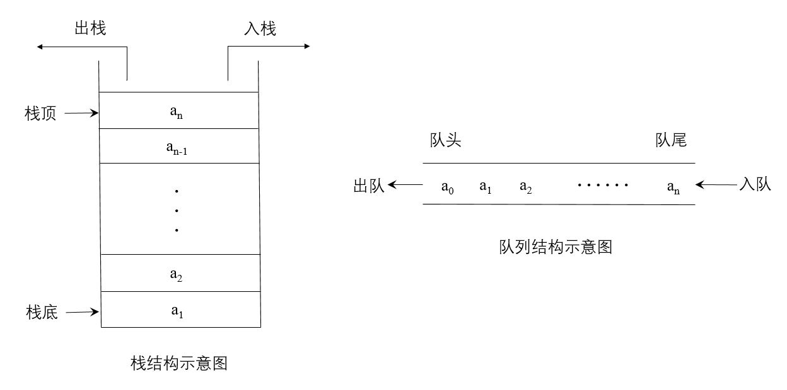
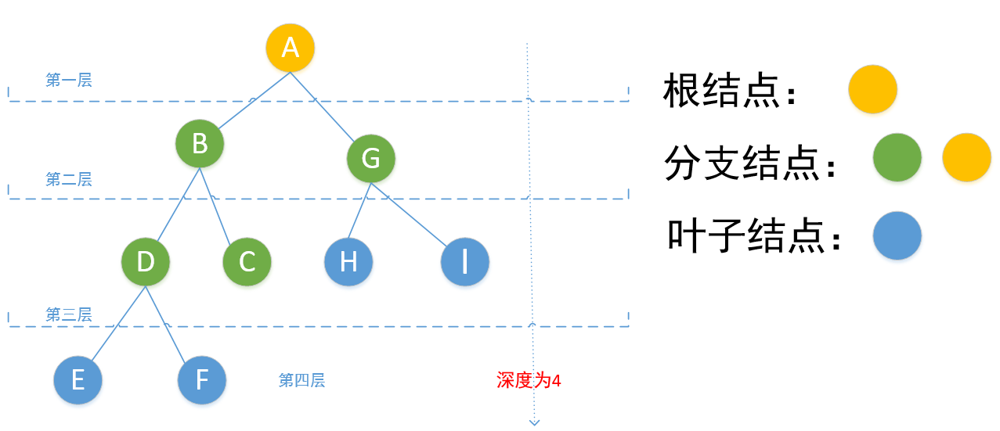

# 一、面试所需

## 面试素质

* 扎实的基础知识
* 能写高质量的代码
* 分析问题思路清晰
* 优化时间空间效率
* 学习沟通能力
* 良好的代码风格
* 提高**数学能力**

## 注意事项

* 初级程序员注重**算法**和**数据结构**；
* 事先做好准备，对工作有热情；
* 面试过程放松。多问问题，做整体的设计和规划。
* 不要急于提交，自己多测试几个用例；
* 项目介绍原则：STAR、situation、task、action、result。

## 高质量代码

* 代码的**规范性**：**清晰的书写、清晰的布局、合理的命名**；
* 代码的**完整性**：

> 检查代码是否完成了基本功能
>
> 输入边界值是否能得到正确的输出
>
> 是否对各种不合规范的非法输入做出了合理的错误处理。
>
> 从**功能测试、边界测试、负面测试**3个方面设计测试用例。

* 代码的**鲁棒性**：采取防御性编程、处理无效的输入

## 解决面试题的思路

>* 画图
>* 举例
>* 分解

## 优化时间和空间效率

* 编程习惯对代码的时间效率有很大影响。避免重复操作、避免不必要的临时实例；
* 同一个算法用递归和循环实现的时间效率会大不一样。可以用递归的思路来分析问题，写代码的时候可以用数组来保存中间结果基于循环实现。
* 代码的时间效率还体现应聘者对数据结构和算法功底的掌握程度。
* 需要有激情、有耐心地去尝试新的思路，而不是碰到难题就退缩。

**降低时间复杂度的方法**

* 改用更高效的算法；
* 用空间换取时间。

## 面试能力

> "应聘者能够礼貌平和、不卑不亢地和面试官交流，逻辑清晰、详略得当地介绍自己及项目经历，谈论题目时能够发现问题的细节并向面试官询问，这些都是比较好的沟通表现。"
>
> "沟通、学习能力就是看面试者能否清晰、有条理地表达自己，是否会在自己所得到的信息不足地情况下主动发文澄清，能否在得到一些暗示之后迅速做出反应纠正错误。"

* **沟通能力**：无论是在介绍项目经验还是在介绍解题思路的时候，都需要逻辑清晰明了，语言详略得当，表述的时候重点突出、观点明确；
* **学习能力**：计算机是一门更新速度很快的学科，每年都有新的技术不断涌现。

> 面试官一般有两种方法来考察应聘者的学习能力。
>
> 1.询问应聘者最近在看什么书或者在做什么项目、从中学到了哪些新技术。
>
> 2.抛出一个新概念，接下来观察应聘者能不能在较短时间内理解这个新概念并解决相关的问题。

* **善于提问**：学习能力强的人具有积极主动的态度，对未知领域有强烈的求知欲望。
* **知识迁移能力**：根据已经掌握的知识、技术，能够迅速学习、理解新的技术并运用到实际工作中去。
* **抽象建模能力**：把各种现实问题抽象成数学模型并且用计算机的编程语言表达出来。
* **发散思维能力**：发散思维的特点是思维活动的多向性和变通性，注重运用多思路、多方案、多途径来解决问题。对于同一个问题，可以从不同的方向、侧面和层次，采用探索、转化、迁移、组合和分解等方法，提出多种创新的解法。

## 面试流程

第一轮	简历面试

面试官对照简历了解应聘者的项目经历及掌握的技能开始。

应聘者介绍自己的项目经历时，着重介绍自己完成的工作(包括基于什么平台、用了哪些技术、实现了哪些算法)，以及最终对项目组的贡献。

第二轮	技术面试

面试官从编程语言、数据结构和算法等方面考察应聘者的基础知识是否扎实全面。

关注应聘者的沟通能力和学习能力，有可能考察应聘者的知识迁移能力、抽象建模能力和发散思维能力。

应聘者要从基本功能、边界条件、错误处理等方面确保代码的完整性和鲁棒性。

尝试画图让抽象的问题变得形象化，尝试举几个例子来分析隐含的规律，尝试将大的问题分解成两个或者多个小问题再递归地解决小问题。

从时间复杂度和空间复杂度两个方面选择最优的解法。

最后一轮	

面试官会给应聘者机会问几个最感兴趣的问题。

应聘者可以从当前招聘的项目及其团队等方面提出几个问题。

# 二、面试题

## 1:找出数组中重复的数字

> Tips:数组
>
> Python中没有数组的数据结构，但是列表和数组很像。代码经常用列表来表示有序数组


> 在一个长度为n的数组里所有数字都在0～n-1的范围内。数组中某些数字是重复的，但不知道有几个数字重复了，也不知道每个数字重复了几次。请找出数组中任意一个重复的数字。
>
> 
>
> eg：如果输入长度为7的数组{2,3,1,0,2,5,3}，那么对应的输出是重复的2或者3。
>
> 
>
> solution1：把输入的数组排序，从头到尾扫描找出重复数字。排序的时间复杂度O(nlogn)。
>
> 
>
> solution2：利用哈希表，从头到尾扫描每个数字，用O(1)时间判断哈希表是否已经包含该数字。如果没有就加入。时间复杂度为O(n)，空间复杂度O(n)，为哈希表的大小。
>
> 
>
> solution3:从头到尾依次扫描数组中的每个数字，当扫描到下标为i的数字时，比较该数字（设为m）是否等于i。如果不是，拿它和第m个数字进行比较。相等就找到重复数字，不相等就交换第i个数字和第m个数字。继续重复比较。
> 尽管有一个两重循环，每个数字最多交换2次，时间复杂度O(n)，空间复杂度O(1)。

## 2:不修改数组找出重复的数字

> 在一个长度为n+1的数组里所有数字都在1～n的范围内。请找出数组中任意一个重复的数字，但不能修改输入的数组。
>
> 
>
> eg：如果输入长度为8的数组{2，3，5，4，3，2，6，7}，那么对应的输出是重复的2或者3。
>
> 排序和哈希表都需要额外的O(n)的辅助空间。
> 看起来在某个范围内数字的个数对解决问题很重要。
>
> 
>
> solution:（类似二分查找）将1～n从中间m分开，1～m和m+1～n。统计1～m在数组中出现的次数，超过m说明这里面有重复元素；另一边同理。继续重复二分操作，直到单个元素出现次数大于1。
> 二分查找的思路，countRange将被调用O(logn)次，每次需要O(n)时间，总的时间复杂度为O(nlogn)，空间复杂度为O(1)。

## 3:二维数组查找

> 在一个二维整数数组中，每一行都按照从左到右递增的顺序排序，每一列都按照从上到下递增的顺序排序。请实现函数判断数组中是否含有某整数。
>
> eg：
> 1 2 8 9
> 2 4 9 12
> 4 7 10 13
> 6 8 11 15
> 查找数字7，返回true；查找数字5，返回False。
>
> solution：(从边角位置出发寻找)首先选取数组右上角的数字。如果该数字等于查找数，则结束；如果该数字大于要查找的数，剔除该数字所在列；如果该数字小于要查找的数，则剔除该数字所在行。如此直到找到要查找的数字。
> 同样，也可以选取左下角的数字。但不能选择左上角数字或者右下角数字。

## 4:把字符串中的空格替换成'20%'。

> eg:输入“We are happy"，则输出"We%20are%20happy."


> solution1:使用Python字符串的内置函数

```python
"We are happy".replace(' ','%20')
```

> solution2:使用正则表达式

```python
import re
str = re.compile(' ')
str.sub('%20','We are happy')
```

## 5:从尾到头打印链表

> Tips：链表
>
> 在Python中，没有指针的概念，而类似指针的功能都是通过引用来实现的，为了方便理解，我仍使用指针来进行描述，而在实现的代码中，都是通过引用来建立结点之间的关系。
>
> 单链表数据结构的定义实例

```python
class LNode:
	def __init__(self,x):
		self.data = x
		self.next = None
```

>  单链表有两种形式，第一种头节点是空的，第二种头节点的值就是第一个实际值
>
> 构造单链表,head为空的头节点（Pyhton3无法创立空的，所以赋值为0，第一个实际值是head.next
>
> 直接使用head就是头节点为空的单链表，使用head.next就是头节点为第一个值的单链表
> 带头节点单链表的意思就是第一种，不带头节点单链表是第二种


> 输入一个链表的头节点，从尾到头反过来打印每个节点的值。
>
> eg: 1->2->3->4->5->6->7->8；打印为8 7 6 5 4 3 2 1

>如果把链表中的链接节点的指针反转过来，改变链表的方向，就可以从头到尾输出了。但会改变链表结构。通常打印是一个只读操作，我们不希望打印时改变内容，假设要求不能改变链表结构。（**翻转栈**后续会遇到）
>
>solution1:第一个遍历到的节点最后一个输出，而最后一个遍历到的节点第一个输出。典型的“后进先出”。使用**栈**实现这种顺序。
>
>实现栈可以用数组、链表实现。（**实现栈**在后续会遇到）
>
>栈这里先使用数组简单模拟。只有入栈和出栈操作。

```python
def print_list(head):
    stack = []
    while head != None:
        stack.append(head.data)
        head = head.next
    print('打印列表:',end = " ")
    while len(stack) > 0:
        print(stack.pop(),end = " ")
    print('\n')
```

> solution2:既然想到了递归，递归本质上是一种栈结构。每访问一个节点，先递归输出它后面的节点，再输出该节点自身。

## 6.重建二叉树

> 输入某二叉树的前序遍历和中序遍历的结果，请重建该二叉树，假设输入的前序遍历和中序遍历的结果中都不包含重复的数字。
>
> eg：输入前序遍历序列{1,2,4,7,3,5,6,8}和中序遍历序列{4,7,2,1,5,3,8,6}则重建如下二叉树并输出它的头结点。
>
> ​		      1
>
> ​	2		|			3
>
> 4			|	5	   |  	6
>
> ​	7        |             |  8

> solution:前序遍历的第一个数字1就是根节点的值，找到中序遍历中根节点的位置，左边为左子树，右边为右子树。可以用同样的方法继续进行，下面可以用递归来实现。

## 7.二叉树的下一个节点

> 给定一颗二叉树和其中的一个节点，如何找出中序遍历序列的下一个节点？树中的节点除了有两个分别指向左、右子节点的指针，还有一个指向父节点的指针。
>
> eg：图中二叉树的中序遍历是{d,b,h,e,i,a,f,c,g}
>
> ​		         a
>
> ​	b		   |		c
>
> d  |	e	 |	f	 	g
>
> ​	|h     i   |             

> solution:
>
> 如果节点有右子树，那么它的下一个节点就是它的右子树中最左节点。例如，(a,f)、（b,h）。
>
> 如果节点没有右子树，如果节点是它父节点的左子节点，那么它的下一个节点就是它的父节点，例如，（d,b）、（f,c）。
>
> 如果节点既没有右子树，并且是父节点的右子节点，需要沿着指向父节点的指针一直向上遍历，直到找到一个是它父节点的左子节点的节点。

## 8.实现栈

> 实现栈的数据结构，使其具有以下方法：压栈、弹栈、取栈顶元素、判断栈是否为空以及获取栈中元素个数。
>
> 用**数组、链表**两种方式来实现。
>
> 数组实现时，可以利用数组自带的append()和pop()方法；链表实现时，采用带头结点的链表，头结点是钉子，下面依次挂着挂钩，压栈从最上面增加挂钩，弹栈从最上面取出挂钩。

## 9.实现队列

>实现一个队列的数据结构，使其具有入队列、出队列、查看队列首尾元素、查看队列大小等功能。
>
>用**数组、链表**两种方式来实现。

## 10.斐波那契数列

> 写一个函数，输入n，求斐波那契数列的第n项。

> solution
>
> 使用递归或者循环
>
> 递归的优缺点见**递归和循环**
>
> 使用递归时，n=100时，代码运行明显会出现障碍，而使用循环则没有影响。
>
> 本题循环实现时，使用了Python**生成器**
>
> yield和return功能类似，都会返回函数数值，但yield在返回值后，代码并没有结束，而是在此处中断，在调用send()或者next()方法后，yield可继续执行。


> 相似试题：
>
> 青蛙跳台阶
>
> 一只青蛙一次可以跳上1级台阶，也可以跳上2级台阶。求该青蛙跳上一个n级台阶总共有多少种跳法。

## 11.冒泡排序

> **原理**：
>
> 如果需要将数组**从小到大**重新排序，那么**从头到尾**开始下面的比较操作：
>
> 1. 从头部开始比较相邻的两个元素，如果前面的元素大于后面的元素，交换位置；
> 2. 往前对每组相邻元素做这样的比较、交换操作，这样保证最后一个是最大的元素；
> 3. 重新从头部开始这样的操作，除了在此之前排好的元素；
> 4. 继续操作，直到没有可比较的数据为止。
>
> **从大到小**需要**从尾到头**进行操作。
>
> 
>
> **特点及性能**
>
> 在最坏的情况下，每次比较之后都需要交换位置，所以**时间复杂度为O($n^2$)**。
>
> 在最好的情况下，**时间复杂度为O(n)**。
>
> **平均时间复杂度为O($n^2$)**
>
> 对于**空间复杂度**来说，冒泡排序用到的额外的存储空间只有一个，就是用于交换位置的临时变量，所以**空间复杂度为O(1)**。
>
> 
>
> **适用场景**
>
> 面试，应用中不会使用

## 12.快速排序

> **原理**
>
> 快速排序是对冒泡排序的一种改进，基本思想是：通过一趟排序将要排序的数据分割成独立的两部分，其中一部分的所有数据比另一部分的所有数据要小，再按照这种方法对两部分的数据分别进行快速排序，整个排序过程可以递归进行，使整个数据变成有序序列。（**分治法**）
>
> 1. 从数组中选择一个**基准数**，一般为头尾的数，这里取第一个数
> 2. 首先从数组的**右边开始往左边找**，设下标为j，进行减减操作，找到第1个比基准数小的值，将它与基准值交换；接着从数组的**左边开始往右边找**，设下标为i，进行加加操作，找到第1个比基准数大的值，将它与基准值交换；如此交替，直到i与j相遇，最后基准值所在的位置就是 k 的位置，也就是说 k 左边的值均比 k 上的值小，而 k 右边的值都比 k 上的值大。
> 3. 接下来就是以 k 为分界线，分为两部分，然后在左右两部分分别执行上述排序操作。
>
> 
>
> **特点及性能**
>
> 最坏情况下的**时间复杂度**和冒泡排序一样，是 O($n^2$)。
>
> **平均时间复杂度为O($nlogn$)**进行排序，所以所占用的空间应该是常量级的，但是由于每次划分之后是递归调用，所以递归调用在运行的过程中会消耗一定的空间。
>
> 在一般情况下，**空间复杂度为 O($logn$)**，在最差的情况下，若每次只完成了一个元素，那么空间复杂度为 O(n)。所以我们一般认为快速排序的空间复杂度为 O($logn$) 。
>
> 快速排序基本上被认为是相同数量级的所有排序算法中，**平均性能最好**的。
>
> 
>
> 各大语言标准库的排序函数也基本都是基于快排实现的。

## 13.插入排序

> **原理**
>
> 每一步将一个待排序的数据插入到前面已经排好序的有序数列中，直到插完所有元素为止。
>
> 
>
> **特点及性能**
>
> 插入排序本身比较简洁，容易实现，该算法的时间复杂度为O($n^2$)。

## 14.归并排序

> **原理**
>
> 归并排序，是创建在归并操作上的一种有效的排序算法。算法是采用分治法（Divide and Conquer）的一个非常典型的应用，且各层分治递归可以同时进行。
>
> 归并排序是用分治思想，分治模式在每一层递归上有三个步骤：
>
> * **分解（Divide）**：将n个元素分成个含n/2个元素的子序列；
> * **解决（Conquer）**：用合并排序法对两个子序列递归的排序。
> * **合并（Combine）**：合并两个已排序的子序列已得到排序结果。
>
> [更具体原理](https://zhuanlan.zhihu.com/p/124356219)
>
> **特点及性能**
>
> 不管元素在什么情况下都要做这些步骤，所以花销的时间是不变的，所以该算法的最优时间复杂度和最差时间复杂度及平均时间复杂度都是一样的为：O( $nlogn$ )。
>
> 归并的空间复杂度就是那个临时的数组和递归时压入栈的数据占用的空间：n + logn；所以空间复杂度为: O(n)。
>
> 归并排序思路简单，速度仅次于快速排序，为**稳定排序算法**，一般用于对总体无序，但是各子项相对有序的数列。

## 15.特定要求下的排序

> 在面试时，如果面试官要求实现一个排序算法，那么应聘者一定要问清楚这个排序应用的环境是什么，有哪些约束条件，得到足够多的信息之后，再选择最合适的排序算法。
>
> * 面：请实现一个算法，要求时间效率为$O(n)$。
> * 应：对什么数字进行排序，有多少个数字？
> * 面：想对公司所有员工的年龄排序。我们公司总共有几万名员工。
> * 应：也就是说数字的大小在一个较小的范围之内是吧。可以使用辅助空间吗？
> * 面：只允许使用常量大小辅助空间，不得超过$O(n)$。
>
> 上述关键信息：**需排序的数字在一个较小范围内，可以使用辅助内存**。重复数字较多。
>
> 
>
> solution：公司员工的年龄有一个范围，可以设置为0~99。然后，用数组来统计每个年龄出现的次数，相当于给数组ages排序了，该方法用长度为100的整数数组作为辅助空间换来了$O(n)$的时间效率。

## 16.旋转数组的最小数字

> 把一个数组最开始的若干个元素搬到数组的末尾，我们称之为数组的旋转。输入一个递增排序的数组的一个旋转，输出旋转数组的最小元素。
>
> 
>
> eg:数组{3，4，5，1，2}为{1，2，3，4，5}的一个旋转，该数组的最小元素为1。
>
> 
>
> solution：从头到尾遍历的时间复杂度为$O(n)$，但是没有利用旋转数组的特性。那么，很容易就想到使用二分查找实现$O(logn)$的查找。
>
> 使用二分查找时，一般使用两个指针作为辅助。本题更要注意的是数组取特殊情况时，比如{3}，数组未旋转，[1,0,1,1,1]，[1,1,1,0,1]

## 17.矩阵中的路径

> 请设计一个函数，用来判断在一个矩阵中是否存在一条包含某字符串所有字符的路径。路径可以从矩阵中的任意一格开始，每一步可以在矩阵中向左、右、上、下移动一格。如果一条路径经过了矩阵的某一格，那么该路径不能再次进入该格子。
>
> 
>
> eg：在下面的矩阵中包含一条字符串'bfce'的路径，但不包含字符串'abfb'的路径。
>
> a	<u>b</u>	t	g
>
> c	<u>f</u>	<u>c</u>	s
>
> j	d	<u>e</u>	h
>
> 
>
> solution:这是一个用`回溯法`解决的经典问题。首先，在矩阵中任选一个格子作为路径的起点。假设矩阵中某个格子的字符为ch，并且这个格子对应于路径上的第i个字符。
>
> 如果路径上的第i个字符不是ch，那么这个格子不可能处在路径上的第i个位置。如果路径上的第i个字符正好是ch，那么到相邻的格子寻找路径上的第i+1个字符。除矩阵边界上的格子之外，其他格子都有4个相邻的格子。重复这个过程，直到路径上的所有字符都在矩阵中找到相应的位置。

## 18.机器人的运动范围

> 地上有一个m行n列的方格。一个机器人从坐标(0,0)的格子开始移动，它每次可以向左、右、上、下移动一格，但不能进入行坐标和列坐标的数位之和大于k的格子。
>
> 请问该机器人能够到达多少个格子。
>
> 
>
> eg：当k为18时，机器人能够进入方格(35,37)，因为3+5+3+7=18。但它不能进入方格(35,38)，因为3+5+3+8=19。
>
> 
>
> solution：`回溯法`。
>
> 功能测试：多行多列，k为正数；一行或一列；k=0；k为负数

## 19.剪绳子

> 给你一根长度为n的绳子，请把绳子剪成m段(m、n都为大于1的整数)，每段绳子的长度记为k[0],k[1],……,k[m]，请问k[0]\*k[1]\*……\*k[m]可能的最大乘积是多少？
>
> 
>
> eg：绳子的长度为8时，剪成2、3、3的三段，此事得到的最大乘积时18。
>
> 绳子长度为20时，最大乘积为1458。
>
> 
>
> solution1:常规的需要O($n^2$)时间和O(n)空间的动态规划的思路
>
> 定义函数f(n)为把长度为n的绳子剪成若干段后各段长度乘积的最大值。剪第一刀的时候，我们有n-1种可能的选择，因此，f(n)=max(f(i)*f(n-i))。
>
> 考虑递归的重复计算，思考如何避免大量不必要的重复计算。
>
> tips:从下而上
>
> 
>
> solution2:O(1)时间和空间的贪婪算法。
>
> 增加一种策略，使得到的各段绳子的长度的乘积将最大：
>
> 当n>=5时，尽可能多的剪长度为3的绳子；当剩下的绳子长度为4时，把绳子剪成两段长度为2的绳子。
>
> 证明：
>
> n大于5时，可以证明$3(n-3)>=2(n-2)>n$。
>
> 比如n为16时，由于16肯定不是最大乘积，那么尽可能的多取3出来，但是最后多于了4，由于多取3是在大于5时候的策略，4的时候发现4为最优值。


> 题目本身的小bug，没要求k[i]为正整数。如果将这个bug作为条件。
>
> 那么，长度为8时，最大乘积不是18，而是${ (\frac{8}{3}})^3 >18$
>
> 通过组合学中的柯西不等式，当段数确定时，总是均匀分布时，乘积为最大。
>
> 那么我们就要确定段数，通过简单的计算，n大于3时，段数为$[\frac{n}{e}]$附近的整数时，再取均匀分布就可以取到最大乘积。
>
> (感兴趣可以自行编程实现)

## 20.二进制中的1的个数

> 请实现一个函数，输入一个整数，输出该数二进制表示中1的个数。
>
> 
>
> eg：把9表示成二进制是1001，有2位是1。因此，函数输出位2.
>
> 
>
> solution：使用位运算(基础概念见-算法与数据结构)
>

```python
def count1(n):
	count = 0
	while(n):
		if n&1:
			count += 1
			n >>= 1
	return count
```

> * 把整数右移一位和把整数除以2在数学上是等价的，那么代码两种都可以使用吗？
>
> * 如果输入的是个负数，会发生什么情况呢？
>
> 除法的效率要比移位运算低得多，实际编程中应尽可能地用移位运算符代替乘除法。
>
> 上面的代码在输入负数的时候，右移一位时，为了保证移位后是一个负数，因此移位后的最高位会设为1，那么就会陷入死循环。

```python
def count2(n):
    if n < 0:
        s = bin(n & 0xffffffff)
    else:
        s = bin(n)
    return s.count('1')
```

```python
def count3(n):
	count = 0
	while n:
		count += 1
		n = (n-1)&n
	return count
```

> 把一个整数减去1，再和原来的整数做**与**运算，会把该整数二进制最右边的1变成0。一个整数的二进制表示中有多少个1，就可以进行多少次这样的操作。

## 21.数值的整数次方

> 实现函数power(base,exponent)，求base的exponent次方。不得使用库函数，同时不需要考虑大数问题。(exponent为整数)
>
> 错误示例：

```python
def power(base,exponent):
	result = 1
    for i in range(1,exponent):
        result *= base
    return result
```

> 上述代码没有考虑输入的指数(exponent)小于1的时候。
>
> **全面但不够高效的解法**
>
> 当指数为负数的时候，先对指数求绝对值，算出次方的结果后再取倒数。底数为0且指数为负数的时候需要特殊处理。如何告诉函数调用者出现了这种情况，可以使用三种方法：**返回值、全局变量、异常**。
>
> 0的0次方在数学上是没有意义的，因此无论输出0或1都可以接受。
>
> **既全面又高效的解法**
>
> 如果指数为32，那么只需要在16次方基础上平方一次。
>
> 也就是说，可以用如下公式求a的n次方。

$$
a^{n}=\begin{cases}
a^{n/2}\cdot a^{n/2} &n为偶数
 \\
a^{(n-1)/2}\cdot a^{(n-1)/2}&n为奇数
\end{cases}
$$

> 这个公式用$O(logn)$时间的时间效率解决了问题，可以用递归来实现。
>
> 极致效率：用右移运算符代替除以2，用位与运算符代替求余运算符。

## 22.打印从1到最大的n位数

> 输入数字n，按顺序打印出从1到最大的n位十进制数。比如输入3，则打印出1、2、3一直到最大的三位数999。
>
> 错误示例：

```python
def SpecialPrint(n):
    n = 1
    i = 0
    while (i < n ):
        n* = 10
    for i in range(1,n):
        print(i)
```

> 当n很大的时候，用什么数值类型都会溢出，也就是要考虑大数问题。
>
> **在字符串上模拟数字加法的解法**
>
> 最常用也是最容易的办法是用字符串或者数组表示大数。
>
> 最直观的办法，字符串的每个字符都是'0'~'9'之间的某一个字符。当实际数字不够n位时，在字符串的前半部分补0。
>
> 首先将字符串中的每一个数字都初始化为‘0’，然后每一次将表示加1，在打印出来。
>
> 因此，我们只需要做两件事：
>
> 一是在字符串表达的数字上模拟加法，二是把字符串表达的数字打印出来。

## 23.表示数值的字符串

> 请实现一个函数用来判断字符串是否表示数值(包括整数和小数)。
>
> 
>
> eg：字符串"+100"、"5e2"、"-123"、"3.1416"和"-1E-16"都表示数值，但"12e"、"1a3.14"、"1.2.3"、"+-5"、"12e+5.4"都不是。
>
> 
>
> solution：表示数值的字符串遵循模式A\[.\[B\]\]\[e|EC\]或者.\[B\]\[e|EC\]。
>
> A表示整数，B表示小数，C表示指数部分。如果没有整数部分，小数部分不能为空。
>
> A和C都是可能以+-开头的0~9的数位串；B也是0~9的数位串，但不能有正负号。

## 24.调整数组顺序使得奇数位于偶数前面

> 输入一个整数数组，实现一个函数来调整该数组中数字的顺序，使得所有奇数位于数组的前半部分，所有偶数位于数组的后半部分。
>
> solution1：
>
> 最简单的方法就是，从头扫描数组，每碰到一个偶数，将这个数放在队尾，并把后面所有数字往前移动一位。但总的时间复杂度为$O(n^2)$。
>
> solution2：
>
> 扫描这个数组的时候，发现有偶数在奇数的前面，就交换他们的顺序。
>
> 可以用两个指针分别从开始和结尾向中间移动，直到相遇。

>本题虽然非常简单，但是还需要能够考虑可拓展的解法：
>
>* 将题目改成所有负数在正数前面；
>* 能被3整除的数都在不能被3整除的数前面
>* ……
>
>要解决这个问题，只需要修改函数中的两处判断标准，大的逻辑框架完全不需要动。
>
>将函数拆分成两部分：
>
>一是判断数字应该在前半部分还是后半部分；二是拆分数组的操作。

## 25.数组中出现次数超过一半的数字

> 数组中有一个数字出现的次数超过数组的一半，请找出这个数字。
>
> 
>
> eg：输入一个长度为9的数组{1,2,3,2,2,2,5,4,2}。由于数字2在数组中出现了5次，因此输出2.
>
> 
>
> solution1：如果是排好序的数组，那么就能很容易统计出每个数字出现的次数。排序的时间复杂度为$O(nlogn)$。但是效率不会很高。
>
> 
>
> solution2：前面解法没有考虑数组的特性：**一个数字出现的次数超过了数组长度的一半**。也就是统计学上的中位数。我们有成熟的时间复杂度为$O(n)$的算法得到数组中任意第k大的数字。
>
> 这种算法收快速排序算法的启发，随机选择一个数字，然后调整数组中数字的顺序，使得比选中的数字小的数字都排在它的左边，比选中数字大的数字都排在它的右边。
>
> 
>
> solution3：从数组角度来解决这个问题：数组中一个数字出现的次数超过数组长度的一半，也就是说它出现的次数比其他所有数字出现的次数的和还要多。因此，可以考虑在遍历数组的时候保存两个值：一个是数组中的一个数字；另一个是次数。
>
> 遍历到下一个数字的时候，如果下一个数字和我们保存的数字相同，则次数加一；如果下一个数字和保存的不同，则次数减一。如果次数为0，那么需要保存下一个数字，并把次数设为1。可以肯定，最后留下来的数字就是所要找的数字。

## 26.连续子数组的最大和

> 输入一个整型数组，数组里有正数也有负数。数组中的一个或连续多个整数组成一个子数组。求所有子数组的和的最大值。要求时间复杂度$O(n)$。
>
> 
>
> eg：输入的数组为{1,-2,3,10,-4,7,2,-5}和最大的子数组为{3,10,-4,7,2}
>
> 
>
> solution1：**举例分析数组规律**
>
> 初始化和为0。1为1，1、-2为-1，1、-2、3为2；但是之前累加的和小于0，因此会比3小，即第一个数字开始的和会小于从第三个数字开始的子数组的和。因此，之前可以被抛弃。
>
> 3为3，3、10为13，3、10、-4为9；此处要把13存储起来；3、10、-4、7为16；更新13为16；再加2为18，更新16为18，最后加上-5变小，遍历结束，最终最大和为18。
>
> solution2：**应用动态规划**
>
> 如果用函数f(i)来表示以第i个数字结尾的子数组的最大和，那么就要求出max[f(i)]，利用如下递归公式：
> $$
> f\left( i \right) = \left\{ {\begin{array}{*{20}{c}}
> {pData[i]}\\
> {f(i - 1) + pData[i]}
> \end{array}\begin{array}{*{20}{c}}
> {}&{\begin{array}{*{20}{c}}
> {i = 0、f(i - 1) \le {\rm{0}}}\\
> {i \ne 0、f(i - 1) > 0}
> \end{array}}
> \end{array}} \right.
> $$
> 虽然用递归的方式分析动态规划问题，但最后都会基于循环去编码。

## 27.1-n整数中1出现的次数

> 输入一个整数n。求1~n这n个整数的十进制表示中1出现的次数。
>
> 
>
> eg：输入12，1·12这些整数中包含1的数字有1、10、11和12，1一共出现5次。
>
> 
>
> solution1：**低效率解法**：不推荐
>
> 累加整数1出现的次数，可以对10求余数判断整数的个位数是否为1，如果还大于10就继续判断。
>
> 时间复杂度为$O(nlogn)$。
>
> 
>
> solution2：**基于数学规律**
>
> 如果不希望计算每个数字的1的个数，那就只能去寻找1在数字中出现的规律了。
>
> 拿一个大数为例：21345
>
> 我们希望将问题转化为**排列组合**问题，比如：一个四位数(xxxx)，每位上可取0至9，求1出现的次数。
>
> 可以用组合加法：$1*C_4^1*9^3+2*C_4^2*9^2+3*C_4^3*9+4*1*9^0$
>
> 上式也等价于$4*10^3$，一个是从每个数字去数1，一个是从每个位置去数1。
>
> 那么如何转化呢，将21345分为两部分：1-1345，1346-21345。
>
> 观察第二部分从1346-11345，11346-21345，如果不考虑万位，那么两部分从千位到个位的数1就转换为上述问题；计算万位上1出现的个数，可以很明显地看出有1xxxx有1万个，此处不考虑后面的1。
>
> 那么我们可以用同样的办法去递归计算第一部分，将位数不断下调直至个位。需要注意某位为0的情况。
>
> 一个数字n有$O(logn)$位，因此这种思路的时间复杂度位$O(logn)$。

## 28.把数组排成最小的数

> 输入一个正整数数组，把数组里所有数字拼接起来排成一个数，打印能拼接出的所有数字中最小的一个。
>
> 
>
> eg：输入数组{3,32,321}，则打印处这3个数字能排成的最小数字321323。
>
> 
>
> solution：**定义排序规则**
>
> 比较数组m、n，如果mn>nm,则n小于m；那么目标就是按新的大小顺序从小到大排列数组。
>
> **难点一**：新的大小关系有效(自反、对称、三角不等式)；证明从小到大排列的数最小；
>
> **难点二**：考虑mn是否会溢出：使用字符串来处理。
>
> **难点三**：如何排序？
>
> 如果要求0不能在首位，还需要进行额外处理。

## 29.把数字翻译成字符串

> 给定一个数字，我们按照如下规则把它翻译成字符串：0翻译成“a"，1翻译成"b"，……，11翻译成"l",……25翻译成“z"。一个数字可能有多个翻译。请实现一个函数，用来计算一个数字有多少种不同的翻译方法。
>
> 
>
> eg：12258有5种不同的翻译，分别是"bccfi"、"bwfi"、"bczi"、"mcfi"、"mzi"。
>
> 
>
> solution：**递归**
>
> 如果从左往右分析，那么遇到1、2的时候，就可能就有两种翻译情况，那么就可以利用递归函数来计算翻译的数目。如果$f(i)$表示从第i位数字开始的不同翻译的数目，那么$f(i)=f(i+1)+g(i,i+1)*f(i+2)$，其中，g函数：数字在10~25范围内，取值为1，否则为0。
>
> **实现**：虽然用递归的思路来分析，但由于存在重复的子问题，递归并不是解决这个问题的最佳方法。
>
> 递归最大的问题是自上而下解决问题，如果从最小的子问题开始自下而上解决问题，这样就可以消除重复的子问题。也就是**从数字的末尾开始，从右到左翻译并计算不同翻译的数目**。

## 30.礼物的最大价值

> 在一个m*n的棋盘的每一格都放有一个礼物，每个礼物都有一定的价值(大于0)。可以从棋盘的左上角开始拿礼物，并每次向右或者向下移动一格，直到棋盘的右下角。给定一个棋盘及其礼物，计算最多能拿到多少价值的礼物。
>
> 
>
> eg：如果沿着1、12、5、7、7、16、5，能拿到最大价值为53的礼物。
>
> 1	10	3	8
>
> 12	2	9	6
>
> 5	7	4	11
>
> 3	7	16	5
>
> 
>
> solution：典型的能用**动态规划**来解决的问题。设$f(i,j)$表示到坐标为(i,j)的格子时能拿到的礼物总和的最大值。
> $$
> f(i,j)=max(f(i-1,j),f(i,j-1))+gift[i,j]
> $$
> 尽管用递归来分析问题，但为了避免重复计算，使用基于循环的代码来计算。为了缓存中间计算结果，需要一个**辅助的二维数组**。
>
> 在本题中，可以使用更少的空间，使用一个**一维数组**就行，将数组随行数增加而不断更新。

## 31.最长不含重复字符的子字符串

> 请从字符串中找出一个最长的不包含重复字符的子字符串，计算该最长子字符串的长度。假设字符串中只包含'a'-'z'的字符。
>
> 
>
> eg：在字符串"arabcacfr"中，最长的不含重复字符的子字符串时"acfr"，长度为4。
>
> 
>
> solution：**动态规划**
>
> 定义函数f(i)表示第i个字符为结尾的不包含重复字符的子字符串的最长长度，那么整体的就最长长度就是f(i)的最大值。(最长不含重复字符串的子字符串的结尾也在数组中)
>
> 一种情况是第i个字符之前没有出现过，那么就是简单的加一。如果已经出现过，计算与上一次的距离作为最新距离。
>
> 例如，'a',f(0)=1;	'r' not in 'a',f(1)=2;	'a' in 'ar',f(2)=2=d;	……；最后求最大的f(i)。

## 32.丑数

> 我们把只包含因子2、3、5的数称作为丑数。求按从小到大的顺序的第1500个丑数。习惯上把1当作第一个丑数。
>
> 
>
> eg：6、8都是丑数，但14不是，因为它包含因子7。
>
> 
>
> solution1：**逐个判断每个整数是不是丑数，不够高效**
>
> 判断丑数：如果能被2、3、5整除，就一直除以2、3、5，如果最后为1，那么就是丑数。
>
> 接下来就是按照顺序判断每个整数是不是丑数。
>
> 即使一个数字不是丑数，我们还是要对它执行求余数、除法操作。
>
> 
>
> solution2：**创建数组保存已知的丑数，空间换时间**
>
> 丑数应该是由另一个丑数乘以2、3、5的结果。可以创建一个数组，里面的数字是排好序的丑数，每个丑数都是前面的丑数乘以2、3、5得到的。
>
> 已知的丑数数组为[1,……，M]。
>
> 数组中存在某个数arr[t2]，乘以2以后大于M，但arr[t2-1]却小于等于M；同理得到t3，t5；
>
> 那么，2\*arr[t2],3\*arr[t3]),5\*arr[t5])最小值即为下一个丑数，将其添加进数组。
>
> 

```python
t2,t3,t5 = 0,0,0
for i in range(len(arr)-1):
    if 2*arr[i] <= arr[-1] < 2*arr[i+1]:
        t2 = i+1
    if 3*arr[i] <= arr[-1] < 3*arr[i+1]:
        t3 = i+1
    if 5*arr[i] <= arr[-1] < 5*arr[i+1]:
        t5 = i+1
    if t2 and t3 and t5:
        break
add = min(min(2*arr[t2],3*arr[t3]),5*arr[t5])
arr.append(add)
```

## 33.数组中的逆序对

> 在数组中的两个数字，如果前面一个数字大于后面的数字，则这两个数字组成一个逆序对。输入一个数组，求出这个数组中的逆序对的总数。
>
> 
>
> eg：数组{7,5,6,4}中，一共存在5个逆序对，分别是（7，6）、（7，5）、（6，4）、（5，4）。
>
> 
>
> solution1：**定义**
>
> 遍历数组，同时对每个元素判断后面的数是否小于它，但时间复杂度为$O(n^2)$。
>
> 
>
> solution2：**归并排序、分治法**
>
> 时间复杂度为$O(nlogn)$。
>
> 1. 将数组逐步对半拆分，直到变成都为单个元素；
> 2. 逐步合并、排序，并统计逆序对，统计完后，将数组变为顺序数组。
>
> 第一步结束，拆成7、5、6、4；
>
> 依次两个为一组比较大小，如7大于5，则数量加1，将7、5合并为[5,7]，子数组变为了长度为2的数组；
>
> 将长度为2的子数组合并、排序，[5,7]、[4,6]，
>
> 比较7和6，7>6，则加2，将7放入新数组[ , , ,7]；
>
> 比较5和6，5<6，则不变，将6放入新数组[ , , 6,7]；
>
> 直到把所有元素放入；
>
> 如此将数组长度还原到最开始长度。

## 34.数字在排序数组中出现的次数

> 统计一个数字在排序数组中出现的次数。
>
> 
>
> eg：输入排序数组{1,2,3,3,3,3,4,5}和数字3。输出4.
>
> 
>
> solution1：既然输入的数组是排序的，那么我们就能自然想到二分法，可以先用二分查找找到一个3，然后再找到的3的左右两边顺序扫描，分别找出第一个3和最后一个3。因为要查找的数字可能出现O(n)次，所以这个算法和直接从头到尾扫描整个数组统计出现的次数的效率是一样的。(不合适)
>
> 
>
> solution2：更好地利用二分查找。直接计算重复出现的数字的第一个k和最后一个k。
>
> 查找第一个k，拿中间的数字和k比较，比k大，则在左半段；比k小，则在右半段；若相等，判断是不是第一个k，如果不是，继续在左半段寻找。
>
> 查找最后一个k同理。
>
> 时间复杂度为$O(logn)$。

## 35.0-n-1中缺失的数字

> 一个长度为n-1的递增排序数组中的所有数字都是唯一的，并且每个数字都在范围0-n-1之内。这n个数字有且只有一个数字不在该数组中，请找出这个数字。
>
> 
>
> solution1：**求和法**
>
> 利用求和公式分别计算，得到的差就是缺失的数，解法需要O(n)的时间，但没有利用数组是递增排序这一特点。
>
> 
>
> solution2：**二分法**
>
> 数组中一些数字与它们的下标相同，如果不在数组中的那个数字记为m，那么，所有比m小的数字的下标都与它们的值相同。m是第一个数值和下标不同的元素。那么，解法的时间效率为O(logn)。

## 36.数组中数值和下标相等的元素

> 假设一个单调递增的数组里的每个元素都是整数并且是唯一的。请实现一个函数，找出数组中任意一个数值等于其下标的元素。
>
> 
>
> eg：{-3,-1,1,3,5}，数字3和它的下标相等。
>
> 
>
> solution：**二分查找**
>
> 如果第一次中间的数字和下标相等，则找到该数；如果数字大于下标，那么它之后的数字都大于下标，从左边去寻找；数字小于下标同理。需要考虑不存在该数字的情况。

## 37.数组中只出现一次的两个数字

> 一个整型数组里除了两个数字之外，其他数字都出现了两次。请实现函数找出这两个数字。要求时间复杂度为$O(n)$，空间复杂度为$O(1)$。
>
> 
>
> eg：{2,4,3,6,3,2,5,5}，输出4、6
>
> 
>
> solution：**异或**
>
> 异或运算的性质：任何一个数字异或它自己等于0。**从头到尾依次异或**数组中的每个数组，那么最终结果是两个唯一的数字的异或，而其他出现两次的数字都被消除掉了。
>
> 由于两个唯一的数字异或结果肯定不为0，假设为010010，任取一个1的位置(可取第一个)，位置记为n，以**第n位是不是1**为标准把原数组中的数字分为两个数组(与0010000进行或操作)，那么，两个唯一的数字就被分配到两个数组中，而且其他相同的重复数字也会分配到同一个数组中。再对数组进行异或，就能得到两个唯一的数字。

## 38.数组中唯一只出现一次的数字

> 在一个数组中除一个数字只出现一次之外，其他数字都出现了三次。请找出那个数字。
>
> 
>
> eg：{2,5,2,4,3,4,6,4,3,2,5,3,5}
>
> 
>
> solution:**位运算**
>
> 虽然不能使用上面的异或运算，但我们仍然可以沿用位运算的思路。如果一个数字出现三次，那么它的二进制表示的每一位也出现3次，如果把所有出现三次的数字的二进制表示的每一位都分别加起来，那么每一位的和都能被三整除。
>
> 我们把所有数字的二进制表示的每一位都加起来，如果某一位的和能被3整除，那么只出现一次的数字二进制表示中对应的位置位0，否则为1。
>
> 这种解法的时间效率为O(n)。需要一个长度为32的辅助数组来存储，空间效率为O(1)。

## 39.和为s的两个数字

> 输入一个递增排序的数组和一个数字s，在数组中查找两个数，使得它们的和正好是s。如果有多对数字的和等于s，则输出乘积最小的一对。
>
> 
>
> eg：{1,2,4,7,11,15}，s=15，输出4、11.
>
> 
>
> solution：
>
> 我们希望乘积最小，那么两个数相差较大的时候比较小。
>
> 头尾设定两个指针，如果a+b>s，则尾指针左移；如果a+b<s，则头指针右移；直到a+b=s，若指针相遇都不相等，那么就不存在。
>
> 这种算法的时间复杂度为O(n)。

## 40.和为s的连续正数序列

> 输入一个正数s，打印出所有和为s的连续正数序列(至少含有两个)。
>
> 
>
> eg：输入15，打印出三个连续序列1-5、4-6、7-8。因为1+2+3+4+5=4+5+6=7+8=15。
>
> 
>
> solution：
>
> 用small和big分别表示序列的最小值和最大值。如果，序列之和大于s，small+1；如果小于，big+1。因为这个序列至少要有两个数字，一直增加small到(1+s)/2为止。


## 41.翻转单词顺序

> 输入一个英文句子，翻转句子中单词的顺序，但单词内字符的顺序不变。为简单起见，标点符号和普通字母一样处理。
>
> 
>
> eg：输入："I am a student."；输出："student. a am I"。
>
> 
>
> solution1：Python特有的str.split()和str.join(seq)函数
>
> 通过split函数以空格为分割将字符串分割为字符串列表，然后通过列表翻转，利用join函数重新连接。


## 42.n个骰子的点数

> 把n个骰子扔在地上，所有骰子朝上一面的点数之和为s。输入n，打印出s的所有可能的值出现的概率。
>
> 
>
> n个骰子的点数和的最小值为n，最大值为6n。n个骰子的所有点数的排列数是$6^n$。要解决这个问题，需要统计出每个点数出现的次数，然后把每个点数出现的次数除以$6^n$，就能求出每个点数出现的概率。
>
> 
>
> solution1：**基于递归求骰子点数**
>
> 我们可以将骰子分为两堆：第一堆只有有1个，另一堆有n-1个。第一堆有可能出现1-6的点数，再加上另一堆的点数之和。然后将n-1也分成两堆，这样不断下去，就是一种递归的思路。
>
> 我们可以定义一个6n-(n-1)的数数组，将和为s的点数出现的次数保存在数组中。
>
> 
>
> solution2：**基于循环求骰子点数**
>
> 用两个数组来存储骰子点数的每个总数出现的次数。一轮循环，第一个数组中的第n个数字表示骰子和为n出现的次数。下一轮循环中，加上一个新的骰子，此时和为n的骰子出现的次数应该等于上一轮中骰子点数和为n-1、n-2、……n-6的次数的总和，所以把另一个数组的第n个数字设为前一个数组对应的第n-1、……、n-6个数字之和。
>
> 如何存储也可以优化，代码中使用了单个数组，那么计算要从后往前算。


## 43.扑克牌中的顺子

> 从扑克牌中随机抽取5张牌，判断是不是一个顺子，即这5张牌是不是连续的。A为1，J为11，Q为12，K为13，而大小王可以看成任意数字。
>
> 
>
> eg：{0,1,3,4,5}：连续，{0,0,1,5,6}：不连续。
>
> 
>
> 分析：把5张牌看作由5个数字组成的数组。大小王是特殊的数字，不妨定义为0。最直观的方法是把数组排序。0可以当成任意数字，用0去补满数组中的空缺。如果排好序后不连续，相邻两个数字相差若干个数字，只要有足够的0补满，数组实际上还是连续的。
>
> 需要做三件事：首先是数组排序，其实是统计数组中0的个数，最后统计排序后相邻数字之间的空缺总数。
>
> 如果非0数字重复出现，数组不是连续的。


## 44.圆圈中最后剩下的数字

> 0，1，……n-1这n个数字排成一个圆圈，从数字0开始，每次从这个圆圈里删除第m个数字。求出这个圆圈里剩下的最后一个数字。(约瑟夫环问题)
>
> 
>
> eg：0、1、2、3、4这5个数字组成一个源泉，从0开始每次删除第3个数字，删除后从被删除的下一个数字开始计数，则删除的前4个数字依次是2、0、4、1，因此，最后剩下的数字是3。
>
> 
>
> solution1：**环形链表模拟圆圈**
>
> 创建一个共有n个节点的环形链表，然后每次在这个链表中删除第m个节点。
>
> 我们使用``cur.next = cur.next.next``来删除节点，那么就需要找到被删除节点的前一个位置，当m=1时，比较特殊，可以直接得到结果为n-1
>
> 每删除一个数字需要m步运算，共有n个数字，时间复杂度为$O(mn)$，还需要一个辅助链表来模拟，空间复杂度为$O(n)$。
>
> 
>
> solution2：**创新解法，数学计算**
>
> 我们定义一个函数f(n,m)，函数值为最后剩下的数字。
>
> 第一个被删除的数时(m-1)%n，记为k；那么删除一个数字后剩下的序列为：k+1、……、n-1、0、……、k-1。
>
> 新序列的函数设为g(n-1,m)，那么可以知道f(n,m)=g(n-1,m)。
>
> 那么，接下来研究如果将g转化为f，创建映射后，新序列经过映射p(x)=(x-k-1)%n，p(g(m,n))=f(m,n)。
>
> 逆映射(x+k+1)%n，将两个等式结合，得到递推关系：
> $$
> f(n,m) = \left\{ {\begin{array}{*{20}{c}}
> {0,}\\
> {[f(n - 1,m) + m]\% n,}
> \end{array}\begin{array}{*{20}{c}}
> {n = 1}\\
> {n > 1}
> \end{array}} \right.
> $$
> 时间复杂度为$O(n)$，空间复杂度为$O(1)$。

## 45.构建乘积数组

> 给定一个数组A[0,1,……,n-1]，请构建一个数组B[0,1,……,n-1]，其中B中的元素
>
> $B[i]=A[0]*A[1]*……*A[i-1]*A[i+1]……A[n-1]$。不能使用除法。
>
> 
>
> solution1：**连乘n-1个数字**
>
> 此方法需要$O(n^2)$的时间复杂度，效率过低。
>
> 
>
> solution2:
>
> 把B[i]看成两部分的乘积：$C[i]=A[0]*A[1]*……*A[i-1]$和$D[i]=A[i+1]……A[n-1]$。
>
> C[i]可以自上而下算出来，D[i]可以自下而上算出来，时间复杂度为O(n)。


# 三、基础知识

## 数组

>数组是某类型的数据按照一定的顺序组成的数据的集合。如果将有限个类型相同的变量的集合命名，那么这个称为数组名。组成数组的各个变量称为数组的分量，也称为数组的元素。用于区分数组的各个元素的数字编号称为下标。
>
>Python中没有数组的数据结构，但是列表和数组很像。代码经常用列表来表示有序数组。

## 链表

> 在Python中，没有指针的概念，而类似指针的功能都是通过引用来实现的，为了方便理解，我仍使用指针来进行描述，而在实现的代码中，都是通过引用来建立结点之间的关系。
>
> 单链表有两种形式，第一种头节点是空的，第二种头节点的值就是第一个实际值;
> 构造单链表，head为空的头节点（Pyhton3无法创立空的，所以赋值为0，第一个实际值是head.next）
>
> 直接使用head就是头节点为空的单链表，使用head.next就是头节点为第一个值的单链表
> 带头节点单链表的意思就是第一种，不带头节点单链表是第二种
>
> 单链表数据结构的定义实例

```python
class LNode:
	def __init__(self,x):
		self.data = x
		self.next = None

if __name__=="__main__":
    i = 1
    head = LNode(0)
    cur = head
    #构造单链表
    while i<8:
        tmp = LNode(i)
        cur.next = tmp
        cur = tmp
        i += 1
    print('原始链表':',end = "  ")
    cur = head.next
    while cur !=None:
        print(cur.data,end = "  ")
        cur = cur.next
    print('\n')
```

## 栈与队列

> 栈与队列是在程序设计中被广泛使用的两种重要线性数据结构，都是在一个特定范围的存储单元中存储的数据，这些数据可以重新被取出使用。
>
> 不同的是，栈先存进去的数据最后只能最后被取出来，是LIFO(Last In First Out，后进先出)，它将进行顺序逆序，即先进后出，后进先出；队列，先排队先买，后排队后买，是FIFO(First In First Out，先进先出)，它保持进出顺序一致，即先进先出，后进后出。
>
> 在Python中，栈和队列都可以用数组或者链表来实现。(面试题8、9)



## 二叉树

### 基础性质

>  二叉树(Binary Tree)也称为二分数、二元树等，它是n个有限元素的集合，该集合或者为空、或者由一个称为根(root)的元素以及两个不相交、分别被称为左子树和右子树的二叉树组成。

> 二叉树的递归定义为：二叉树或者是一棵空树，或者是一颗由一个根结点和两棵互不相交的分别称作根结点的左子树和右子树所组成的非空树，左子树和右子树又同样都是一棵二叉树。

- 结点的度：结点所拥有的的子树的个数称为该结点的度。
- 叶子结点：度为0的结点称为叶子结点。
- 分支节点：度不为0的结点称为分支结点。
- 左孩子、右孩子、双亲：一个结点的子树的根结点称为这个结点的孩子，这个结点称为它孩子结点的双亲。具有同一个双亲的孩子结点互称为兄弟。
- 路径、路径长度：如果一棵树的一串结点n1、n2……nk有如下关系：结点ni是ni+1的父结点，就把n1、n2……nk称为一条由n1到nk的路径。这条路径的长度为k-1.
- 祖先、子孙：如果有一条路径从结点M到结点N，那么M就称为N的祖先，而N称为M的子孙。
- 结点的层数：规定树的根结点的层数为1，其余结点的层数等于它的双亲结点的层数加一。
- 树的深度：树中所有结点的最大层数称为树的深度。
- 树的度：树中各结点度的最大值称为该树的度。
- 满二叉树：在一棵二叉树中，如果所有的分支结点都存在左子树和右子树，并且所有叶子结点都在同一层上，这样的二叉树称作满二叉树。
- 完全二叉树：一棵深度为k的有n个结点的二叉树，对树中的结点按从上至下、从左至右的顺序进行编号，如果编号为i的结点和满二叉树中编号为i的结点在二叉树中的位置相同，则这棵二叉树称为完全二叉树。



>  二叉树的基本性质如下所示：

1. 一颗非空二叉树的第$i$层上最多有  $  2^{i-1}$ 个结点。
2. 一棵深度为$k$的二叉树中，最多具有$2 ^k -1$个结点，最少有$k$个结点。
3. 对于一棵非空的二叉树，度为0的结点总是比度为2的结点多一个，即如果叶子结点数为$n0$，度为2的结点数为$n2$，则有$n0 = n2 +1$。
4. 具有$n$个结点的完全二叉树的深度为「${log}_2 n$」+1。

### 实现构造

> 二叉树有顺序存储和链式存储两种存储结构。

```python
class BiTNode:
    def __init__(self,data = 0):
        self.data = data
        self.lchild = None
        self.rchild = None
```
> 构造一个二叉树
>
> ​		      1
>
> ​	2		|			3
>
> 4			|	5	   |  	6
>
> ​	7        |             |  8

```python
def constructTree():
    node1,node2,node3,node4 = [BiTNode(i) for i in [1,2,3,4]]
    node5,node6,node7,node8 = [BiTNode(i) for i in [5,6,7,8]]
    node1.lchild,node1.rchild = node2,node3
    node2.lchild = node4
    node4.rchild = node7
    node3.lchild,node3.rchild = node5,node6
    node6.lchild = node8
    return node1
```

### 遍历

> **前序遍历**：先访问根节点，再访问左子节点，最后访问右子节点。	根左右
>
> 上图前序遍历的顺序是A、B、D、E、F、C、H、G、I；
>
> **中序遍历**：先访问左子节点，再访问根节点，最后访问右子节点。	左根右
>
> 上图中序遍历的顺序是E、D、F、B、C、A、H、G、I；
>
> **后序遍历**：先访问左子节点，再访问右子节点，最后访问根子节点。	左右根
>
> 上图后序遍历的顺序是E、F、D、C、B、H、I、G、A；

```python
#前序遍历打印二叉树的节点内容
def printTreePreOrder(root):
    if root ==  None:
        return None
    print(root.data,end = ' ')
    if root.lchild != None:
        printTreePreOrder(root.lchild)
    if root.rchild != None:
    	printTreePreOrder(root.rchild)

#中序遍历打印二叉树的节点内容
def printTreeMidOrder(root):
    if root ==  None:
        return None
    if root.lchild != None:
        printTreeMidOrder(root.lchild)
    print(root.data,end = ' ')
    if root.rchild != None:
    	printTreeMidOrder(root.rchild)

#后序遍历打印二叉树的节点内容
def printTreePostOrder(root):
    if root ==  None:
        return None
    if root.lchild != None:
        printTreePostOrder(root.lchild)
    if root.rchild != None:
    	printTreePostOrder(root.rchild)
    print(root.data,end = ' ')
```


## 字符串

> 字符串是由数字、字母、下划线组成的一串字符，是最常用的数据结构之一。通过考察字符串的一些细节，能够看出求职者的编程习惯，进而反映出求职者在操作系统、软件工程、边界内存处理等方面的知识掌握能力，而这些能力往往是是否录用求职者的重要参考因素。


# 四、算法和数据操作

## 1.递归和循环

> 如果我们需要重复多次计算相同的问题，则通常可以选择用**递归**或者**循环**两种不同的方法。
>
> 
>
> **递归**是在一个函数内部调用这个函数自身，而循环则是通过设置计算的初始值及终止条件，在一个范围内重复运算。
>
> **优缺点**：
>
> * 递归虽然简介，但它有显著的缺点。函数调用是有时间和空间的消耗的：每一次函数调用，都需要在内存栈中分配空间以保存参数、返回地址及临时变量，而且都需要时间。
>
> * 递归中有可能很多计算都是重复的，会导致性能极大降低。
>
> * 除效率以外，递归还可能引起更严重的问题：调用栈溢出。当调用的层级太多时，就会导致报错。
>
> * 而循环就避免了很多重复计算。

> 具体案例：
>
> 10.斐波那契数列
>
> 29.把数字翻译成字符串
>
> 30.礼物的最大价值

## 2.查找和排序

> 查找和排序都是在程序设计中经常用到的算法。查找相对而言较为简单，不外乎**顺序查找、二分查找、哈希表查找、二叉排序树查找**。
>
> 如果要求在排序、部分排序的数组中**查找一个数字或者统计某个数字出现的次数**，那么都可以尝试用二分查找算法。
>
> 哈希表最主要的优点是能够在O(1)时间内查找某一元素，缺点是需要额外的空间来实现哈希表。
>
> 二叉排序树查找算法对应的数据结构是二叉搜索树。
>
> 排序比查找要复杂一些。需要比较**插入排序、冒泡排序、归并排序、快速排序**等不同算法的优劣。从**额外空间的消耗、平均时间复杂度、最差时间复杂度**等方面比较它们的优缺点。

## 3.回溯法

> 回溯法是一种选优搜索法，又称为试探法，按选优条件向前搜索，以达到目标。但当探索到某一步时，发现原先选择并不优或达不到目标，就退回一步重新选择，这种走不通就退回再走的技术为回溯法，而满足回溯条件的某个状态的点称为“回溯点”。
>
> **基本思想**
>
> 在回溯法中，每次扩大当前部分解时，都面临一个可选的状态集合，新的部分解就通过在该集合中选择构造而成。这样的状态集合，其结构是一棵多叉树，每个树结点代表一个可能的部分解，它的儿子是在它的基础上生成的其他部分解。树根为初始状态，这样的状态集合称为状态空间树。
>
> 回溯法对任一解的生成，一般都采用逐步扩大解的方式。每前进一步，都试图在当前部分解的基础上扩大该部分解。它在问题的状态空间树中，从开始结点（根结点）出发，以深度优先搜索整个状态空间。这个开始结点成为活结点，同时也成为当前的扩展结点。在当前扩展结点处，搜索向纵深方向移至一个新结点。这个新结点成为新的活结点，并成为当前扩展结点。如果在当前扩展结点处不能再向纵深方向移动，则当前扩展结点就成为死结点。此时，应往回移动（回溯）至最近的活结点处，并使这个活结点成为当前扩展结点。回溯法以这种工作方式递归地在状态空间中搜索，直到找到所要求的解或解空间中已无活结点时为止。

>  具体案例：
>
> 17.矩阵中的路径
>
> 18.机器人的运动范围

## 4.动态规划和贪婪算法

> **动态规划**现在是编程中的热门话题。如果面试题是求一个问题的最优解，而且该问题能够分解成若干个子问题，并且该问题能够分解成若干个子问题，并且子问题之间还有重叠的更小的子问题，就可以考虑用动态规划来解决。
>
> 动态规划的特点
>
> * 小问题的最优解组合起来能够得到整个问题的最优解；
> * 整体问题的最优解是依赖于各个子问题的最优解；
> * 把大问题分解成若干个小问题，这些小问题之间还有相互重叠的更小的子问题；
> * 从上往下分析问题，从下往上求解问题(避免重复计算)。
>
> 应用动态规划的时候，总是从解决最小问题开始，把已经解决的子问题的最优解存储下来(大部分面试题都是存储在一维或者二维数组里)，并把子问题的最优解组合起来逐步解决大的问题。
>
> **贪婪算法**：每一步都可以做出一个贪婪的选择，基于这个选择，我们确定能够得到最优解。
>
> 需要用数学方式来证明贪婪选择是对的，能够得到全局最优解。
>
> 如果不能证明，那么只是得到只是一个相对较优的解。

> 具体案例：
>
> 19.剪绳子
>
> 26.连续子数组的最大和
>
> 30.礼物的最大价值

## 5.位运算

> 位运算是把数字用二进制表示后，对每一位上0或者1的运算。
>
> 程序员圈一则流传了很久的笑话：
>
> 世界上有10种人，一种人直到二进制，而另一种人不知道二进制。
>
> 位运算总共只有5种运算:
>
> **与、或、异或、左移、右移**
>
> &、|、^、<<、>>
>
> 左移运算符m<<n表示把m左移n位。左移n位时，最左边的n位将被丢弃，同时最右边补上n个0。
>
> 00001010<<2 = 00101000
>
> 10001010<<3 = 01010000
>
> 右移运算符m>>n表示把m右移n位。右移n位时，最右边的n位将被丢弃，处理最左位的情形要复杂。如果数字是无符号值，则用0填补最左边的n位；如果是一个有符号值，则用数字的符号填补最左边的n位(正数补0，负数补1)
>
> 00001010>>2 = 00000010
>
> 10001010>>3 = 11110001

> 具体案例：
>
> 20.二进制中1的个数


# 五、挖坑

> 1.用python实现单例模式
> [单例](https://github.com/JushuangQiao/Python-Offer/tree/master/second/second#%E9%9D%A2%E8%AF%95%E9%A2%982-%E4%BD%BF%E7%94%A8Python%E5%AE%9E%E7%8E%B0%E5%8D%95%E4%BE%8B%E6%A8%A1%E5%BC%8F)   